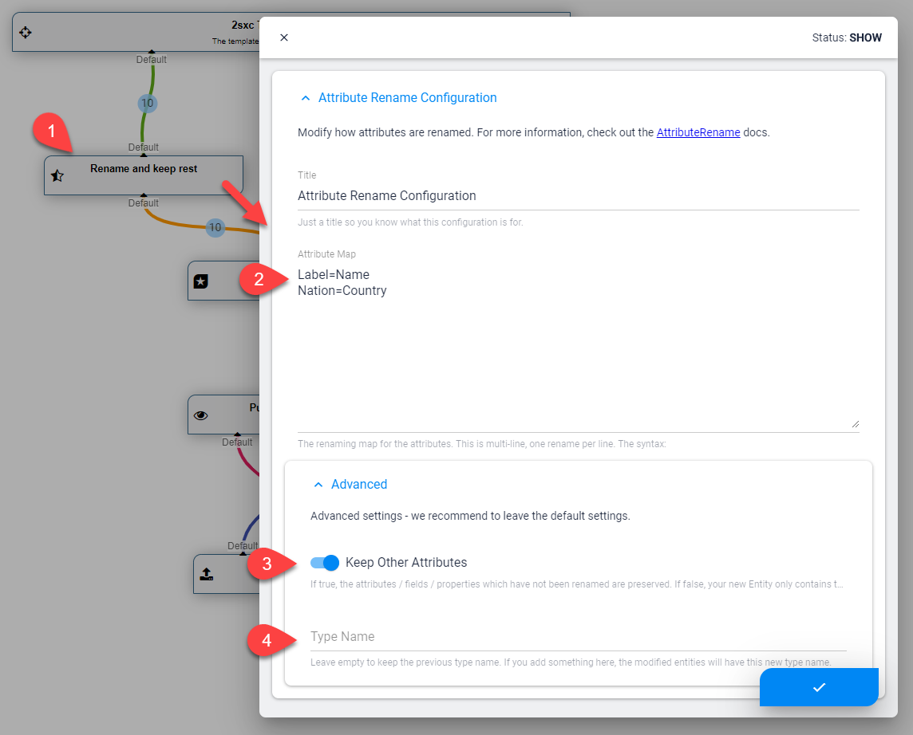

---
uid: ToSic.Eav.DataSources.AttributeRename
---

TODO: update the standard list with attribute rename and the StreamSwitch one I made last week

The **AttributeRename** [DataSource](xref:NetCode.DataSources.DataSource) is part of the [Standard EAV Data Sources](xref:Basics.Query.DataSources.Index). It renames attributes from items so that the result has more appropriate field/property names. Optionally it will also remove all fields which have not been renamed, in case you only want the smaller, renamed items. 

## How to use with the VisualQuery

When using the  [VisualQuery](xref:Basics.Query.VisualQuery.Index)  you can just drag it into your query. Now you can configure what properties you want and not. 

In this screenshot you can see:

1. The DataSource which we're configuring
1. The field map renaming fields
1. Toggle to keep attributes which were not renamed - default is `True`
1. The optional type name which you can give the modified entities - default is blank, resulting in the original type being used

## Programming With The AttributeRename DataSource

[!include["simpler-with-vqd"](shared-use-vqd.md)]

[!include["Read-Also-Section"](shared-read-also.md)]

[!include["Demo-App-Intro"](shared-demo-app.md)]

[!include["Heading-History"](shared-history.md)]
1. Introduced in EAV / 2sxc 10.27

[!include["Start-APIs"](shared-api-start.md)]