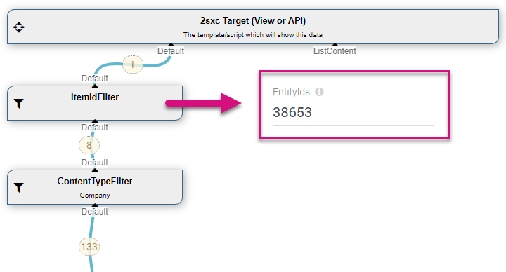
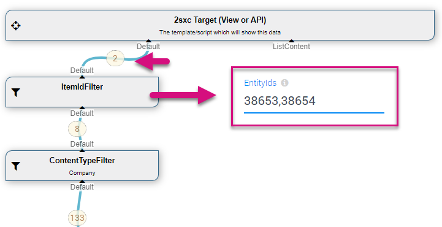

The **ItemIdFilter** [DataSource](xref:NetCode.DataSources.DataSource) is part of the [Standard EAV Data Sources](xref:Basics.Query.DataSources.Index). It will only return the items with the id specified. 

_Warning: You should always use it in combination with a [Content-Type filter](xref:ToSic.Eav.DataSources.EntityTypeFilter), as you want to be sure nobody can just crawl any entity you have in your system!_

## How to use with the VisualQuery
When using the  [VisualQuery](xref:Basics.Query.VisualQuery.Index)  you can just drag it into your query. This is what it usually looks like:

You can also use multiple values:

Or URL-parameters:

## Programming With The ItemIdFilter DataSource
[!include["simpler-with-vqd"](shared-use-vqd.md)]

[!include["Read-Also-Section"](shared-read-also.md)]

[!include["Demo-App-Intro"](shared-demo-app.md)]

[!include["Heading-History"](shared-history.md)]

1. Introduced in EAV 4.x, 2sxc ?

[!include["Start-APIs"](shared-api-start.md)]