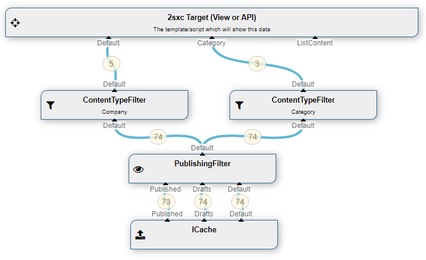

## Data Source: ContentType EntityType Filter

> [!NOTE]
> this data source used to be called EntityTypeFilter, we renamed it in 2sxc 9.8 for consistency

The **ContentTypeFilter** [DataSource](xref:NetCode.DataSources.DataSource) is part of the [Standard EAV Data Sources](xref:Basics.Query.DataSources.Index). It will only let items pass through, which are of a specific type. 

## How to use with the VisualQuery
When using the  [VisualQuery](xref:Basics.Query.VisualQuery.Index)  you can just drag it into your query. In the settings you'll specify the type-name. The resulting query will usually be a bit like this:



The above example shows:

1. a two content-type filters, each filtering a different type


## Programming With The ContentTypeFilter DataSource
[!include["simpler-with-vqd"](shared-use-vqd.md)]

```cs
// A source which can filter by Content-Type (EntityType)
var allAuthors = CreateSource<EntityTypeFilter>();
allAuthors.TypeName = "Author";

```

[!include["Read-Also-Section"](shared-read-also.md)]

[!include["Demo-App-Intro"](shared-demo-app.md)]

[!include["Heading-History"](shared-history.md)]

1. Introduced in EAV 3.x, 2sxc ?

[!include["Start-APIs"](shared-api-start.md)]