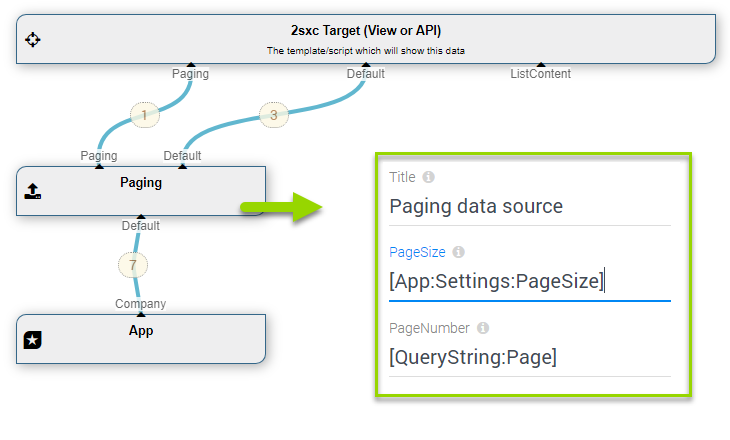

The **Paging** [DataSource](xref:NetCode.DataSources.DataSource) is part of the [Standard EAV Data Sources](xref:Basics.Query.DataSources.Index). It will limit the items returned to a _page_ containing just a few items, and will also provide a _paging-information_ so that the UI knows what page it's on and how many pages remain.  

## How to use with the VisualQuery
When using the  [VisualQuery](xref:Basics.Query.VisualQuery.Index)  you can just drag it into your query. This is what it usually looks like:

The above example shows:

1. a content-type filter limiting the items to type _Company_
2. a Paging which only passes on the first 3 companies of page 1

## Using Url Parameters for Paging
This example shows how you can use the Url Parameter to page through the results:

...you could also set the page size from other tokens like url or app-configuration, like this:

## Programming With The Paging DataSource
[!include["simpler-with-vqd"](shared-use-vqd.md)]

[!include["Read-Also-Section"](shared-read-also.md)]

[!include["Demo-App-Intro"](shared-demo-app.md)]

[!include["Heading-History"](shared-history.md)]

1. Introduced in EAV 4.x, 2sxc ?

[!include["Start-APIs"](shared-api-start.md)]