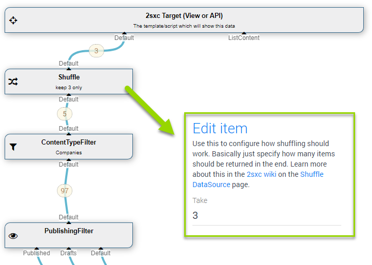

The **Shuffle** [DataSource](xref:NetCode.DataSources.DataSource) is part of the [Standard EAV Data Sources](xref:Basics.Query.DataSources.Index). It will randomize the order of items which came in. This is common for components which show "3 random quotes" and similar scenarios. 

## How to use with the VisualQuery
When using the  [VisualQuery](xref:Basics.Query.VisualQuery.Index)  you can just drag it into your query. This is what it usually looks like:

The above example shows:

1. a content-type filter limiting the items to type _Company_
2. a shuffle which only passes on 3 random companies 

## Programming With The Shuffle DataSource
[!include["simpler-with-vqd"](shared-use-vqd.md)]

[!include["Read-Also-Section"](shared-read-also.md)]

[!include["Demo-App-Intro"](shared-demo-app.md)]

[!include["Heading-History"](shared-history.md)]

1. Introduced in EAV 4.x, 2sxc ?

[!include["Start-APIs"](shared-api-start.md)]