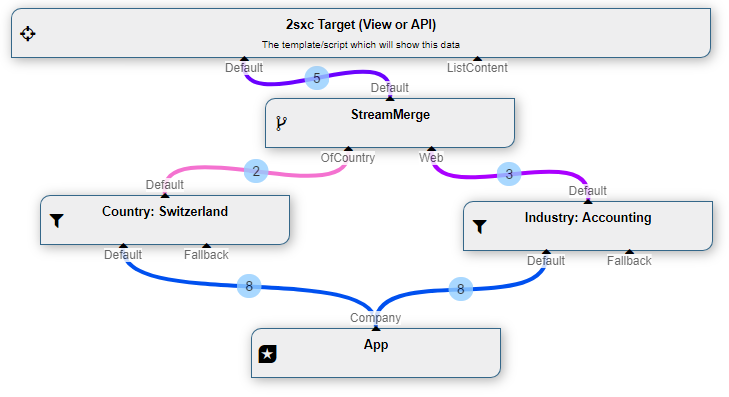
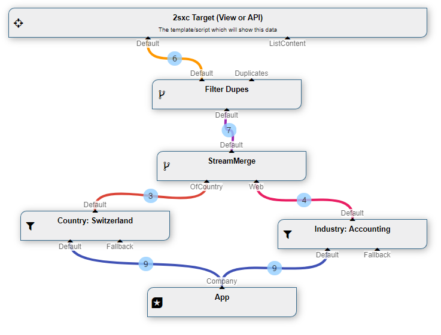

The **StreamMerge** [DataSource](xref:NetCode.DataSources.DataSource) is part of the [Standard EAV Data Sources](xref:Basics.Query.DataSources.Index). It will create a new stream containing everything which came into this data source.  

## How to use with the VisualQuery
When using the  [VisualQuery](xref:Basics.Query.VisualQuery.Index)  you can just drag it into your query. This is what it usually looks like:

The above example shows two filters finding items and delivering them on the same stream. 

## Example Using ItemFilterDuplicates
A common scenario will also combine this using the [ItemFilterDuplicates](xref:ToSic.Eav.DataSources.ItemFilterDuplicates), in case various in-streams deliver the same item:

## No Settings
The StreamMerge DataSource has no settings to configure.

Note that it will automatically merge the streams in A-Z order of the In-Stream names. 

## Programming With The StreamMerge DataSource
[!include["simpler-with-vqd"](shared-use-vqd.md)]

[!include["Read-Also-Section"](shared-read-also.md)]

[!include["Demo-App-Intro"](shared-demo-app.md)]

[!include["Heading-History"](shared-history.md)]

1. Introduced in EAV 4.x, 2sxc 9.10

[!include["Start-APIs"](shared-api-start.md)]