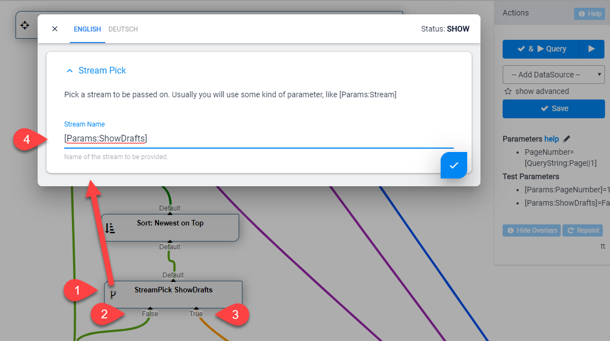

The **StreamPick** [DataSource](xref:NetCode.DataSources.DataSource) is part of the [Standard EAV Data Sources](xref:Basics.Query.DataSources.Index). It will pick a stream from In and pass that on to Out.  

## How to use with the VisualQuery
When using the  [VisualQuery](xref:Basics.Query.VisualQuery.Index)  you can just drag it into your query. This is what it usually looks like:

In this screenshot you can see:

1. The DataSource which we are configuring
1. The stream called `True`
1. The stream called `False`
1. The configuration which will resolve a token to `True` or `False` and thereby pick the stream

## Programming With The StreamPick DataSource
[!include["simpler-with-vqd"](shared-use-vqd.md)]

[!include["Read-Also-Section"](shared-read-also.md)]

[!include["Demo-App-Intro"](shared-demo-app.md)]

[!include["Heading-History"](shared-history.md)]

1. Introduced in EAV / 2sxc 10.26

[!include["Start-APIs"](shared-api-start.md)]