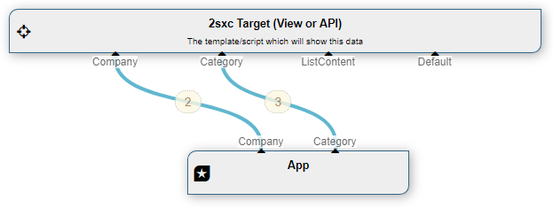
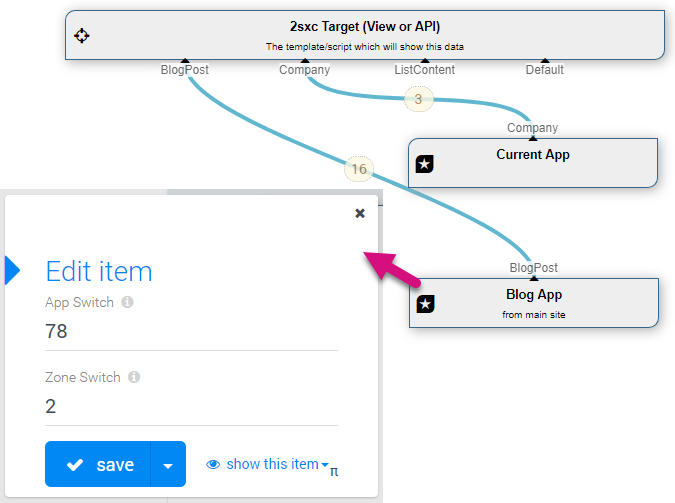

The **App** [DataSource](xref:NetCode.DataSources.DataSource) is part of the [Standard EAV Data Sources](xref:Basics.Query.DataSources.Index). It provides all items of the current App or of another App if needed.

## How to use with the VisualQuery

When using the  [VisualQuery](xref:Basics.Query.VisualQuery.Index)  you can just drag it into your query. In its initial state, the Default out stream will deliver all Entities of all Content-Types which you can then filter.

🔑 However, you can rename that or create more; _the out-connections will automatically filter to the name of the matching content types_, which looks like this:



 There are three common use cases:

### 1. Using App With The Current App

You can either just use it without any _In_ stream, then it will just deliver the published items. This is because without an _In_, the **App** will automatically build an In providing published only.

If you do provide any kind of in, it will use that as the source. So if you provide a Publishing-Source on the in, which will cause the **App DataSource** to differ the result based on the user who is looking at it. So editors would see unpublished as well:


### 2. Using App with Other App

The App-DataSource can also be configured to deliver data from _another_ app. For this, to configure and set the ZoneId and AppId:


You can also deliver data from different Apps by using multiple App sources:



## Programming With The App DataSource

[!include["simpler-with-vqd"](shared-use-vqd.md)]

Important: to access data of the current App, please use the `App.Data` as it's a pre-build object with the same streams. For example, use `App.Data["BlogPost"]` to get all the BlogPost items.

An example code

```razor
@{
  var blog = CreateSource<ToSic.Eav.DataSources.App>();
  blog.ZoneSwitch = 2; // go to Zone 2
  blog.AppSwitch = 403; // go to App 403
}
@foreach(var post in AsList(blog["BlogPost"]))
{
  <div>@post.EntityTitle</div>
}
```

The previous example creates an App source to the zone 2, app 403 and retrieves all items of type  `BlogPost` to show in a loop.

### Important When Coding

Note that data sources only retrieve data once, and then ignore any further configuration. So you must set Zone/App before accessing the data.

[!include["Read-Also-Section"](shared-read-also.md)]

* [Razor examples using App.Data](xref:NetCode.DynamicCode.Objects.App.Data)

[!include["Demo-App-Intro"](shared-demo-app.md)]

[!include["Heading-History"](shared-history.md)]

1. Introduced in EAV 3.x, in ca. 2sxc 6.x

[!include["Start-APIs"](shared-api-start.md)]
