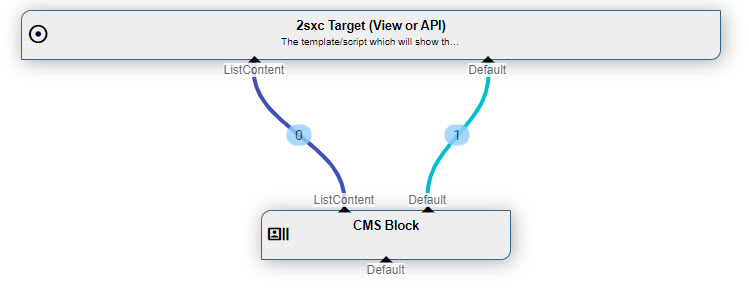
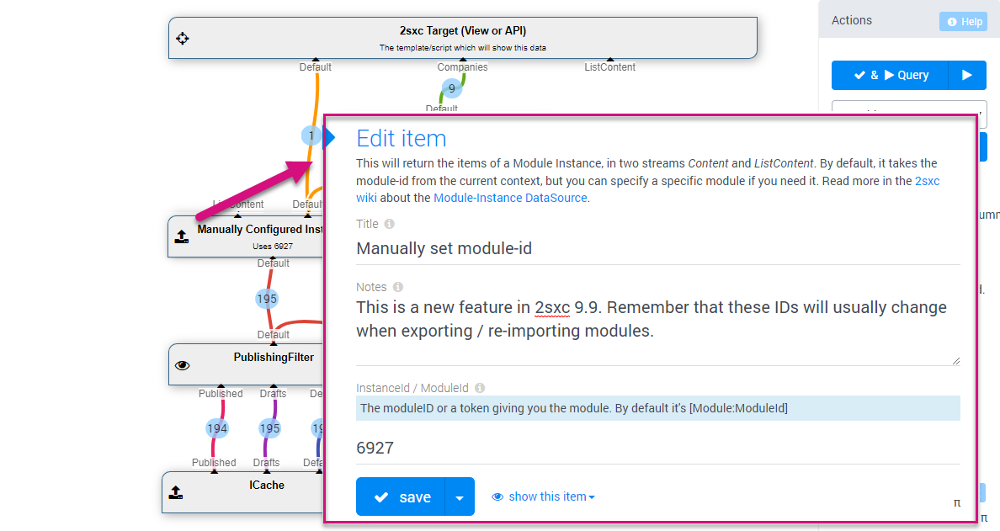

# CmsBlock DataSource (Module-Data)

The **CmsBlock DataSource** [DataSource](xref:NetCode.DataSources.DataSource) is part of the [Standard 2sxc/Dnn Data Sources](xref:Basics.Query.DataSources.Index). It is the default data source as it directly delivers module-instance data and is used for all scenarios which don't explicitly have a query, and it can also be used as part of a query.  

## How to use with the VisualQuery

When using the  [VisualQuery](xref:Basics.Query.VisualQuery.Index)  it is already in the default / initial query: 

The above example shows:

1. all data start in the cache _ICache_
1. it is then by default passed through the [PublishingFilter](xref:ToSic.Eav.DataSources.PublishingFilter)
1. then it enters this Instance/Module, which gets the current ModuleInstance and passes on the data which has been assigned to it

## Using Module/Instance Data For Configuration
Things get really exciting when you use values which the user edited in the module as a setting in your query. Here's an example: 

As you can see, the _Default_ out of the **CmsBlock** is passed into the [ValueSort](xref:ToSic.Eav.DataSources.ValueSort) data source with the stream-name _Settings_ and is then used in a token to configure bbehavior of the sort. 

## Manually Assigning a Module ID (2sxc 9.9)

In 2sxc 9.9 we added the configuration dialog, so you can specify what module the data should come from. This allows you to have configuration-modules or primary-data-modules, which are re-used in queries:

## Programming With The CmsBlock DataSource

[!include["simpler-with-vqd"](../../ToSic.Eav/DataSources/shared-use-vqd.md)]

The only property you need to set is `InstanceId` (2sxc 9.9+) if you want to provide a different module-id. 

[!include["Read-Also-Section"](../../ToSic.Eav/DataSources/shared-read-also.md)]

[!include["Demo-App-Intro"](../../ToSic.Eav/DataSources/shared-demo-app.md)]

[!include["Heading-History"](../../ToSic.Eav/DataSources/shared-history.md)]

1. Introduced in EAV 4.x, 2sxc ?
1. Added ability to configure in in the visual-query (2sxc 9.9)

[!include["Start-APIs"](../../ToSic.Eav/DataSources/shared-api-start.md)]