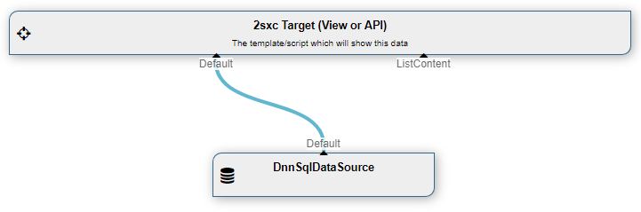

# Data Source: DnnSql

The **DnnSql** [DataSource](xref:NetCode.DataSources.DataSource) is part of the [Standard Dnn Data Sources](xref:Basics.Query.DataSources.Index). It lets you use data from the Dnn SQL databases as if they were entities. 

This is what it looks like:

## How to use 
Internally the DnnSqlDataSource is exactly the same as the [Sql DataSource](xref:ToSic.Eav.DataSources.Sql) just with fewer options, because you cannot choose most of the settings. Please consult the [Sql DataSource documentation](xref:ToSic.Eav.DataSources.Sql) to see how you can use it. 

[!include["simpler-with-vqd"](../../../ToSic.Eav/DataSources/shared-use-vqd.md)]

[!include["Read-Also-Section"](../../../ToSic.Eav/DataSources/shared-read-also.md)]

[!include["Demo-App-Intro"](../../../ToSic.Eav/DataSources/shared-demo-app.md)]

[!include["Heading-History"](../../../ToSic.Eav/DataSources/shared-history.md)]

1. Introduced in EAV 3.x, in 2sxc ?

[!include["Start-APIs"](../../../ToSic.Eav/DataSources/shared-api-start.md)]