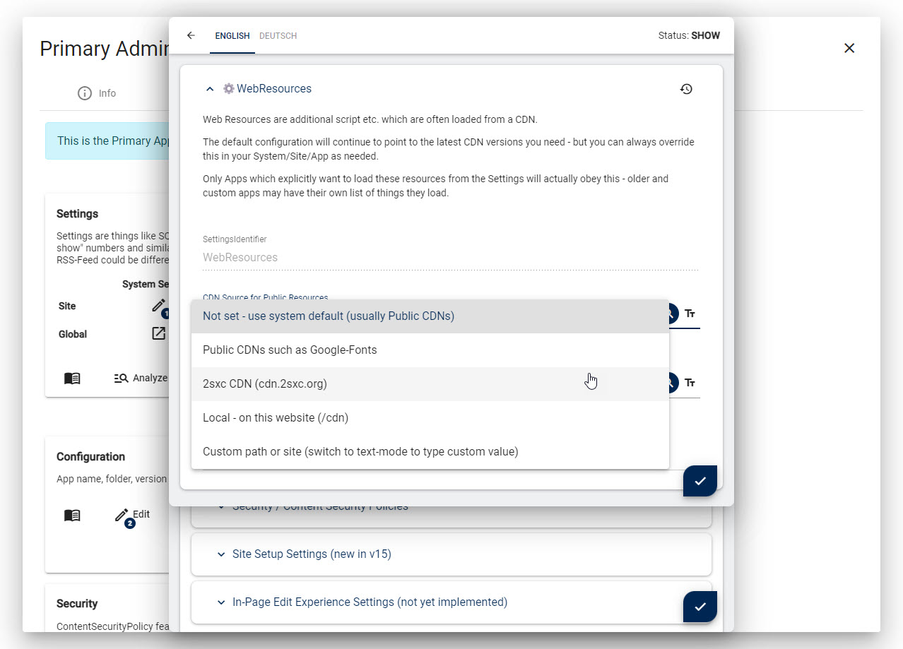

# 2sxc CDNs (Content Delivery Networks)

CDNs (Content Delivery Networks) are the backbone of the internet.
They are usually used to get common files from all over the universe such as:

* Fonts (icons, ...)
* JavaScripts (galleries, ...)
* CSS (bootstrap, ...)

But they have a major problem: It's unclear which CDNs track users.
This can cause major GDPR issues.
For example, many fonts are provided by Google Fonts, which can get you into legal trouble with the EU.
Here's a summary of the problems:

1. Some CDNs are not GDPR compliant - or you simply don't know
1. If you use [CSP (Content Security Policy)](xref:Abyss.Security.Csp.Index) you may have to whitelist many CDNs

## How 2sxc uses CDNs

2sxc is simple to install, use and customize.
Part of this comfort is possible thanks to CDNs.
For example, let's say you have multiple 2sxc Apps which use FancyBox (a cool JavaScript lightbox).
2sxc allows these Apps to just say "I need Fancybox5" using `Kit.Page.Activate("Fancybox5")`
and 2sxc will automatically get it from a CDN.

The reason this is important, is because all parts of the page should use the same version of fancybox.
Otherwise two Apps on the same page could break each other.

So 2sxc has a list of standardized resources which are retrieved on demand when needed.
These are loaded from CDNs by default - to keep the installation small.
An admin can always modify this list to point to other locations, but it's hard work, and it's easy to miss something.

In addition, the Edit UI and some Admin/Dev-UIs use CDNs to load large resources.
The code editor uses Monaco (Visual Studio Code) which can be 20+ MB to download.

## Divide and Conquer the Problem

To solve this, we had to figure out solutions for:

1. efficiently get all the dependencies to create an own CDN
1. create a 2sxc CDN with all important resources which is under our control
1. allow others to use the resources to create their own CDN
1. allow admins to point specific resources to their preferred location
1. create global settings to automatically use a predefined CDN for everything ([Patrons only](xref:Patrons.Sentinel))

## The 2sxc Resources Git Repo

We created / scripted a Git Repository which contains all the resources we need.
You can find it on <https://cdn.2sxc.org/>.

You can use this as a starting point in case you yourself wish to create a CDN.

As of now (v16.00 2023-05) it contains all the resources for

1. public JavaScripts, css and fonts provided as [Resources](xref:Basics.Configuration.Settings.WebResources) in 2sxc
1. icons and fonts used in the [Edit UI](xref:Basics.Browser.Edit.Index)

In future, we plan to extend it with resources used by other Admin UIs such as the code editor.

## cdn.2sxc.org

Using the Git Repo, we created a CDN which is under our control.
It's published as GitHub Pages on <https://cdn.2sxc.org/>.
GitHub uses CloudFlare to distribute the pages, so it's fast and reliable.

💡 You can simply use this CDN for your own projects - we don't collect any data

## Create your own Custom CDN

If you want to create your own CDN, you can simply fork the Git Repo and publish it on your own.
You can also just keep the parts you need and copy them to your site, eg. to `/cdn/`.

## Quick-Configure Resources for Custom CDN

The easiest way to do it is by using a simple setting in the UI like this:

This is a [Patrons Sentinel](xref:Patrons.Sentinel) only feature.
So if you want it fast, simple and fire/forget, just become a patron 🦸🏽‍♀️.

## Manually Configure Resources for Custom CDN

If you want to do it manually, you can do it like this:

1. Go to the resources management
1. Select each resource you want to change and enter a different HTML block for these resources

---

## History

1. Developed in 2sxc 15.04 for the public resources and Edit UI
1. Released in 2sxc 16.00 LTS

Shortlink: <https://go.2sxc.org/cdn>
