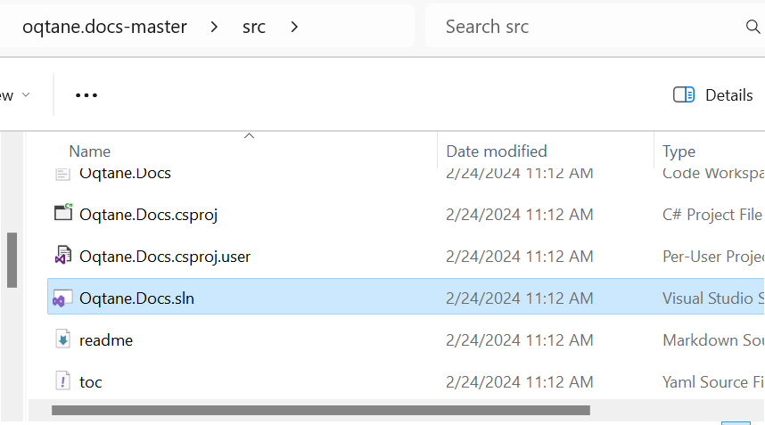

[!include["many-projects"](../_docs-for-many-projects.md)]

# Build the Docs with Code

> [!TIP]
> This expands on the initial [Build Docs Only](xref:Abyss.Contribute.Docs.Build.DocsOnly) guide, to include the code.
>
> So make sure that works, before you continue here.

## Setup Everything

For the **Code + Docs** build the code must be in the correct location near the docs project.
This is because the C# code is compiled and the XML-comments are extracted from the compiled code.

As this documentation-guide is for multiple projects, each one is explained separately.

### Setup Code / Docs for the Solutions

# [🌴 2sxc](#tab/2sxc)

Ensure that you have set up the complete 2sxc/EAV development environment.
This environment should be configured and functional for the development of C# and JavaScript code.

➡️ For more information refer to the [Code](xref:Abyss.Contribute.Code) documentation.

# [🩸 Oqtane](#tab/oqtane)

Ensure that you have set up the complete Oqtane development environment.

 ➡️ See [Oqtane Docs Setup](./oqtane/index.md)

# [♾️ cre8magic](#tab/cre8magic)

TODO:

---

## Build and Test Locally

Depending on your preferred toolchain, you can use

1. VS Code  (recommended ⭐)
2. Visual Studio 2022 (not recommended)

# [VS Code ⭐](#tab/vs-code)

Building and previewing everything with VS Code is the recommended ⭐ way.

1. Open the `*.code-workspace` workspace and build the same way as with the [docs-only](xref:Abyss.Contribute.Docs.Build.DocsOnly) scenario...

1. ...except that we want to run **docfx: build**.

1. In the output you should then see a bunch of stuff - ending with `Build Succeeded`

1. It is generated into the root `/docs` folder.

<div gallery="build-vs-code">
  
  
  
  
</div>

Test Locally

* Recommended 🌟: Use the [Live Server](https://marketplace.visualstudio.com/items?itemName=ritwickdey.LiveServer)
  extension to serve the `/docs` folder on <http://localhost:5500`> using `Alt + L, Alt + O`.

* Alternative: Set up IIS to publish the `/docs` folder on a domain such as `docs.oqtane.me` (not recommended as unnecessarily complex).


# [Visual Studio](#tab/visual-studio)

Building and previewing everything with Visual Studio 2022 is _not recommended_
because it's way slower, more difficult and doesn't provide a great experience.

* Open the `*.sln` solution located in the `/docs-src` folder.

* Rebuild the entire solution. It is generated into the root `/docs` folder.

<div gallery="vs-2022">
  
  
</div>

Test Locally

* Just run IIS Express with F5
* _Alternatively:_ Set up IIS to publish the `/docs` folder on a domain such as `docs.oqtane.me` (not recommended as unnecessarily complex).


## How it Works

The documentation development takes place in this [2sxc-docs](https://github.com/2sic/2sxc-docs) GitHub repository.
The documentation is generated from `*.yml` and `*.md` files and 2sxc/EAV's C# and JavaScript source code.

## Troubleshooting

Before you do any of this troubleshooting, make sure you already did the [Build Docs Only Troubleshooting](xref:Abyss.Contribute.Docs.Build.DocsOnly#troubleshooting) steps.


### Issue with Code-Docs being Out-of-Date

To see your updates in the locally hosted IIS website, make sure to use the `Rebuild Solution` option.


### Verify the Code Build

If docfx encounters an error when building a .NET project, you can manually attempt to build the project. This allows you to get more information about the error and address it. You can do this with the following commands:

```cmd
cd c:\[your-path]\2sxc\Src\Dnn\ToSic.Sxc.Dnn
dotnet build
```

Upon successful execution, you should see the message: `Build succeeded`.

