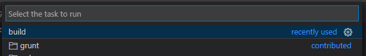
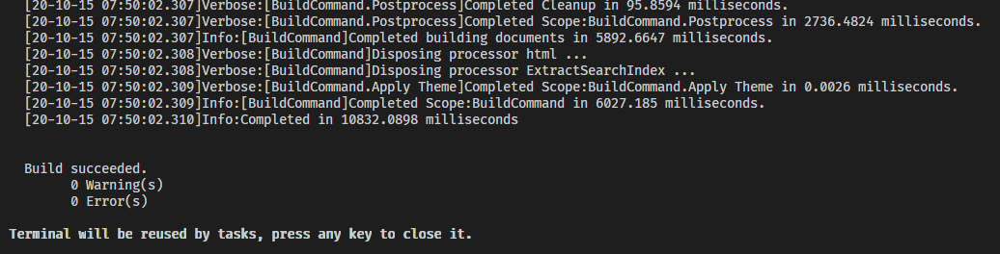
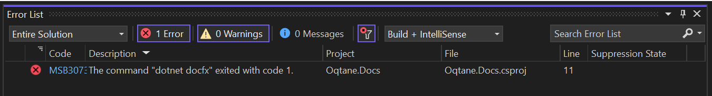
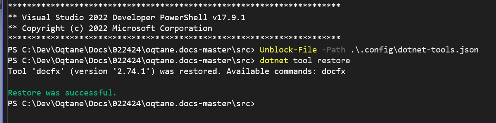

[!include["many-projects"](../_docs-for-many-projects.md)]

# Build the Documentation Only

All of these projects come with a setup to only build the documentation, without the need to compile the C# code.
This is much faster and easier, and is the recommended way to work on the documentation.
This page explains how to do this.

Make sure you have already done the steps in [Run Locally using VS-Code](xref:Abyss.Contribute.Docs.Setup.Index).

## Prerequisite: Install DocFX

The documentation tool we use is **docfx**, which needs to be installed on your development machine.
You can install it using the following command:

```cmd
dotnet tool install -g docfx
```

## Build and Test Locally

Depending on your preferred toolchain, you can use

1. VS Code  (recommended ⭐)
2. Visual Studio 2022 (not recommended)

# [VS Code ⭐](#tab/vs-code)

Building and previewing everything with VS Code is the recommended ⭐ way.

1. Open the `*.code-workspace` workspace in the `docs-src` in VS Code.
    * for 🌴 2sxc it's the `/2sxc Docs Generator/2sxc Docs.code-workspace`
    * for 🩸 Oqtane it's the `/src/Oqtane.Docs.code-workspace`
    * for ♾️ cre8magic it's the `/docs-src/cre8magic.code-workspace`

1. Hit `Ctrl + Alt + B` to see the build-commands.  
    You can also use `Ctrl + Shift + P` and selecting "Run Task" ...and then "Build"

1. For now, we only want to run **docfx: build docs (skip building API, faster for documentation)**.

1. In the output you should then see a bunch of stuff - ending with `Build Succeeded`

1. It is generated into the root `/docs` folder.

<div gallery="build-vs-code">
  
  
  
  
</div>

> [!TIP]
> This is much faster than the full build, as it doesn't compile the C# code, so it also doesn't need the source code to be available in the correct location.

After build, you can preview the documentation in your browser using the [Live Server](xref:Abyss.Contribute.Docs.Setup.Preview) extension.


# [Visual Studio](#tab/visual-studio)

Building and previewing everything with Visual Studio 2022 is _not recommended_
because it's way slower, more difficult and doesn't provide a great experience.

* Open the `*.Docs.sln` solution located in the `/src` folder.

* Rebuild the entire solution. It is generated into the root `/docs` folder.

<div gallery="vs-2022">
  
  
</div>

Test Locally

* Just run IIS Express with F5
* _Alternatively:_ Set up IIS to publish the `/docs` folder on a domain such as `docs.oqtane.me` (not recommended as unnecessarily complex).

---
<!-- the --- above ends the tabs -->

## How it Works

The documentation development takes place in this docs repository.
The documentation is generated from `*.yml` and `*.md` files and previously generated `*.yml` files from the C# and JavaScript source code.

TODO:!


## Troubleshooting

### Build Error because Files are In-Use

Sometimes the build will fail, because the [Live Server](xref:Abyss.Contribute.Docs.Setup.Preview) accessed them while docfx tried to write the files.
In such a situation, just run the build again. If that doesn't help, stop the Live Server and try again.

### Issue Locked dotnet-tools.json

If you encounter build errors like shown below:

<div gallery="locked-dotnet-tools">
  
  
</div>

Try to execute the following commands in terminal:

```cmd
Unblock-File -Path .\.config\dotnet-tools.json
dotnet tool restore`
```

After running these commands, the build errors should be resolved.




### Verify Docfx Works

To verify whether docfx can successfully build the documentation, use the following command in the VS-Code terminal:

```cmd
docfx
```

The successful execution of this command should display the message: `Build succeeded`.
