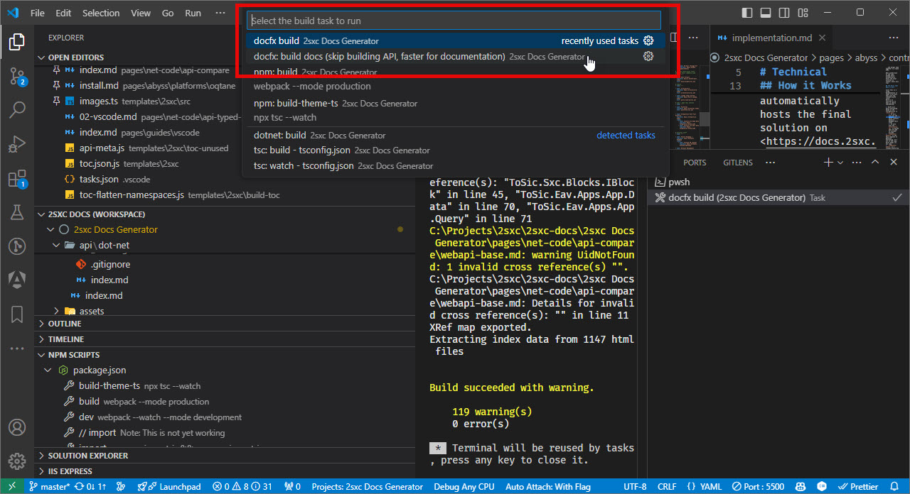

[!include["many-projects"](../_docs-for-many-projects.md)]

# Build the Documentation


## Start with Visual Studio Code

➡️ Make sure you already did the steps in [Run Locally using VS-Code](xref:Abyss.Contribute.Docs.Setup.Index).

## Install DocFX

The documentation tool we use is **docfx**, which needs to be installed on your development machine. You can install it using the following command:

```cmd
dotnet tool install -g docfx
```

## Two Build Processes: Docs and Docs+Code

We've configured the most important build commands in VS-Code so you can just get started.
They are located in `.vscode/tasks.json`.

Hit `Ctrl + Alt + B` to see the build-commands.
These two are of interest:

* **docfx: build docs (skip building API, faster for documentation)** will only build the markdown files, which is much faster if you're only working on the docs.  
  _Note that this should work, even if the C# code doesn't compile._

* **docfx build** will compile the real source code, generate the docs from the XML-comments and merge them with this project's markdown files.

<div gallery="vs-code">
  
</div>

## Basic Build: Docs Only

➡️ [Build Docs Only](xref:Abyss.Contribute.Docs.Build.DocsOnly)


## Advanced Build: Code + Docs

➡️ [Build Docs and Code](xref:Abyss.Contribute.Docs.Build.DocsAndCode)
