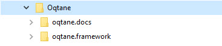

# Setup to Build Oqtane Docs + Code

To set everything up, clone the oqtane.docs and the oqtane.framework repositories
in the same parent folder (e.g., `c:\projects\oqtane`), creating a structure like:

* `c:\projects\oqtane` (example)
  * `oqtane.docs` cloned from [oqtane.docs](https://github.com/oqtane/oqtane.docs)
  * `oqtane.framework` cloned from [oqtane.framework](https://github.com/oqtane/oqtane.framework)

```text
some-root\
├── oqtane.docs
├── oqtane.framework
```

That will look like this:



---

[!include[](~/shared/authors/iJungleboy/_main-author.md)]
