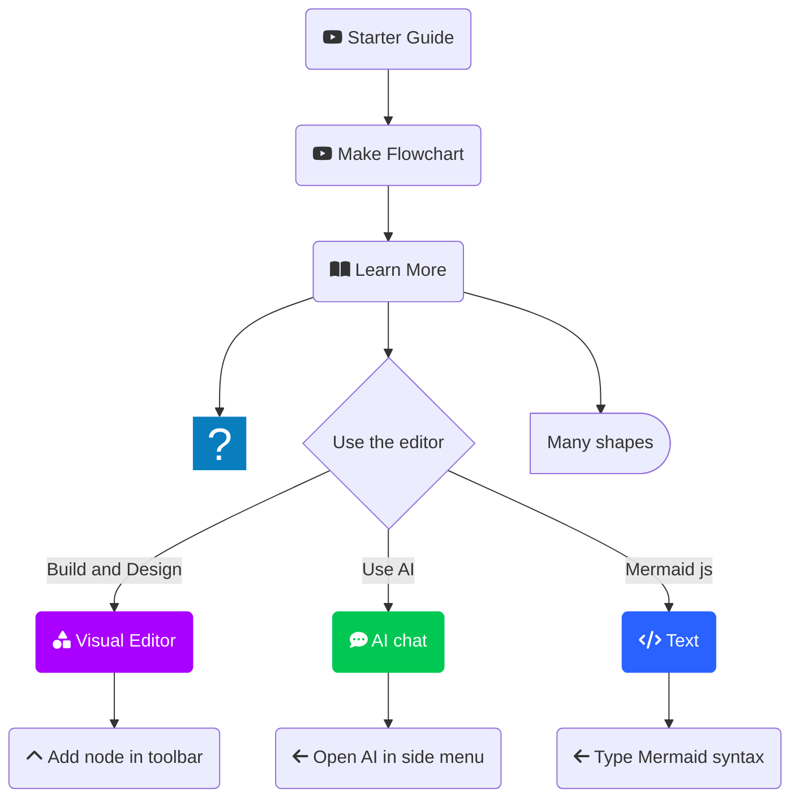
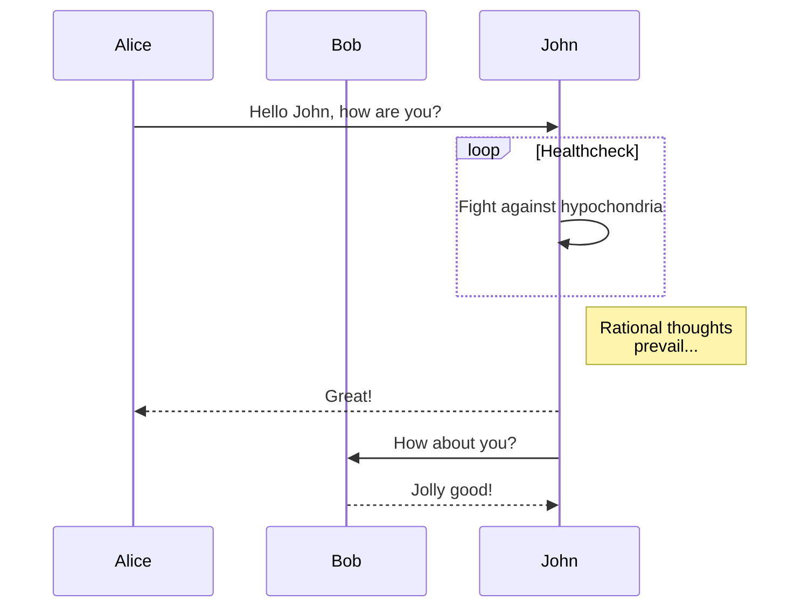
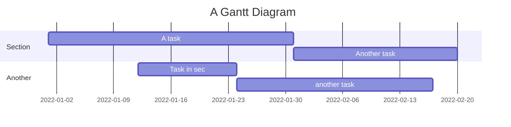
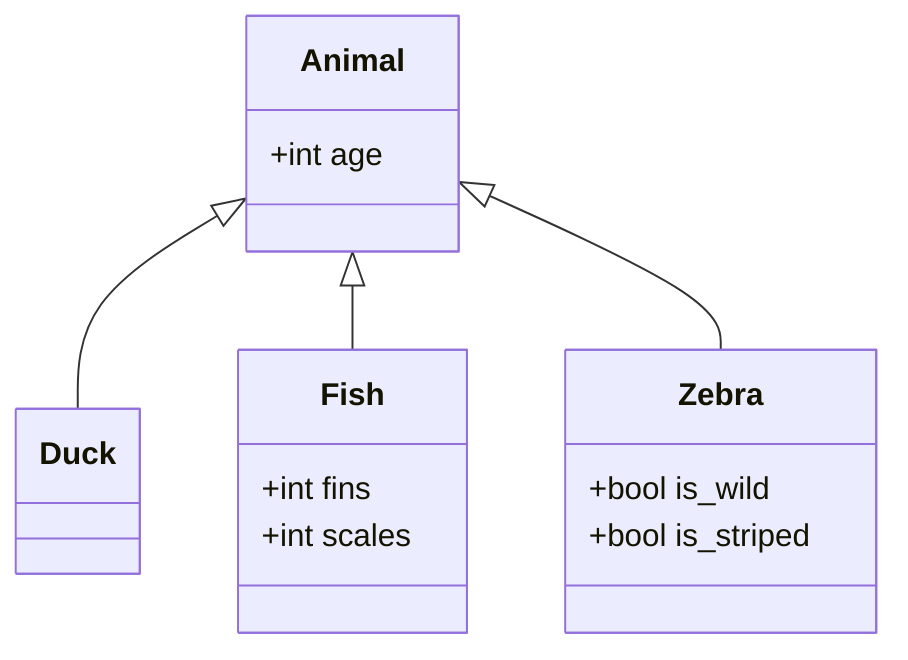
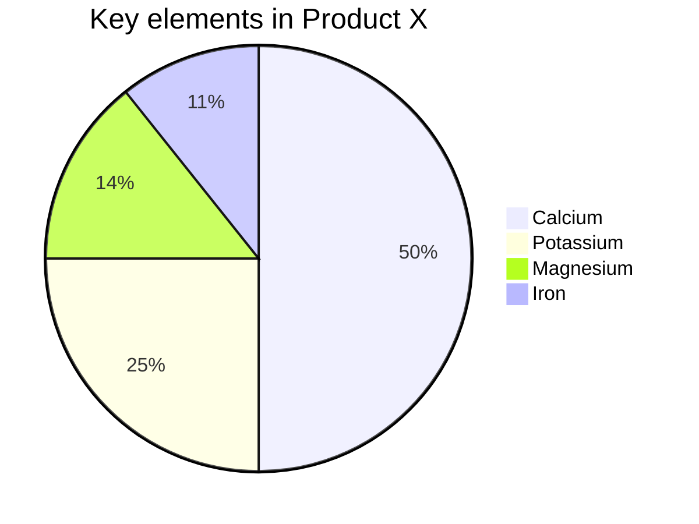
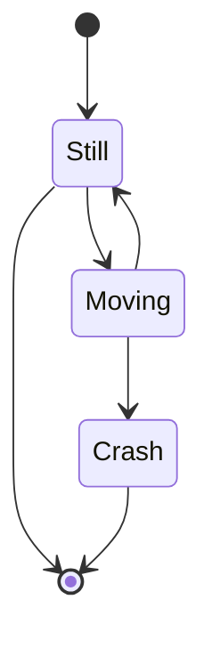

# Mermaid Diagrams

DocFx supports Mermaid diagrams, which are a simple way to create diagrams in markdown.
Here is an example:

``````markdown

``````

This will render as:


## More Examples

# [Flowchart](#tab/flowchart)



# [Sequence Diagram](#tab/sequence)



# [Gantt Chart](#tab/gantt)



# [Class Diagram](#tab/class)



# [Pie Chart](#tab/chart)



# [State Diagram](#tab/state)



---

To create your own diagrams, you can use

* the [Mermaid free Playground](https://www.mermaidchart.com/play)
* or the older [Mermaid Live Editor](https://mermaid-js.github.io/mermaid-live-editor/).

Mermaid has so many features, so if you love it, best check out the [official docs](https://mermaid.js.org/intro/).

---

## History

1. Supported since ca. 2022
