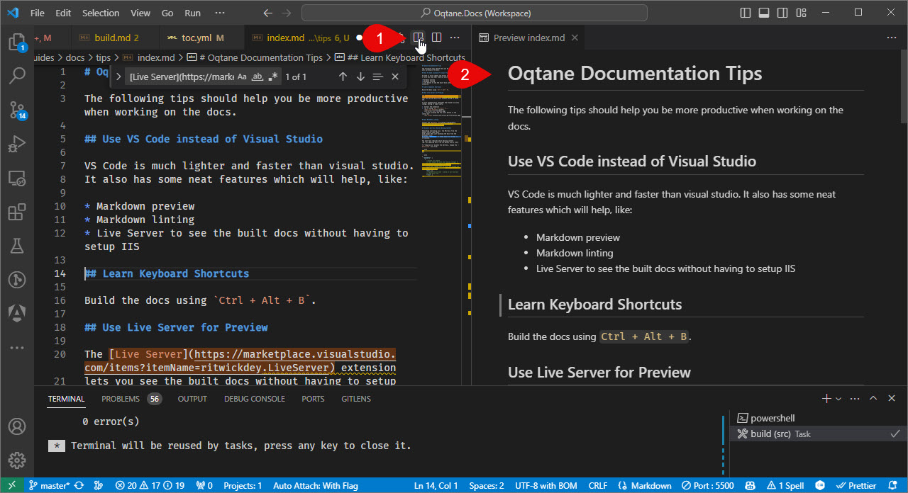

# Preview Markdown in Visual Studio Code

VS-Code has a nice preview built in.
Just open a markdown file and click the `Open Preview to the Side` button in the top right corner of the editor.

But the improved [Markdown Preview Enhanced](https://marketplace.visualstudio.com/items?itemName=shd101wyy.markdown-preview-enhanced)
extension is even better, as it even supports [Mermaid](https://mermaid.js.org/).

To use the better preview, make sure you previously followed the [setup instructions](xref:Abyss.Contribute.Docs.Setup.Index) to install the recommended extensions.

