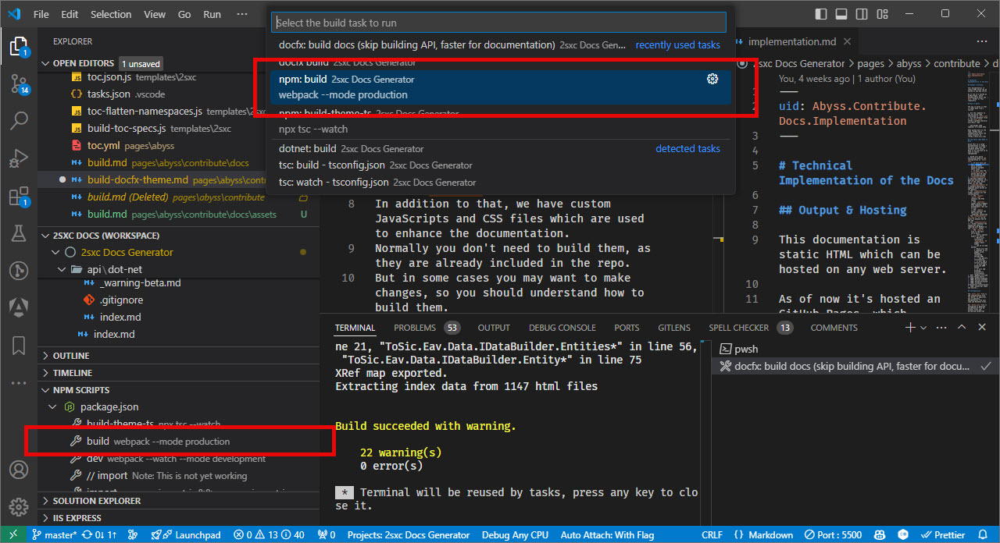

[!include["many-projects"](../_docs-for-many-projects.md)]

# Docs: TypeScript, CSS, WebPack Customizations

> [!WARNING]
> This is a technical documentation about how the documentation system works.
> It helps the core team understand how to maintain and enhance the documentation system.
>
> It's not meant for most contributors, as it's too technical.

To make the docs more interactive and user-friendly, we use TypeScript and SASS which is compiled with WebPack.
We provide additional features such as:

1. **Lightbox** feature for images - with Fancybox
1. **Image Galleries** - with Fancybox
1. **Razor / Blazor Code Highlighting** - with highlightjs
1. **Version switcher** - to access older archives of the docs
1. **Permalink system** - to easily share links to specific sections
1. **Blinking architecture illustrations** - to explain context of specific sections

Normally you don't need to build them, as they are already included in the repo.
But in some cases you may want to make changes, so you should understand how to build them.

## Parts that Make it Work

The parts that make it work are

* **NPM** manages the packages and scripts
* **WebPack** compiles the TypeScript and SCSS
* **TypeScript** is used to write the JavaScript
* **SCSS** is used to write the CSS
* **Fancybox** is used for the lightbox
* **HighlightJS** is used for syntax highlighting
* `/templates/[project]/src/` contains the TypeScript and SCSS files
  * `/src/styles/` contains the SCSS files which are project specific
  * `/src/styles/shared/` contains files which are shared across all docs-projects
  * `/src/scripts/*` are project specific TypeScript files
  * `/src/scripts/versions/*` are shared TypeScript files for the version switcher
  * `/src/scripts/shared/utils/*` are shared TypeScript files
  * `/src/scripts/shared/xref/*` are shared TypeScript files for the Permalink system
  * `/src/scripts/shared/@types/*` are shared TypeScript files for the HighlightJS configuration

Everything shared is in `/src/scripts/shared/...` so it's easier to copy 1:1 into other projects.

## How it Works

This documentation system leverages modern web development tools to enhance user experience and maintainability. Here's how the different components work together:

### package.json

The package.json file is the core of the helper Node.js project setup that we need for:

* build and development of documentation theme by building TypeScript and SCSS assets in `/templates/[project]/src/`

It specifies the project’s dependencies and scripts.
In `scripts` are defined commands like `build` and `dev` to automate tasks.
It has additional configuration properties:

```json
  "templateName": "2sxc",
  "version": "18.05.01",
  "enableDebug": false,
```

## Get Started

Make sure you have node/npm installed.
Then let NPM install all dependencies using continuous-integration.
Run this in the `docs-src` folder (ideally just from the VS-Code terminal):

```cmd
npm ci
```

This command:

* Installs all dependencies specified in `package-lock.json`.
* Ensures a clean installation by removing existing `node_modules`.
* Provides a reproducible environment for builds.

## Build

To compile TypeScript and build SCSS assets in `/templates/[project]/src/` that are used by documentation HTML templates, run this in the `docs-src` folder (ideally just from the VS-Code terminal):

### Production

For production webpack is building optimized and minimized assets.

```cmd
npm run build
```

This triggers the build script defined in `package.json`, which runs **Webpack** to process the assets.

...or use `ctrl+shift+b` and select `build`
...or right-click on the `build` task in the VS-Code task-runner.

<div gallery="vs-code">
  
</div>

### Development

To stremline development webpack will watch source files in `/templates/[project]/src/` and autobuild assets. Also it will generate **maps** files for debuging.

```cmd
npm run dev
```

### What Happens During Compilation

1. Webpack Processes Assets:
   * TypeScript (.ts files): Transpiled into JavaScript, enabling the use of modern JavaScript features and type checking.
   * SCSS (.scss files): Compiled into CSS, allowing for modular and maintainable stylesheets.
1. Asset Bundling:
   * Combines scripts and styles into bundles for efficient loading.
   * Generates Source Maps for easier debugging.
1. Optimization:
   * Minifies JavaScript and CSS to reduce file sizes.
   * Removes unused code through tree shaking.
1. Output Generation:
   * Compiled files are placed in the output folder.
   * Outputs include:
     * `main.js`: The bundled JavaScript file for documentation HTML templates.
     * `main.css`: The compiled CSS file for documentation HTML templates.

## Integration with the Documentation

* Scripts and Styles Inclusion:
  * The generated `main.js` and `main.css` are linked in the documentation HTML templates.
  * Enhances interactivity with features like lightboxes and syntax highlighting.
* Feature Enhancements:
  * **Fancybox**: Enables image lightbox functionality for a better viewing experience.
  * **Highlight**: Provides syntax highlighting for code snippets.
  * **Version Switcher**: Allows users to switch between different documentation versions seamlessly.
  * **Permalinks**: Facilitates easy sharing of specific sections within the documentation.

## Compilation Output

* Location:
  * Compiled assets are output to a `/docs-src/templates/[project]/public/`.
  * This directory is configured in `/docs-src/templates/shared-global/webpack.config.js`.

### Serving Assets in Development

The documentation site serves these static assets to users from `docs` folder.

* in `docs-src` folder, run `docfx` to build whole documentation to `docs` folder
* use `npm run dev` to build documentation theme assets
* use live-server to monitor and test documentation in local browser

Ensures that all interactive features and styles are properly loaded.

By understanding this build process, contributors can effectively maintain and enhance the documentation system.

## How to Repeat this Setup on another Project

1. **Step 1: Set Up Project Folder**
   * When referencing `/docs-src/templates/[project]/src`, replace `[project]` with your actual project folder name.
   * Ensure the `/docs-src/templates/shared-global` folder exists.

1. **Step 2: Adjust Configuration Files in `docs-src`**
   * In `package.json`:
     * Update `templateName` with your project folder name.
     * Update `version` to match the version of the source code you are documenting.
     * Add `"enableDebug": false` if it's not already present.
     * Under `scripts`, keep `build` and `dev`. You may delete unnecessary `import*` scripts.

By following these steps, you can set up a documentation system for your project that mirrors the structure and functionality of the original setup. This allows for integrated documentation that includes both manually authored content and auto-generated documentation from your source code.

---

## History

* Updated 2024-12-04 v18.04

