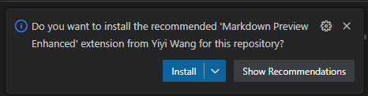
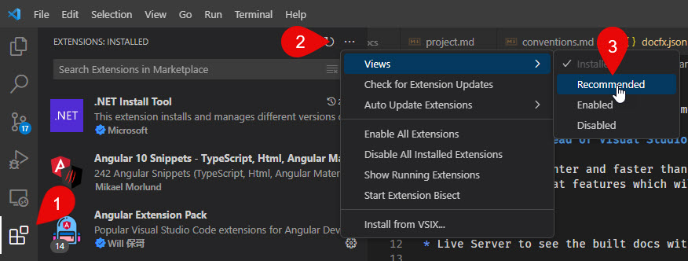

[!include["many-projects"](../_docs-for-many-projects.md)]

# Setup & Preview Docs Locally using VS-Code

We always use VS Code to work in the docs.
VS Code is much lighter and faster than visual studio.
It also has some neat features which will help, like:

* Markdown preview
* Markdown linting
* Live Server to see the built docs without having to setup IIS

## Install VS-Code and Pull the Docs Repo

1. Install VS-Code from <https://code.visualstudio.com>
1. Pull the docs repo into a folder beside the main code repo(s)

## Open the Workspace and Install Extensions

Please open the `[project-name].code-workspace` **Workspace** in VS Code. The VS Code docs project has recommended extensions which will help you be more productive.
If you open the project the first time, it will ask you to install them.

> [!TIP]
> Opening the workspace in VS-Code will ask you to install the recommended extensions.
> You should really do this, as it makes life much easier
> and includes a simple web-server to test the docs.

It will ask you to install these extensions:

1. [DavidAnson.vscode-markdownlint](https://marketplace.visualstudio.com/items?itemName=DavidAnson.vscode-markdownlint) a great markdown linting tool
1. [shd101wyy.markdown-preview-enhanced](https://marketplace.visualstudio.com/items?itemName=shd101wyy.markdown-preview-enhanced) a great markdown preview tool, also supports Mermaid diagrams
1. [ritwickdey.LiveServer](https://marketplace.visualstudio.com/items?itemName=ritwickdey.LiveServer) a simple web-server to test the docs

## Install Recommended Extensions Manually

If you accidentally skipped the installation of the recommended extensions, you can install them manually.
To install them later, go to the extensions tab
and find the "Show Recommended Extensions".

---

Last Update: 2024-12-05 by @iJungleboy
