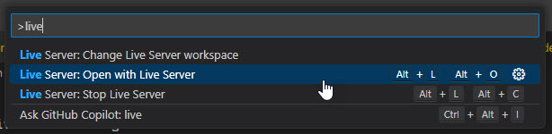
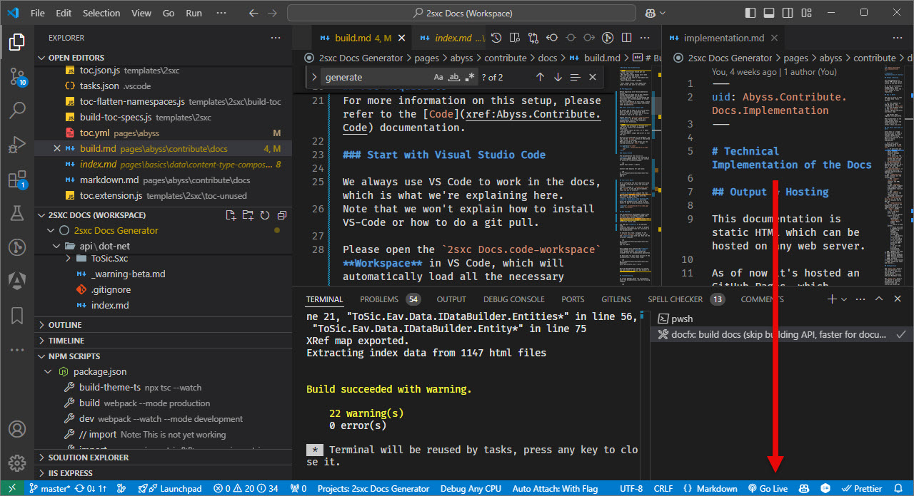
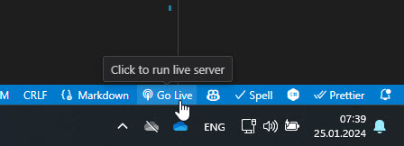

[!include["many-projects"](../_docs-for-many-projects.md)]

# Preview Docs Locally

## Using VS-Code and Live Server

The [Live Server](https://marketplace.visualstudio.com/items?itemName=ritwickdey.LiveServer) VS-Code extension
lets you see the built docs without having to setup IIS.

It also automatically refreshes the browser on every change, making it super-comfy.

Once you've installed all the plugins, you can see the `Go Live` button in the bottom right corner of VS-Code.
When you click it (or use `Alt + L, Alt + O`), a web server will be started hosting the `/docs` folder:

    
    
    
    

## Troubleshooting the Live Server

If you have trouble with the preview, here some background how it works.

1. The preview is a simple web-server which hosts the `/docs` folder.

1. It runs using the [ritwickdey.LiveServer](https://marketplace.visualstudio.com/items?itemName=ritwickdey.LiveServer).

1. The configuration for this is in the `[project-name].code-workspace` file, in the section `liveServer.settings.mount`.

## Run Docs in IIS Locally (not recommended)

> [!TIP]
> This is not recommended, as it's much slower and more complex than using the Live Server.

The generated docs are static pages and contain various JavaScripts to provide menu and search functionality.
These do not work, if you just open the `index.html` in a browser.
So you need to run it in a local IIS to fully test it.

This is how you can set it up:

<iframe src="https://azing.org/oqtane/r/RGNE-ePH?embed=1" width="100%" height="400" frameborder="0" allowfullscreen style="box-shadow: 0 1px 3px rgba(60,64,67,.3), 0 4px 8px 3px rgba(60,64,67,.15)"></iframe>

> [!WARNING]
> **Warning about Caching in IIS**
>
> The navigation / menus in docfx use JavaScript,
> so you'll sometimes see an old cached menu on your local system.
> Just activate F12 and disable cache to ensure that you're always viewing the latest build.

---

Last Update: 2024-12-05 by @iJungleboy
