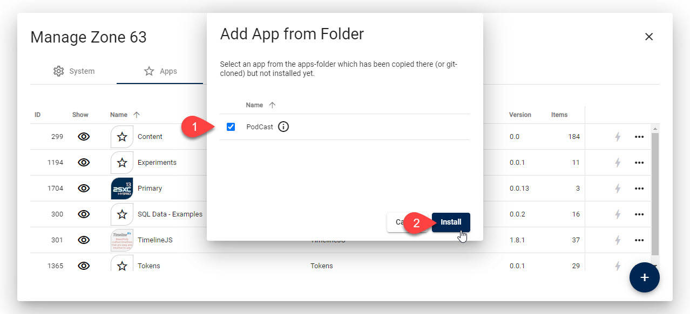

# Sync Apps from Dev ➡️ Production - Deploy App with Git-Sync

2sxc 15 introduces the ability to import an entire App from the file system.
This is ideal when your code is on a versioning server such as Github.
It allows you to push your changes to the git-server, and then pull it into a folder in the 2sxc.
You can then just go to the UI and import the app directly.

> [!TIP]
> This process also allows you to later sync changes the same way, if you can sync the entire App.

🦸🏾‍♂️ Requires Patron feature [AppSyncWithSiteFiles](https://patrons.2sxc.org/rf?AppSyncWithSiteFiles)

## Step 1: Export Everything to File System

[!include["Step 1 Export Everything"](./_1-export-everything.md)]

## Step 2: Sync with Git / Versioning

Typically you will have your App in git-versioning.
So after saving the entire state, you will want to commit and push.

In the new location, go to the site specific `2sxc` folder.
Then git-clone the repo to a subfolder of your choice.
We recommend that it has the same name as the subfolder you used in development.

## Step 3: Import Directly from File System

You can now go to the Apps-Management and import the App directly from the file system.

