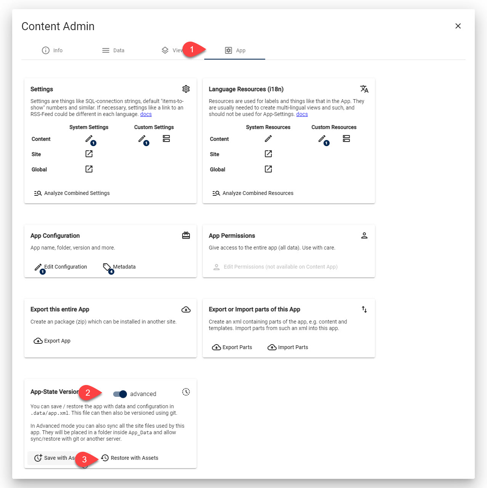

# Sync Apps from Dev ➡️ Production - Sync Entire App

In this scenario the App already exists on the production environment and you made changes on dev.
This scenario makes sense when you can fully reset the production environment to the same state as dev.

> [!WARNING]
> This will reset everything on production, including data and assets added by the editor.

## Step 1: Re-Export Everything to File System

[!include["Step 1 Export Everything"](./_1-export-everything.md)]

## Step 2: Re-Sync with Git / Versioning

Typically you will have your App in git-versioning.
So after saving the entire state, you will want to commit and push.

In the new location, go to the target folder.
Then git-pull the repo.

## Step 3: Re-Import / Reset App on Production

Now got to the App settings on the Production site and import everything.

> [!WARNING]
> Make sure you verify you're importing on the correct system.
> It's easy to accidentally be on the wrong system (dev instead of production).

🦸🏾‍♂️ If you want to sync the ADAM assets as well, you need the Patron feature [AppSyncWithSiteFiles](https://patrons.2sxc.org/rf?AppSyncWithSiteFiles)

---

## History

1. Export / Import of Apps introduced ca. 2sxc v4
1. App-state export with content-assets 2sxc v15
1. App-import from file system 2sxc v15
