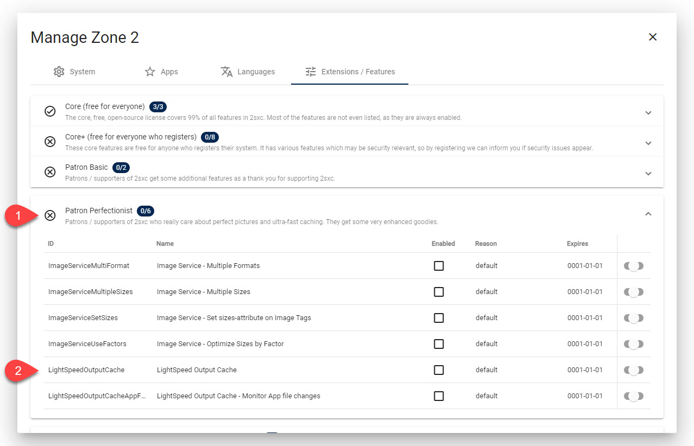
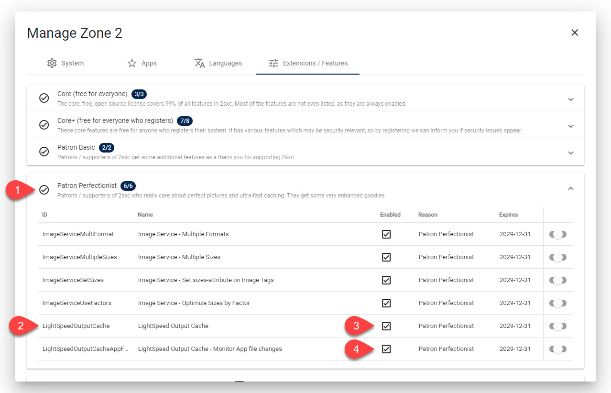
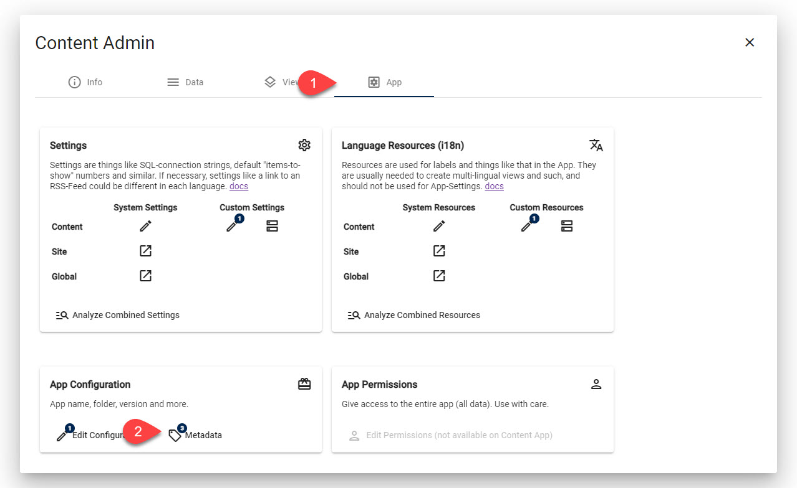
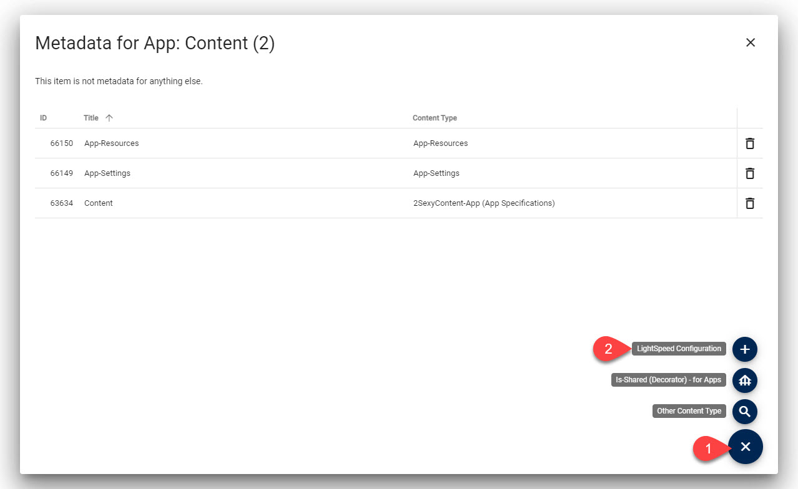
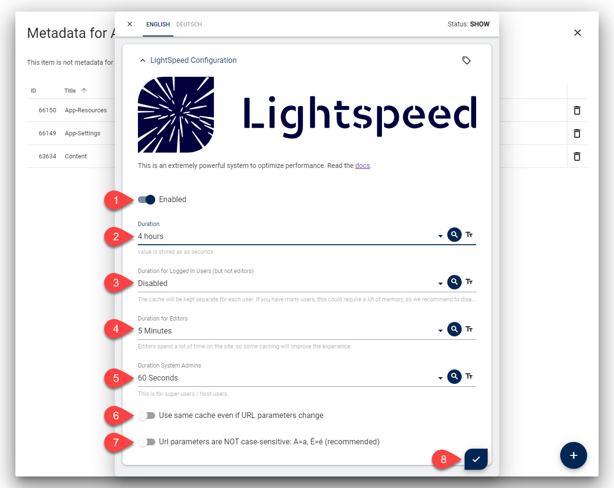
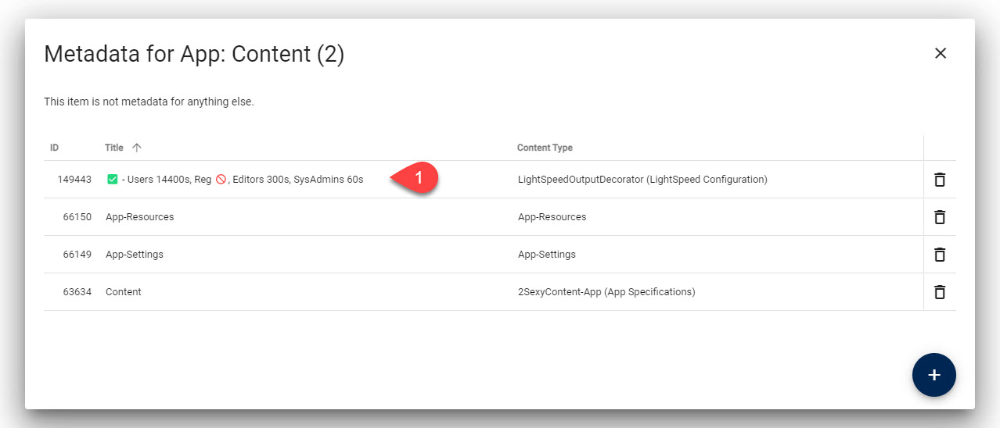
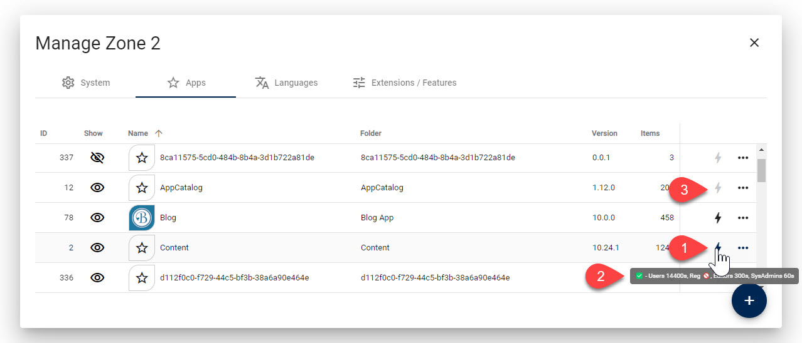
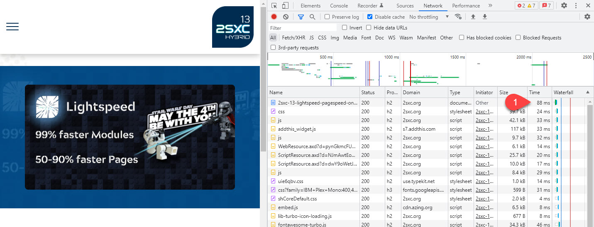
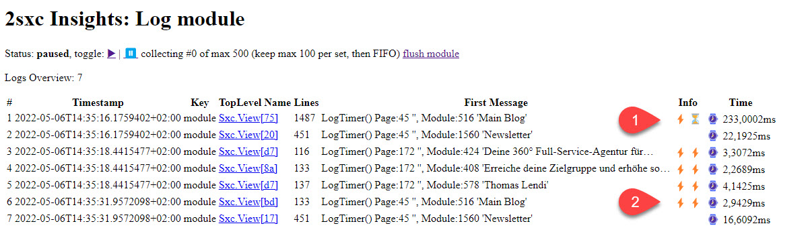

# 2sxc LightSpeed Output Cache

2sxc LightSpeed is an output cache that remembers the output of any module and reuses it when the same module is called again.

This can reduce module rendering time by up to 99% and reduce page load time by 50-90%.

## How it Works

### Basic Principles of 2sxc LightSpeed

Internally every module is rendered into a package containing the final HTML as well as changes to the page, such a title adjustments, CSP headers to add etc.

When LightSpeed is enabled, this package will be cached. But it a very smart way:

1. The cache is by user, so logged in users would always get their own cache.
1. Anonymous users all get the same cache.
1. Depending on LightSpeed settings on the app, the cache can vary by URL parameter, and optionally be case-sensitive.

Since we cache both the final HTML as well as page changes like headers, we can reliably reproduce everything on future requests.

This setup covers 99% of all use cases. For further optimizations, please contact us so we can enhance the API.

### Cache Flushing and Invalidation

The cache will automatically flush if any of these things happen:

1. any data is edited on an app
1. any file in the [app-folder](xref:Basics.App.FoldersAndFiles.Index) is changed

In these two cases all modules of that app are flushed.
This ensures that no matter what you do, the cache is always up to date.

## How to Enable 2sxc LightSpeed

### Enable the 2sxc LightSpeed Feature

_Important: You must be a [2sxc Patron](xref:Patrons.Info) with the **Patron Perfectionist** package to use this feature._

This is what you would probably see if your system is not yet registered:

1. Make sure you have 2sxc 13.10+ installed
1. Register your site and activate the **Patron Perfectionist** package
1. Activate the license on your site so the package is available

This is what you should see once you are ready.

This will activate LightSpeed but nothing will be cached yet, unless you have Apps which already have a LightSpeed configuration.
You can use the toggle to turn LightSpeed off in case something causes trouble.

### Configure 2sxc LightSpeed for your App

To start caching, you must configure it in each app. This happens in the App Metadata.

_If you don't see the menu shown on arrow #2, then you have not activated the feature yet._

This is what each setting does:

* **Enable**: you can change this for each app, espcecially while testing
* **Duration**: this is the normal duration for anonymous users
* **Duration...**: other durations for other users - we suggest that you only set it for anonymous users and admins
* **URL Parameter**: if not set, the cache stays the same even if url parameters change  
    _for Content and other simple things which don't have logic, this is recommended, but for list/details setups you need to enable this_
* **Case Sensitive**: if set, url changes will be case sensitive

> [!TIP]
> We suggest you also activate this for Site-Admins and System-Admins, as these will enjoy editing the site more.
> Since the cache will be flushed on every edit, this should not be a problem.

After saving you should see something like this:

We've made sure that the title contains a summary of all settings, so it's easy to see the configuration.

### LightSpeed Configuration Overview

At the Apps-Management dialog you can see the status for each app.

* You can see if it's enabled or not
* You can also see the details if you hover on the icon
* You can also click on the ⚡ to quickly make some changes

## Verify It Works

### Verify LightSpeed Works in Chrome

We suggest you use an anonymous browser (not logged in) to verify it works.
In a separate logged-in browser you can enable/disable LightSpeed.
If you refresh the page, you should see a much faster response time if LightSpeed is enabled:

### Verify LightSpeed Works in 2sxc Insights

You can also review module loading time in [2sxc Insights](xref:NetCode.Debug.Insights.Index).
Here is an example showing the first load time and cached load times:

> [!IMPORTANT]
> Module load time is just for one module.
> The page can contain many modules and will also need 50-100ms for DNN / Oqtane work.

## Common Issues

Here are some things that can cause trouble when activating the Lightspeed feature:

### Details Pages all Show the Same Content

Details pages usually have a `?id=xxx` or similar parameter to identify the item to show.
The cache must know that each url must be cached separately so you must configure this in the App Metadata.

### Details Pages show the List of Items

This is usually cause by not setting the `URL Parameter` in the App Metadata. Easy to fix.

### Page Headers are not Set on Cached Requests

If you have older apps, especially the old blog which may set page headers using the RazorBlade `HtmlPage` object, you may get unexpected results.

The reason is that this sets headers directly when the code is executed. So once the data is cached, the code doesn't run any more.

**Solution**

Change your code to use the `IPageService` instead. It will queue the page changes and this queue will also be processed in cached situations.

---

## History

1. Created in 2sxc 13.10

Shortlink: <https://go.2sxc.org/lightspeed>
