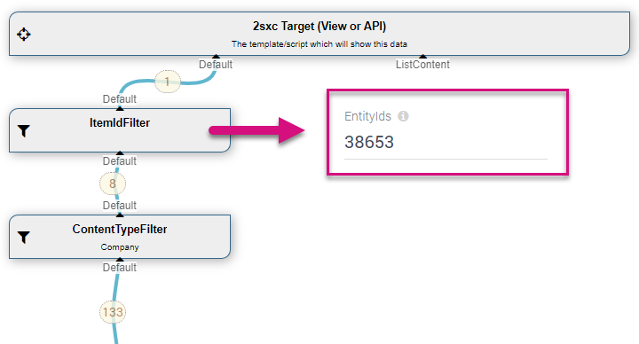

# LookUp System

[!include]

Many things in the EAV and 2sxc require it to look up parameters. Examples could be:

1. The current **Page ID**  
  to then find metadata for this page
1. The current **Date**
  to filter out news items which should be published in future
1. An **Id** from the URL Parameters
  to show details about this id

This is done using [Tokens](xref:Abyss.Parts.LookUp.Tokens) which look like `[QueryString:Id]`. 
To achieve this 2sxc has three parts:

1. [Tokens](xref:Abyss.Parts.LookUp.Tokens) which parses the placeholders
1. The [LookUpEngine](xref:Abyss.Parts.LookUp.Engine) which will get the values...
1. ...using [LookUp Sources](xref:Abyss.Parts.LookUp.Sources) to really resolve the values.

> [!TIP]
> The LookUp System is used in [Queries](xref:Basics.Query.Index) and [Token Templates](xref:Basics.Server.Render.Tokens.Index). 
> But since Token-Templates are fairly trivial, we recommand that you only use Tokens for Queries 
> and instead create your Templates using [Razor](xref:Basics.Server.Render.Razor.Index).

## Example Without LookUp

Imagine a [Query](xref:Basics.Query.Index) which has an [EntityId Filter](xref:ToSic.Eav.DataSources.EntityIdFilter) which expects an ID. This could be hardwired like this:

What happens now is as follows:

1. The EntityId-Filter will pass all the settings to be parsed by the LookUp-Engine
1. The LookUp-Engine will detect that it's a simple value (not a Token) and just return the `38654`
1. The EntityId-Filter will then do it's job and retrieve this item

## Example With LookUp

But it would make more sense if the ID were to be dynamic, maybe from the URL like this:

What happens now is as follows:

1. The EntityId-Filter will pass all the settings to be parsed by the LookUp-Engine
1. The LookUp-Engine will detect the [Token](xref:Abyss.Parts.LookUp.Tokens) and parse it
1. Since the first part in the token says `QueryString` the LookUp-Engine will check if it has a LookUp-Source by that name
1. Since it has a LookUp which answers to `QueryString`, it will ask this source if it can resolve `id`
1. Assuming that the page has `?id=38654` then the LookUp will say _yes! it's `38654`_
1. The EntityId-Filter will then do it's job and retrieve this item

## Discover More

1. The [Token Syntax](xref:Abyss.Parts.LookUp.Tokens) and all the features
1. [LookUp Engine](xref:Abyss.Parts.LookUp.Engine)
1. [LookUp Sources](xref:Abyss.Parts.LookUp.Sources)
1. Query LookUps
1. Token Template LookUps

---

For example, when a Query is created, it may need to know the current PortalId or the current time, to properly filter/sort something. 

This is achieved through 2 special object types, the .ILookUp and .ILookUpEngine, both in the  namespace. 

## Also Read

* 
* 
* 
* 
* 

## History

1. General Tokens introduced in 2sxc 1.0
1. Most enhancements were in 2sxc 07.00

