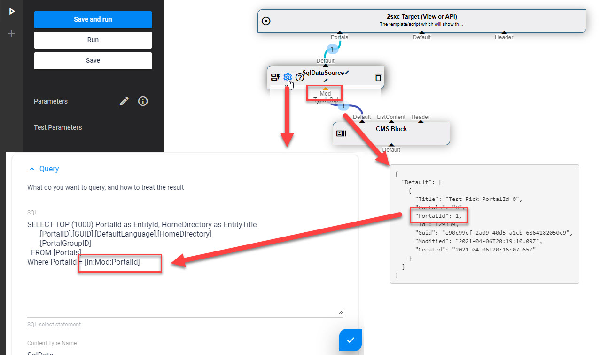
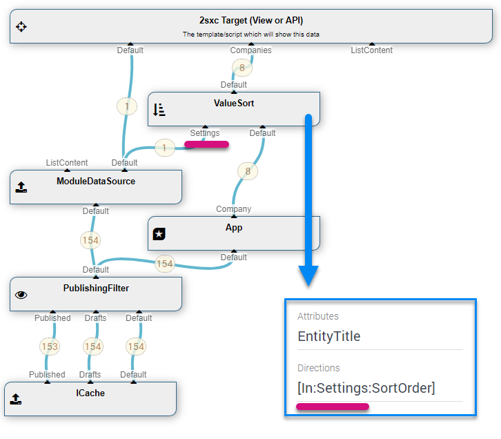

[!include]

# `In` LookUp in Query Parameters

[!include]

Data Sources in a query can retrieve values from another data-source which is a source. Use the `[In:source-name:attribute-name]` syntax. 
So if you have a Value DataSource which has the `Default`-in with the data to filter, and a `Module`-in comes from the Module Settings, 
you would write `[In:Module:Category]` to filter by the the category as selected in the module settings. 

Here's an example with the SQL DataSource:

* The SqlDataSource has a SQL statement with a `[In:Mod:PortalId]` token
* It's important that the connection containing the data is called `Mod` for this to work
* The data handed to it will contain the `PortalId` 1

And another example showing the older UI with the ValueSort DataSource:

---

## Read also

* [VisualQuery Parameters](xref:Basics.Query.Parameters.Index)
* 
* 
* 

## History

1. In added in 2sxc 07.00

