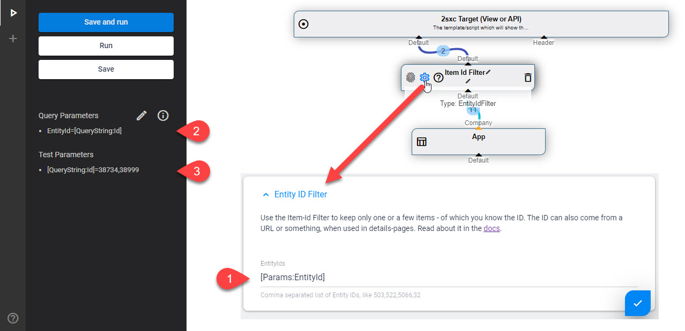

[!include]

# `Params` LookUp in Query Parameters

[!include]

2sxc 10.22 introduced a new parameter source called `Params`. With this you can write things like `[Params:Sort]`. 

The query now has a special LookUp for the source `Params`. This should help you make nicer, more flexible queries and also allow you to set these query parameters from C# code. 

## Configure in VisualQuery

This shows how to use `Params` in [VisualQuery](xref:Basics.Query.VisualQuery.Index):

Here's what you see in the image

1. An Item ID Filter is being configured and it _could_ directly use `[QueryString:Id]` but instead it uses the `[Params:EntityId]`
2. The **Query Parameters** are configured to resolve `EntityId` as `[QueryString:Id]`
3. For _testing purposes_ the **Test Parameters** have a test-value for this

When this is run during testing, it will use the test-parameters, and at runtime it will use the `?Id=...` from the url.

> [!NOTE]
> Your queries can also use params that you didn't configure - but they will return nothing unless you would set them in your C# code before you run the query.

> [!TIP]
> We recommend to always use the Params for everything as it's simpler to see all the parameters your query depends on.  
> So if you have a [ValueFilter](xref:ToSic.Eav.DataSources.ValueFilter) expecting a value from the url, we recommend that you  
> Create a param `FilterLastName=[QueryString:LastName]`  
> In your data-source configuration, use `[Params:FilterLastName]`

---

## Read also

* [VisualQuery Parameters](xref:Basics.Query.Parameters.Index)

## History

1. Params added in 2sxc 10.22

