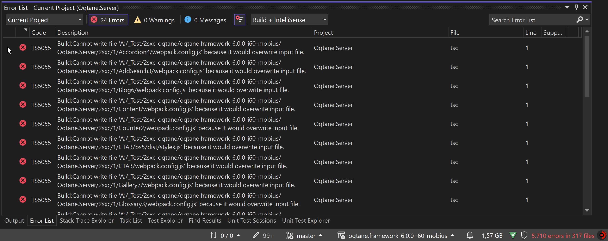

# Issues Building `Oqtane.Server.csproj` After Installing 2sxc Templates

When developing with Oqtane in **developer mode**, you typically run `Oqtane.Server.csproj` by pressing `F5` in Visual Studio. This action builds the project and its dependencies before launching it on IIS Express (`localhost`). However, after installing 2sxc Content and App templates, you might encounter build failures when compiling `Oqtane.Server.csproj`.

## Problem Overview

After adding 2sxc templates to your Oqtane project, the Visual Studio build process may fail with numerous errors—sometimes over 1,000—rendering Oqtane unusable in the development environment.



### Affected Folders

The problematic folder that cause the build issues is `2sxc`.

These directory contain assets for the 2sxc apps and templates.

## Solution: Exclude `2sxc` Folder from the Build

To resolve the build errors, you need to exclude `2sxc` folder from the compilation process. This can be done by modifying the `Oqtane.Server.csproj` file to tell the compiler to ignore these directory.

### Steps to Exclude Folders

1. **Open `Oqtane.Server.csproj`:**

   Locate the `Oqtane.Server.csproj` file in your project directory and open it with a text editor or within Visual Studio.

1. **Add Exclusion Rules:**

   Insert the following `<ItemGroup>` section into the project file:

   ```xml
   <ItemGroup>
     <!-- Exclude these directories from compilation -->
     <Compile Remove="2sxc\**" />
     <!-- Exclude content files from the build output -->
     <Content Remove="2sxc\**" />
     <!-- Exclude files from being embedded as resources -->
     <EmbeddedResource Remove="2sxc\**" />
     <!-- Exclude miscellaneous files not included elsewhere -->
     <None Remove="2sxc\**" />
     <!-- Exclude files from the dotnet watch tool -->
     <Watch Remove="2sxc\**" />
   </ItemGroup>
   ```

   This configuration explicitly tells the build system to ignore all files within the `2sxc` directory when compiling, embedding resources, including content files, and monitoring for changes.

1. **Save and Rebuild:**

   Save the changes to `Oqtane.Server.csproj` and rebuild the project by pressing `F5` or selecting **Build** > **Rebuild Solution** in Visual Studio.

## Why This Happens

The 2sxc templates introduce additional files that are necessary for the application to run but are **not** meant to be part of the compiled code. Visual Studio automatically includes new files and directories added to the project folder. Including them causes conflicts and compilation errors because the compiler tries to process files that aren't valid C# code or are duplicates.

## Summary

By excluding the `2sxc` folder from the build process, you prevent the compiler from processing unnecessary files. This resolves the build errors and allows you to continue developing your Oqtane application with the 2sxc templates installed.

## Related

* [](xref:Abyss.Platforms.Oqtane.Install.IssueHotReload)

---

