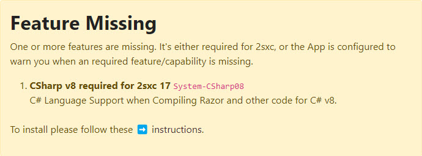

# System Features 🌟

All platforms come with a lot of features pre-installed.
Others can be installed later on, as needed.

You probably arrived here, because you saw a warning similar to this:

To find out how to add features, check the section of your platform:

* ☢️ [DNN](xref:Abyss.Platforms.Dnn.SystemFeatures)
* 🩸 [Oqtane](xref:Abyss.Platforms.Oqtane.SystemFeatures)

## Alternative: Configure Apps to not Request said Features

If the feature was only required by the App configuration, you can also disable that warning.
You would do this if you can't install it and want to disable the warning to see what you can do about it,
we've created a checklist for this:

<iframe src="https://azing.org/2sxc/r/cXiefhIX?embed=1" width="100%" height="400" frameborder="0" allowfullscreen style="box-shadow: 0 1px 3px rgba(60,64,67,.3), 0 4px 8px 3px rgba(60,64,67,.15)"></iframe>

## History

* Introduced in 2sxc 16.8+

---

Shortlink: <https://go.2sic.org/sysfeats>
