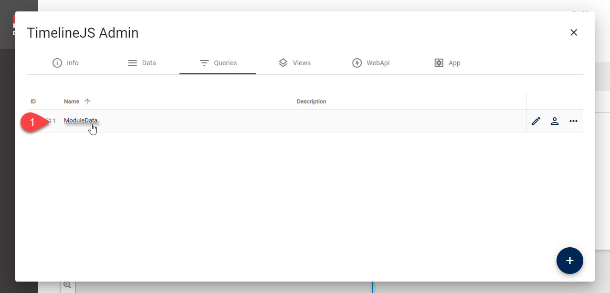
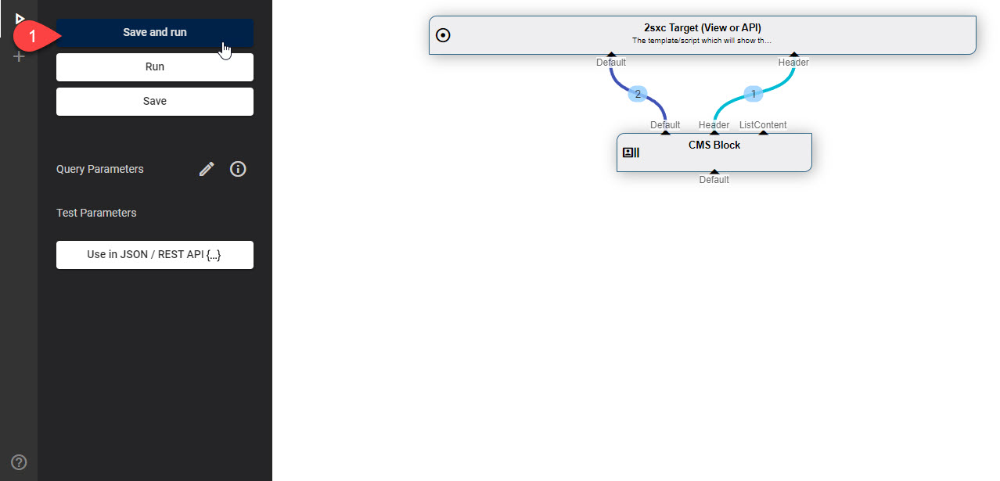
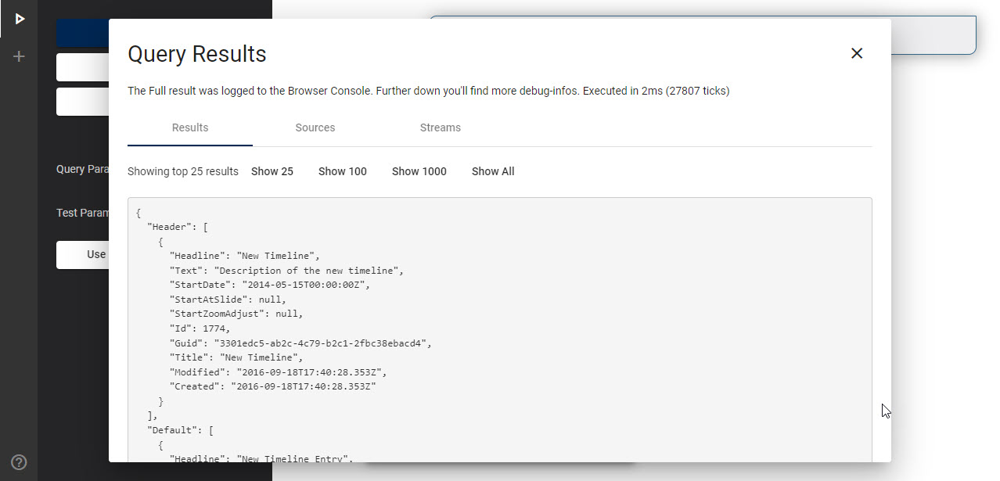

# Fix Breaking Change _InstanceData_ in v13

**Keywords:** #Deprecated #InstanceData

2sxc v13 cleans up some historic, deprecated functionality. They were not used much, but if you have code which used this, here's how to fix any code in production. 

Specifically, three features were removed:

1. The ability to publish Module Instance Data directly
1. The ability to configure this in the View settings
1. The JS API which was optimized to process the resulting data in a fairly untypical way

## Reason for Removal

These features were removed because they were almost never used, and newer mechanisms are much more appropriate than that old stuff. 

## History - How it Used to Work

2sxc V3 (ca. 2013) introduced a feature where a Module could _publish_ the data it was also showing on a normal screen as a WebApi / JSON call. 

It was required that a view activates this feature to ensure that it doesn't happen by accident. The settings in the view were like this (example from the [TimelineJs App](https://2sxc.org/en/apps/app/timelinejs-app-for-dnn-dotnetnuke)):


1. Go to the view configuration
2. The old deprecated settings
3. Enable data publishing (which opened the data for JS)
4. The streams which were to be published

_Note that the stream `Default` is still called `Default` today, but `ListContent` is usually called `Header` today._

Once this was setup, there was a way to get this data through a WebApi call. 

1. From v3 to ca. v6 there was a call which actually went through the Dnn Page (so it was slow)
1. V6 to ca. v11 it used a call to `app-sys/AppContent/GetContentBlockData`
2. Later there was a special WebApi call to `app/auto/InstanceData` which did the same thing

The format of the response was a bit special, specifically it looked like this (TimelineJs example):


1. The call to `InstanceData`
2. The data which was on a special `List` sub-object

To complement this, there was a JS-API which worked as follows:

```js
// Process each Timeline DOM-element on the page
$(".timeline-embed").each(function() {
    // Define our timeline element, get moduleId
    var timeLineElement = $(this);
    var sxc = $2sxc(this);

    // Load the data from the 2SexyContent module and define a callback
    sxc.data.on("load", function (source, data) { 
        processDataAndCreateTimeline(source, data, sxc.id, timeLineElement) 
    }).load();
});
```

Specifically, it used a `data.on` call to kind of say: _on load get the data from the current module_.

The resulting data was then used in the JS - for example like this in TimelineJS:

```js
// what should happen on loading of the data:
function processDataAndCreateTimeline (data, moduleId, timeLineElement) {
    // Old code using the `in`, the `ListContent` and `.List[...]` stream
    var content = data.in.Default.List;
    var listContent = data.in.ListContent.List[0];
    var timelineData = getTimelineData(moduleId, content, listContent);
    ...
```

## Upgrade to Newer functionality

> [!TIP]
> Below you'll find instructions how to create the same functionality using Visual Query and newer JS APIs. 
>
> But: In many cases you may actually want a different solution, because Visual Query is very powerful and may provide other ways to get you the data you need. 

### Step 1: Create Query which Gets Instance Data

This creates a Query API call which gets the same data as before, but in a newer API and newer standard. 

Create the Query - in our example we'll call it `ModuleData`
<br>





After doing this, you have created a query which returns the same data as before, with 2 important differences:

1. The stream `ListContent` is now called `Header`
1. There are no permissions configured yet for anonymous users to access the query

### Step 2: Update the JS code to use the Query instead of the .data

We have updated the TimelineJS code to use the new `fetchJson` [api - see docs](https://github.com/2sic/app-timelinejs/blob/master/assets/scripts.js):

```js
// Process each Timeline DOM-element on the page
$(".timeline-embed").each(function() {
  // Define our timeline element, get moduleId
  var timeLineElement = $(this);
  var sxc = $2sxc(this);

  // New version using fetch and the default Query we just created
  sxc.webApi.fetchJson('app/auto/query/ModuleData')
    .then((data) => processDataAndCreateTimeline(data, sxc.id, timeLineElement));
});
```

In addition, the data returned is a simpler. Specifically three things are now different: 

1. it doesn't have a level `in`
1. it doesn't need the use `.List`
1. in our new Query the Header is in a stream `Header` and not `ListContent`

This would be the modified code in TimelineJs:

```js
function processDataAndCreateTimeline (data, moduleId, timeLineElement) {
  // Re-format streams that are contained in data
  var content = data.Default;
  var listContent = data.Header[0];
  var timelineData = getTimelineData(moduleId, content, listContent);
  ...
```

### Step 3: Set Query Permissions

After doing Step 1 & 2 you will have a working solution, but only super-users (host-users) can use the query because the read-permissions have not yet been configured. To configure them, use this checklist:

<iframe src="https://azing.org/2sxc/r/BE0HbDwA?embed=1" width="100%" height="400" frameborder="0" allowfullscreen style="box-shadow: 0 1px 3px rgba(60,64,67,.3), 0 4px 8px 3px rgba(60,64,67,.15)"></iframe>


---

Shortlink to here: https://go.2sxc.org/brc-13-id