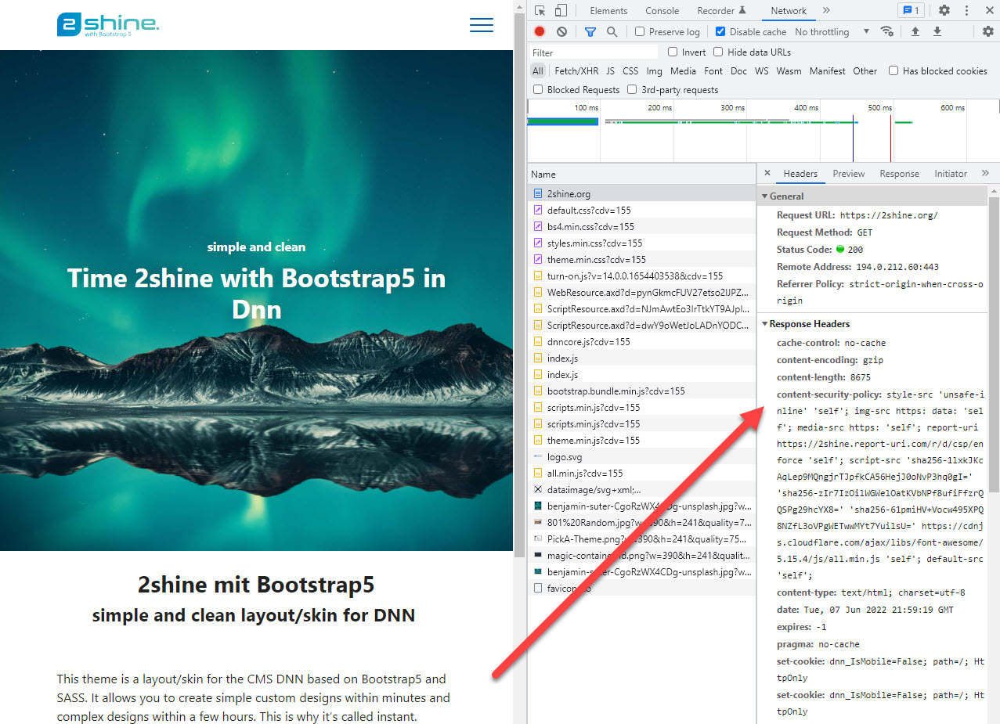

# Content Security Policy (CSP) Basics

Content Security Policy (CSP) is a security policy that helps you to protect your web application from [cross-site scripting attacks](https://en.wikipedia.org/wiki/Cross-site_scripting).

This page should help you understand what it is and how it works. Here's just a quick example of CSP in action:




## The Need for CSP

There is always a risk that the visitor will see content which you didn't intend. 
It could happen because your server was hacked, but there are many other ways to make this happen which are outside of your control. 

This content-insecurity places your visitor at a very high risk of being compromised or redirected.
Or it's possible that actions are performed _as the current user_ without their consent.
Here some basic examples:

### Example: URL Injection for XSS

Your website has a thank-you page which shows the name from the url like `?name=John Doe`.
When you made it, you expected to show `Thank you John Doe`. 
But smart people figured out, that giving it `?name=<script>alert('Hello')</script>` would also work. 

This injection in many flavors BTW: A few years ago even 2sxc had a small loophole which allowed this.
This looks harmless - what can an `alert` do? 
As every hacker will tell you, the alert is just the PoC. Once it works, the rest will follow.

### Example: CSS Attacks

You thought CSS was harmless, right? Nyet. 
If an attacker can manipulate CSS on a page, they can do things like move important links to other locations and make them invisible.
This way you can trick people into performing actions they are not aware of. 

### Example: Hack Attacks

Every DNN Website loads a copy of jQuery located in a very specific folder. 
A hacker figured out that it is possible to modify this file using a security loophole. 
Now that file also loads additional files from another server.

### Example: JavaScript inside an SVG

Your editor just replaced an image on the page, without knowing it contains a JavaScript...

### Example: JavaScript inject through CDN

Your website may load a script such as the old AngularJS from a CDN. 
In many such cases, tweaking the url or cookie can cause it to load more JavaScripts from other sources. 


## What is CSP?

CSP stands for **Content Security Policy** and it sets rules (policies) which are enforced by the browser.

Think of CSP as invisible instructions (HTTP headers) for your browser.
All modern browsers understand these instructions. 
Of course it assumes the browser is friendly - because a user being attacked won't try to actively disable it. 

With CSP you can set rules such as:

1. Never execute any JavaScript
1. Only load CSS files which are from my server
1. Only load images and fonts from my server
1. Never run `on-click` javascripts

## Why does Content-Security-Policy use HTTP Headers?

The headers can only be set by the server delivering the content. 
This means it's fairly tamper proof.
For example, JavaScript cannot modify it. 
This is really important, because this is mostly used when something unexpected compromises your website.

There are two main headers used by CSP

1. `Content-Security-Policy` this will set the rules for the current page/request
1. `Content-Security-Policy-Report-Only` this is for development to see what the browser would do with the rules

Important: You can only use one of these headers at a time. 

> [!WARNING]
> Technically the `Content-Security-Policy` header could also be set using a `<meta>` tag. 
> But not the `Content-Security-Policy-Report-Only`.
> 
> Many security experts regard the meta-tag as a security risk, so we highly recommended against doing this.
> 
> In addition, you could end up with CSP in HTTP headers and meta-tags, which will confuse everybody. 
> 
> You will also need the `...-Report-Only` during setup, which cannot be done using the meta-tag.
> So for simplicity all the documentations here assume HTTP-headers.

## The Four Types of Whitelisting

1. You can just allow everything (not a good idea)
1. You can explicitly allow certain protocols like `https:`/`data:`, domains, files or features like `unsafe-eval`
1. You can allow an inline code/style using a **nonce**
1. You can allow an inline code/style using a **hash**

The first two are probably obvious, but the nonce and hash could use some help...

### What is a Nonce?

A [nonce](https://en.wikipedia.org/wiki/Cryptographic_nonce) is a random string which is used to prevent [cross-site scripting attacks](https://en.wikipedia.org/wiki/Cross-site_scripting).

It basically works like this:

```html
<script nonce="random123">
  alert('Hello');
</script>
```

Obviously this nonce must change on every single request! 
The final piece of the puzzle would be an http header like this:

```
Content-Security-Policy: script-src 'nonce-random123'
```


### What is a Hash?

Instead of using a _nonce_ you can also write a script and [calculate the hash](https://report-uri.com/home/hash) of it.

```html
<script>
  alert('hello world!');
</script>
```

Now you would mention this hash in the header:

```
Content-Security-Policy: script-src 'sha256-VAqTxgfXYRCLFYN1tICr/TFOgCNcl16bsv4r8weidBc='
```

### Warning: Nonce and Hashes disable unsafe-inline

This may come as a surprise but it's important. As soon as you specify a `nonce` or a `hash`, you can't use `unsafe-inline`.
Meaning you can add it, but it will be ignored. 
This is because it's kind of a replacement; older browsers would then process `unsafe-inline` and newer ones would ignore it.


## Next Steps

👉🏼 [Learn how to setup CSP in your website](xref:Abyss.Security.Csp.Index)

---

## Learn more About CSP

1. [Read about CSP on MDN](https://developer.mozilla.org/en-US/docs/Web/HTTP/CSP)
1. [Read about CSP on W3](https://www.w3.org/TR/CSP/)

## History

* CSP added in 2sxc 13.10
* These docs added in 2sxc 14.00