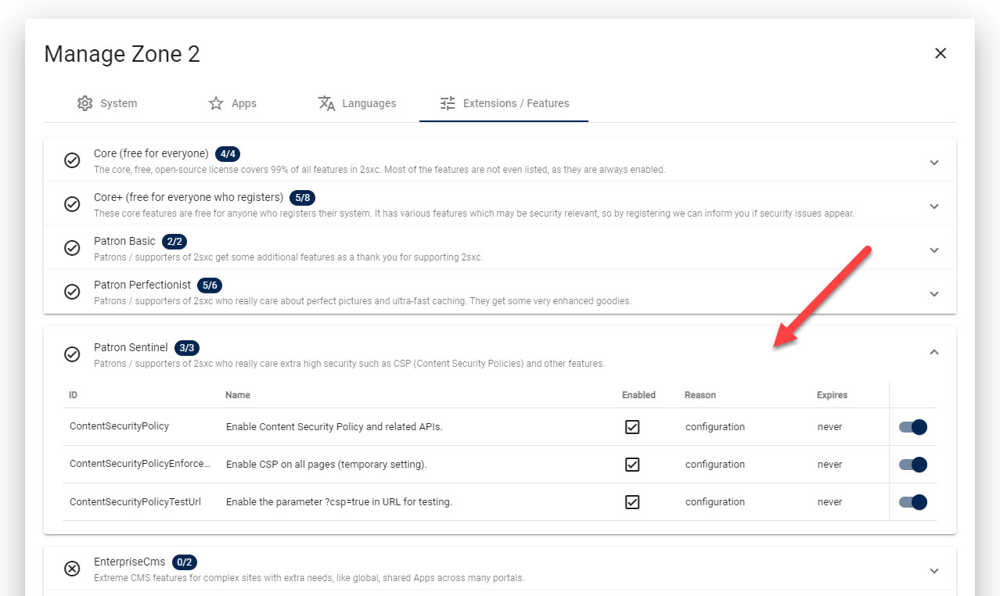
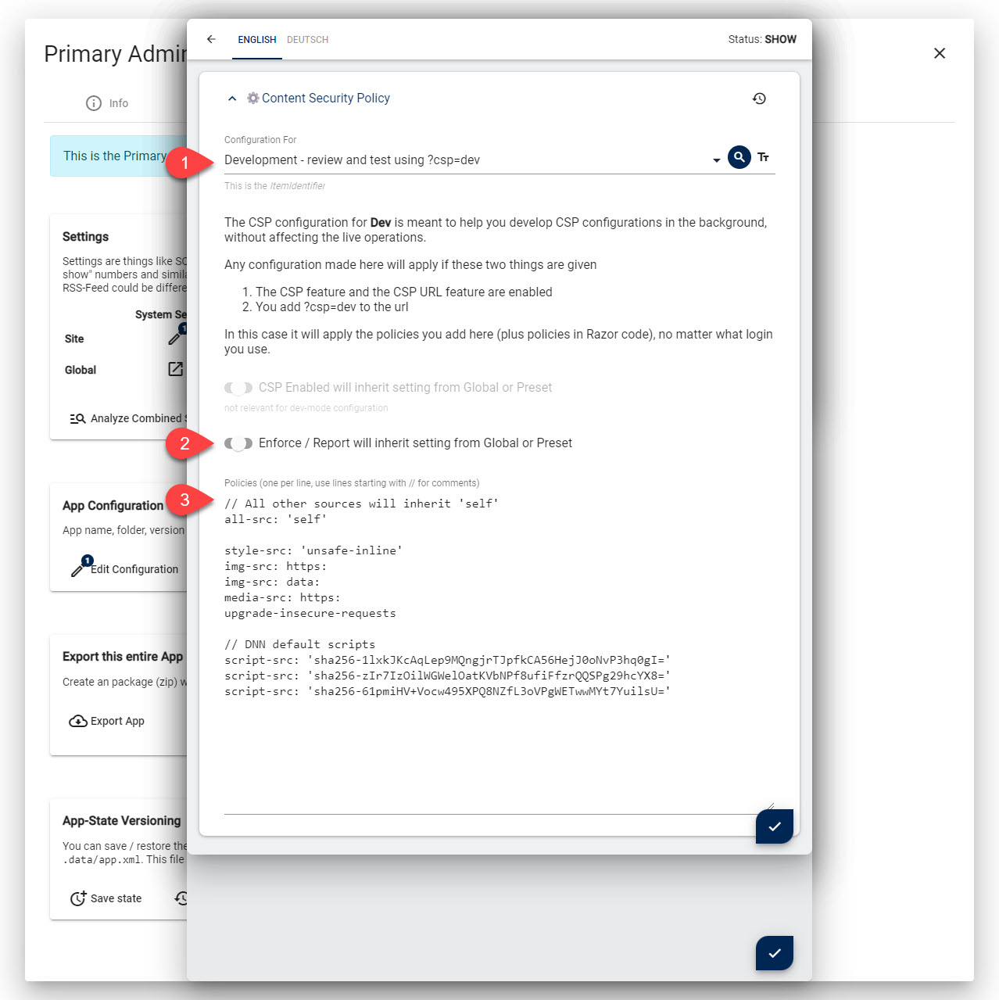

# Content Security Policy (CSP) Guide for 2sxc, Dnn and Oqtane

Content Security Policy (CSP) is a security policy that helps you to protect your web application from [cross-site scripting attacks](https://en.wikipedia.org/wiki/Cross-site_scripting).

In this guide we'll give you step-by-step instructions how to harden a website in no time. 
With a bit of practice you can harden a DNN with Content-Security-Policy in one to two hours 🚀.

🎬 Before you start, be sure you've read the [background, parts and best-practices](xref:Abyss.Security.Csp.Index).

## General Process

1. Plan and prepare
1. Setup CSP for anonymous users in reporting-only-mode with a reporting-server
1. Setup CSP for other users - reporting-only
1. Go productive
1. Monitor for a few days
1. Switch to full-mode

## CSP Preparations

### Planning CSP

> Think before you act

Some choices made ahead of time will save you time and effort later. 

1. Will you make different CSP rules for admins and anonymous users?
1. Will you use a reporting-server?
1. Are you doing this just to "tick the box, yes we did it" or do you want it as secure as possible?


> [!TIP]
> We highly suggest you segment this by users. 
> That will allow you to make much stricter rules for anonymous users and less strict for admins.
> 
> This also gives you a better score in most penetration tests, because they will evaluate the rules for anonymous users.

In addition, we suggest you ask yourself these questions ahead of time, because it will make it easier to hand off work:

1. When you have a situation where a code-change would let you make the rule more strict, will you make the code change, or use a lax rule?
1. When you have CDN resources, will you want to whitelist them, or move them to your server?
1. If you have resources from CDNs, will you whitelist the entire CDNs or just these resources?

### Prepare / Harden a Site for CSP

Before you try to configure CSP it's best to have a good setup which makes it more secure. 

> [!TIP]
> If you follow these recommendations, you will be able to have much stricter policies.
> If you don't, you can still activate CSP but will need a much laxer setup.


Rework your Skins / Apps to match a secure architecture, following the best practices. 
Things such as:

1. Get rid of unused js/css code/files
1. Reduce or better still, remove all jQuery dependent code (especially for anonymous users)
1. Reduce all CDN references to as few as possible
1. Place all your inline scripts and styles in files
1. Change all inline `onclick` or `href:javascript:...` to be bound by the loaded code
1. Use [turnOn](xref:JsCode.TurnOn.Index) to couple the JS with Razor-data such as the ModuleId
1. Use [IPageService.Activate(...)](xref:ToSic.Sxc.Services.IPageService.Activate*) and [IPageService.AssetAttributes(...)](xref:ToSic.Sxc.Services.IPageService.AssetAttributes*) wherever possible

> [!TIP]
> All the latest standard 2sxc apps implement all these best practices. 
> If you still have older Apps, we suggest you install the latest on another server and copy the parts you need. 

### Prepare for Monitoring

Once you've deployed CSP you should get notified of any violations. 
The idea is that violations could just be a sign that something wasn't configured correctly and you may have missed this. 

There are some cool online services which can do this, like https://report-uri.com/. 
So we highly recommend you get an account to use for monitoring.


## Develop CSP Rules

### General Pattern

1. Always do dry-run tests first
    1. Create a new `Dev` policy and set it to _Report-Only_
    1. Test it using `?csp=dev` in the url
1. Choose to start restrictive or lax
    1. either start restrictive and open up the rules step-by-step
    1. or start with lax rules and tighten step-by-step
1. Once it works, apply to production as `...-Report-Only`
1. Repeat with other user roles


### Dry-Run Without Enforcing Policies

First you must enable the dev-feature.



Now you can test the policy by adding `?csp=dev` to any page. 
It will work with any login - as soon as you add the parameter, it will use the `Dev` settings.
This is how the dev settings could look:



### Browser Setup

You will want to have a logged-in window to make configuration changes, and another window to test the policy.
You can either use two browsers (chrome+canary, chrome+firefox, firefox+edge, etc.) 
or a single browser with anonymous/guest modes to have different login states. 

As we're testing this, you will always need to add `?csp=dev` to the url you're testing. 

> [!TIP]
> In the window where you make the configuration, use Ctl+S to just save and not close the widow.
> This will make it much faster to try various setups.

> [!TIP]
> During development, please disable [LightSpeed Cache](xref:Abyss.Lightspeed.Index)
> as it may cache some settings, making it hard to debug. 

### Strict-First Method (recommended)

With Strict-First you start with very strict rules in `...-Report-Only` mode.
You will then review the errors you see in the browsers F12 console.
Then you will loosen up the rules step-by-step.

### Lax-First Method

The Lax-First method assumes that you start with rules that allow everything, then you tighten them up step-by-step.
Here's an example of a very lax rule set, taken from [StackOverflow](https://stackoverflow.com/questions/35978863/allow-all-content-security-policy):

```text
default-src *  data: blob: filesystem: about: ws: wss: 'unsafe-inline' 'unsafe-eval' 'unsafe-dynamic' ;
script-src * data: blob: 'unsafe-inline' 'unsafe-eval' ;
connect-src * data: blob: 'unsafe-inline' ;
img-src * data: blob: 'unsafe-inline' ;
frame-src * data: blob: ;
style-src * data: blob: 'unsafe-inline' ;
font-src * data: blob: 'unsafe-inline' ;
frame-ancestors * data: blob: 'unsafe-inline' ;
```

for 2sxc it can be shorted to:

```
// all-src would always be applied to all rules
all-src * data: blob: 'unsafe-inline'
default-src filesystem: about: ws: wss: 'unsafe-eval' 'unsafe-dynamic'
script-src 'unsafe-eval'
```

You can now start to tighten up the rules.

