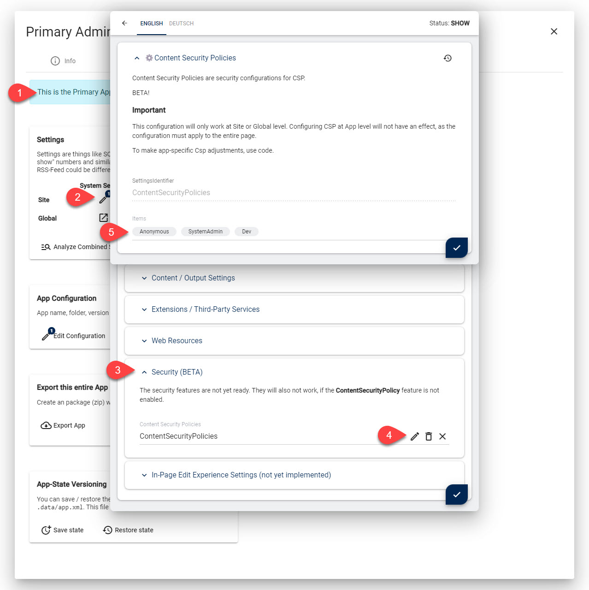

# Content Security Policy (CSP) Parts in 2sxc

Content Security Policy (CSP) is a security policy that helps you to protect your web application from [cross-site scripting attacks](https://en.wikipedia.org/wiki/Cross-site_scripting).

This should give you an overview as to the parts that make CSP work in 2sxc with Dnn and Oqtane.

## 2sxc Implementation

2sxc uses the following parts to make it work

1. [Global Features which can be enabled/disabled](#global-csp-features)
2. [CSP Settings](#settings) at [Site / Global level](#global-and-site-settings)
3. Settings at the [App-Level which will be included automatically](#app-settings)
3. [Policies for different user groups](#content-security-policies-by-user-groups)
3. [Automatic White-Listing of Trusted Resources](#automatic-white-listing-trusted-resources)
4. [C# / Razor APIs](#c-apis-for-advanced-scenarios) for advanced scenarios
4. [Special `all-src` shorthand](#special-all-src-shorthand)
5. [Test configurations which can be activated during development](#test-configurations-for-development)
6. Really [Smart CSP Engine](#smart-csp-engine) which combines everything to make the rules you need
6. [turnOn JavaScript](#turnon-javascript) to run scripts which need Razor data
6. [DNN Page Integration](#dnn-page-integration)
6. [LightSpeed Integration](#lightspeed-integration)


## Global CSP Features

You can manage CSP features in the system administration to enable/disable just the rules you want.

For example, you could only enable dev-rules until you are happy with the configuration.


> [!NOTE]
> The CSP features are very advanced features.
> They are exclusive to patrons who support 2sxc.
> To use them, you must enable the bundle `Patron Sentinel`.

## Settings

### Global and Site Settings

You can configure CSP settings at the site- and global-level.
Anything that is configured at global, but not site-level, will use the global settings.



With these settings you can:

1. Enable/Disable CSP
1. Determine if it's report-only or fully enforced
1. Set a bunch of rules which will be applied

Note that if you set CSP rules at the site level, they will apply to that site and not inherit global settings any more.
This is by design, because it could lead to very confusing, hard-to-debug configurations.


### App Settings

The same configuration which is applied to the site or global can also be configured at the app-level.
The main difference is that this will only be applied to pages which have that App.
In addition, these settigs will be mixed in with the site/global settings.

> [!TIP]
> All default 2sxc Apps have been built with CSP in mind, so all of them already include the CSP settings they need.
> You may need to get the latest releases to see this in action.

## Content Security Policies by User Groups

Different users typically need different CSP policies.
For example, we can really harden the Content Security Policy for end-users, as we can clearly restrict what they need and can do.
Admins and super-users cannot work with the most restrictive rules, because some of the admin-functionality needs more permissions.

2sxc has policies for these user groups:

1. **SystemAdmin** - a policy which will only apply to system admins
1. **SiteAdmin** - a policy which will only apply to site admins
1. **Anonymous** - a policy which will only apply to anonymous users
1. **Default** - the default policy which is used if no other policy is defined
1. **Dev** - a policy which will only apply if the url has `?csp=dev`


## Automatic White-Listing Trusted Resources

As a developer, you want your code to just-work.
So ideally any JS/CSS you add, is automatically white-listed.
But we cannot just white-list every `<script>` tag in your code, as that would make CSP useless again.
So to make this easy _and_ secure, there are two ways to white-list your trusted resources.

> [!TIP]
> All default 2sxc Apps apply these practices.
> You may need to get the latest releases to see this in action.


### Option 1: Registered Web-Resources

Every registered web-resource used by your code will be white-listed automatically.
[Web Resources are registered in the Settings](xref:Basics.Configuration.Settings.WebResources)
at global, site or app-level, and then activated using the [Razor API](xref:ToSic.Sxc.Services.IPageService.Activate*).

```c#
Kit.Page.Activate("fancybox4", "MySpecialFormJs");
```

<a name="auto-white-listing-explicit"></a>

### Option 2: Explicitly Whitelist Assets

If you have inline scripts or styles, you can mark them as trusted by using the [Razor API](xref:ToSic.Sxc.Services.IPageService.AssetAttributes*).

```html
<script src="@App.Path/@Edition/dist/scripts.min.js" @pageSvc.AssetAttributes()></script>
```

The `AssetAttributes(...)` will also do other things like set script priorities.
But anywhere it's applied it will also mark it for whitelisting in CSP (if CSP is enabled).

> [!TIP]
> The Asset-Attributes will add a secret [nonce](https://content-security-policy.com/nonce/) to the HTML.
> Internally it will be processed and removed again, but this ensures that the HTML can carry a single-use key
> to whitelist the resource, while making it impossible for an attacker to guess the key.


## C# APIs for Advanced Scenarios

The previously mentioned features cover 99.9% of all use cases.
We ourselves have not seen a scenario that would need more than this.
But you may want to create other rules for your own use-cases.
In this case, you can use the [IPageService.AddCsp](xref:ToSic.Sxc.Services.IPageService.AddCsp*) method.


## Special `all-src` Shorthand

CSP is a funny beast. If you set a rule such as `default-src: https:`
it will be be applied automatically for js, css, fonts etc.
...But only if you don't set those rules as well.
As soon as you set `script-src: 'self'`, it will not include the previous `https:` rule.

I assume there are cases where this makes sense.
But in our experience this leads to a lot of mistakes.
For example, if the site already whitelists `https:` an an App also needs whitelist another font,
it would have to also manually add all the previous rules.
We felt this is not a good idea.

So we've added a special `all-src` shorthand which will apply the rule to all resources.
It works as follows:

1. Everything you add to `all-src` is added to `default-src`
1. Whenever other rules are added - such as `font-src` - it will add all the rules ever added to `all-src` as well


## Test Configurations for Development

Testing and developing your CSP rules can be very tricky, especially on a live site.
Because if the HTTP headers block something, the site may become unusable.
There are three distinct challenges:

1. Step-by-step tweaking your rules
1. Improving your rules on a site which already has CSP
1. Testing rules for different roles / user-groups

...and all this on a live site, without accidentally blocking the site for everyone.

2sxc makes this possible with a combination of 3 features:

1. A global feature which enables this dev-mode
1. A special Setting called `Dev` which is only used for development
1. A url-parameter `?csp=true` which will switch a page to use the `Dev` settings


This way you can test modified rules in all kinds of combinations and with various users.
Once you're happy, you can then copy/paste the configuration to the live Settings.


## Smart CSP Engine

Technically the HTTP-header can only be set once.
So to make it possible to merge rules / configurations from the Site, App and Razor code,
we've implemented a Smart Engine.

It will collect all the requirements and before rendering the final page,
it merges everything to a final rule-set and generates the HTTP-Header.

## turnOn JavaScript

2sxc introduced [turnOn](xref:JsCode.TurnOn.Index) in v12.04 in preparation for CSP.

It is a crucial part in the entire concept, because it allows you to place your scripts in external files,
and still use parameters/configuration from Razor (such as the ModuleId) in your scripts.
Do check it out 😉.


## DNN Page Integration

All of this leaves just one final piece of the puzzle:
DNN Pages without 2sxc on it. We also want to protect these pages.

Technically this requires the CSP Smart-Engine to be activate on the skin.
We do this automatically, the moment you access DynamicCode using the [IDynamicCodeService](xref:ToSic.Sxc.Services.IDynamicCodeService) on the skin.

To make it work, you must get DynamicCode of the Site or any App from the theme.
The rest will happen automatically. Something like this will do the trick:

```
<%-- This has all common 2sxc services and GetScopedService(...)  --%>
<%@ Import Namespace="ToSic.Sxc.Services" %>
<%-- This namespace provides IDynamicCode --%>
<%@ Import Namespace="ToSic.Sxc.Code" %>
<script runat="server">
  // Get the Dynamic Code of this Site = OfSite() and keep for re-use
  protected IDynamicCode SiteDynCode { 
    get { return _sdc ?? (_sdc = this.GetScopedService<IDynamicCodeService>().OfSite()); } 
  }
  private IDynamicCode _sdc;
</script>
```

_Note that your code must access the `SiteDynCode` somewhere so the `OfSite()` is actually run._

## LightSpeed Integration

We've ensured that CSP will also work with [LightSpeed Cache](xref:Abyss.Lightspeed.Index).
So even cached modules and Apps will still apply the CSP rules.


## Next Steps

👉🏼 [Learn how to setup CSP in your website](xref:Abyss.Security.Csp.Index)
