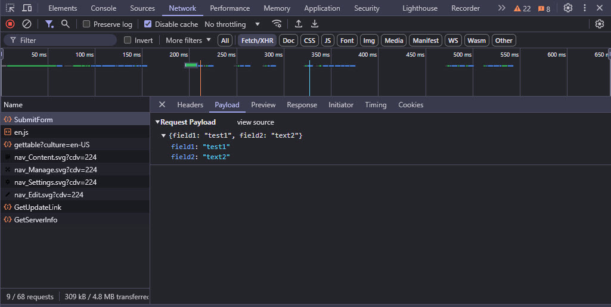
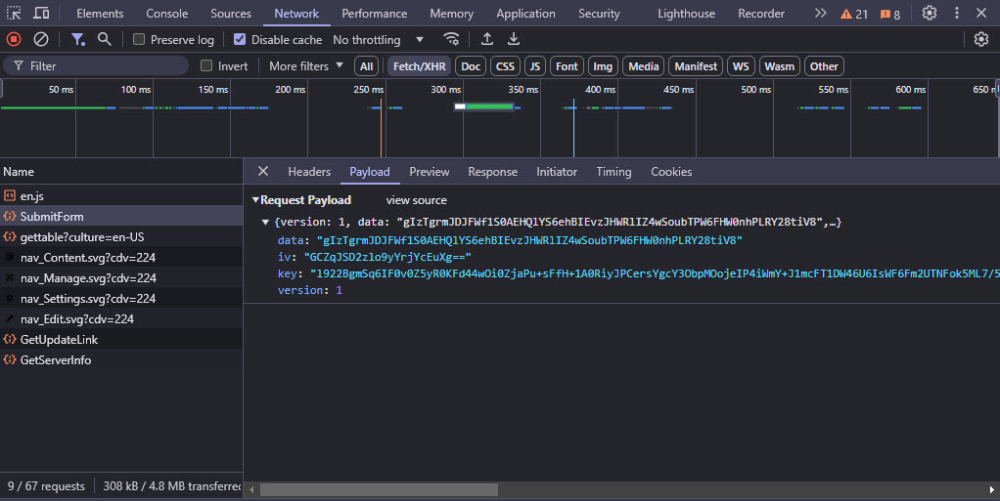

# Network POST Body Encryption (new v19)

2sxc 18.04 introduces a new feature to encrypt the HTTP POST Body.
Reason is for sensitive or personal data which may pass through CDNs or other proxies.

Note that this requires the feature [Sentinel NetworkDataEncryption feature](https://patrons.2sxc.org/features/feat/NetworkDataEncryption).

## What it Does

When this feature is active, your POST data will be encrypted before it is sent to the server.
This is useful when you are sending sensitive data, like passwords, credit card numbers, etc.
This will prevent the data from being intercepted.

The following images show the difference between sending data unencrypted...



... and encrypted.



## How it Works

The system uses a public key to encrypt the data, and the server uses a private key to decrypt it.
The private key is only known to the server and is never sent to the client.

The client then uses the latest [WebCrypto API](https://developer.mozilla.org/en-US/docs/Web/API/Web_Crypto_API)
to encrypt the data before it is sent to the server.

Since PKI is only meant for short messages,
the client will use the Crypto API to generate a **secure, random AES Key** which is used to encrypt the payload.
The AES-Key in turn is encrypted using the public key, so only the server can access the AES key.

In addition, the Crypto API generates an **IV (Initialization Vector)**  which prevents the same data from being encrypted the same way each time.

All of this is then sent to the server, which uses it to decrypt the data.

> [!TIP]
> All of this happens fully automatically,
> just by a) activating the feature in 2sxc and b) enabling it in the view you want to secure
> and c) adding the `[SecureEndpoint]` attribute to your API.

## How it Runs

1. The feature is activated by the `Network.EncryptBody` feature in Razor using `@Kit.Page.Activate("Network.EncryptBody")`
1. The feature will automatically add a public key to the page
1. The public key will be used to encrypt the POST body by the `$2sxc` JavaScript API
1. The encrypted POST body will be sent to the server
1. The server API must then use the [`[SecureEndpoint]`](xref:ToSic.Sxc.WebApi.SecureEndpointAttribute)
   attribute to decrypt the body (remember to add `@using ToSic.Sxc.WebApi`)

## Default Behavior

Basically if you

1. activate the feature in your Razor
1. use the `[SecureEndpoint]` attribute in your API

...everything will be encrypted and decrypted automatically, as the setting `encrypt: "auto"` is assumed.

> [!IMPORTANT]
> In scenarios where the encryption fails, the system will automatically fall back to sending the data unencrypted.
> Read on in case you prefer not to submit unencrypted data.


## Enforcing Encryption / No-Encryption

If you want to enforce encryption (refuse to send unencrypted data), you must use `encrypt: true` in your JavaScript.

If you want to enforce no-encryption even if the public key is provided, you must use `encrypt: false` in your JavaScript.

```javascript
// Get the sxc object for the current module (there are many ways to do this)
const sxc = $2sxc(moduleId);

// With encryption enforced - will throw an error if encryption is not possible
sxc.webApi
  .fetchJson('app/auto/api/SomeEndpoint/SomeMethod', data, { encrypt: true })
  .catch(function(error) {
    // Do some error handling, show a message, whatever
    console.error('Handle error in promise: ', error);
  });
```

## Important: WebCrypto API requires HTTPS

> [!WARNING]
> Because of the way that the WebCrypto API works, it will only work on HTTPS sites, and will not work on HTTP sites.
>
> If you wish to use this feature on an HTTP site, you must provide a polyfill.

---

<!-- Shortlink: <https://go.2sxc.org/csp> -->
