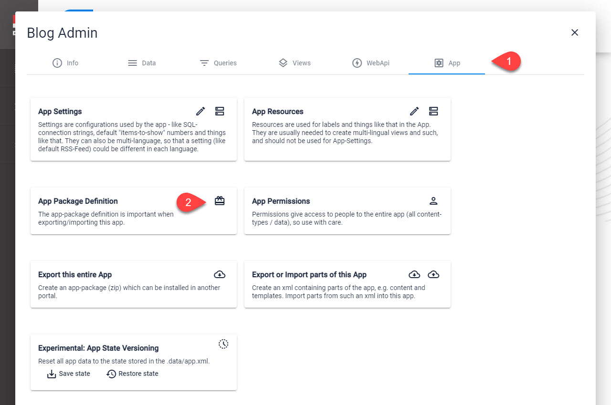
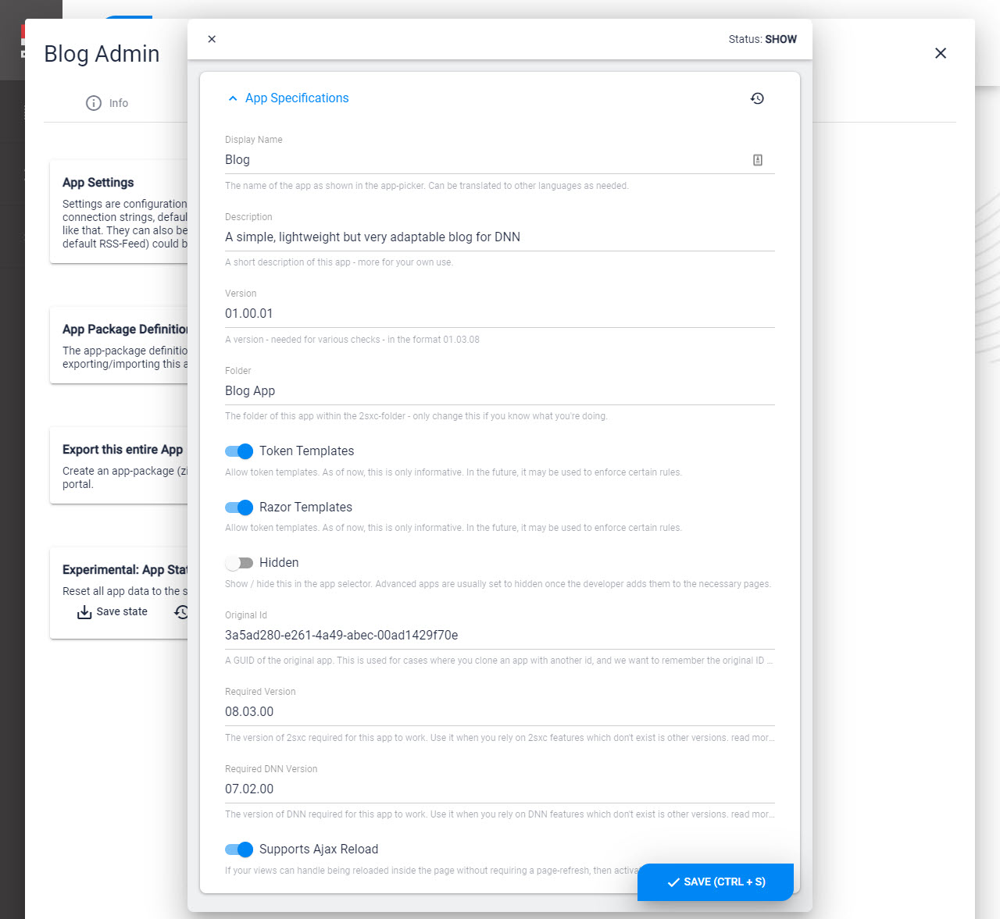

# App Configuration

[!include]

Every App has a **Configuration** Entity which describes things like

1. App Name
1. App Version
1. Folder (within the 2sxc-folder)
1. Minimum version of Dnn needed for the App to work
1. Minimum version of 2sxc needed for the App to work
1. etc.

## Edit App Configuration

This is where you can find the App Configuration

On **2** you can configure the permissions you need:

1. **Display Name**  
  The name shown in the app-picker for the content-editor. It is also used to name the ZIP-package if you ever export the app.
1. **Description** 
  Just an informative description
1. **Version**  
  A version number, will also be used in the package-name when exporting
1. **Folder**  
  The folder within the [portal]/2sxc/ where all the templates, javascripts and other assets are stored. If you touch this, remember to rename the folder as well. 
1. **Allow Token Templates**  
  Just a yes/no if these are allowed in this package. At the moment it has no effect, just for your own information. At a later time it may prevent certain templates from working if disabled. 
1. **Allow Razor Templates**  
  Same as Allow Token Templates.
1. **Original Id**  
  A (optional) guid of the original App which was used to generate this current App. This is only important, if you reset the App-Guid when exporting it; it will help show the correct Getting-Started in the App even if the App-Guid was reset. 
1. **Required Version (added in 08.03.03)**  
  Is used to check if the app can run, or otherwise warn the user. It will use the .net version compare.  
  _Example value: "08.03.00"_
1. **Required DNN Version (added in 08.03.03)**  
  Is used to check if the app can run, or otherwise warn the user. It will use the .net version compare.  
  _Example value: "07.02.00"_

## Difference App Configuration / App Settings

The  is a system Entity and 2sxc needs it for the App to work properly. 

The  can contain any information you configure it to have, and the values are only used in the App itself. 

## Use in C# Code (Razor / WebAPI)

Most of this information is available on the `App` object, like `App.Path`. Read about the [C# API here](xref:NetCode.DynamicCode.Objects.App.Index). 