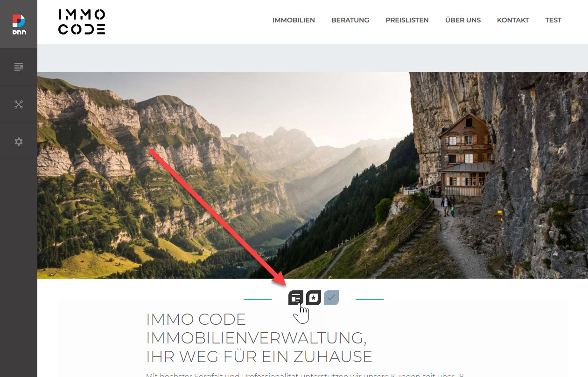
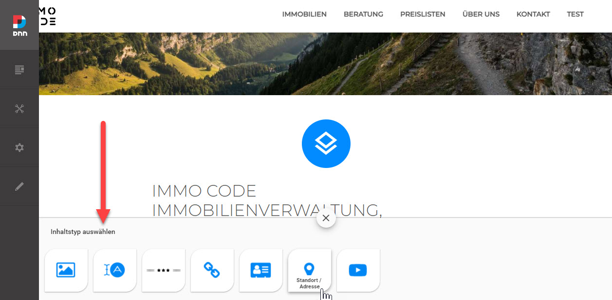
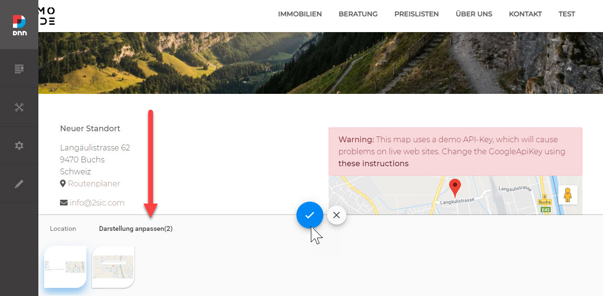

# The _Content_ App

The Content-App is a special App in each Site which is automatically created whenever you start using 2sxc on a site. The core purpose is content-editing like adding text, images, links and simple decorations (like separation lines) to the page.

> [!TIP]
> The content App has some special behavior and limitations by design.

## Special Behavior of _The Content_ App

When adding _the_ Content-App to a page, the dialog which appears will ask the editor to choose the _Content-Type_ (like _Image_) and then how to show it (like _Full-Size_). This is different from all other Apps where the editor will first choose the App (like _Blog_), and then the functionality (like _Tag-Cloud_).

_The_ Content App is quickly added as another module:

It will _first_ show the [Content Type](xref:Basics.Data.ContentTypes.Index) picker:

...and _then_ the [View](xref:Basics.App.Views.Index) to use for this Content-Type.

## Pre-Built Content Templates

_The_ Content App can auto-install prepared templates which are specifically designed for this use case. This is why the installer looks different for _The_ Content App than for normal Apps.

> [!TIP]
> Instead of installing the default set of Content-Types and Views, you can also skip this and just configure your own or import your preferred default Content-App.
>
> Use this [✅ checklist to create a custom template app](https://azing.org/2sxc/r/YHKvArc6)
>
> Use this [✅ checklist to import the custom app](https://azing.org/2sxc/r/t5OIFlI6)

## Special Limitations of The Content App

Since the Content-App is always there by default and the purpose is to add/edit simple content, it's limited by design to _not_ have some functionality other Apps have. This is mainly to protect the developer from building solutions with a bad user experience, since anything complex should be self-contained in it's own App. The limitations are:

1. No [VisualQuery](xref:Basics.Query.VisualQuery.Index)
1. Now [Custom Web APIs](xref:NetCode.WebApi.Index)

## Technical Details

1. Each Site/Portal has an own Content App
1. The ID of the Content-App is `Content` while other Apps have a GUID as the ID

---

## Learn More

1. [The App Folder Structure](xref:Basics.App.FoldersAndFiles.Index)
1. [App Icons](xref:Basics.App.FoldersAndFiles.Icons)
1. [Bundling / Optimizing assets](xref:Basics.Server.AssetOptimization.Index)
1. [✅ How to reset the content-app to factory defaults](https://azing.org/2sxc/r/Ll3AalkO)

## History

1. Introduced in 2sxc 1.0
1. Enhanced to have multi-language App [Resources](xref:Basics.App.Settings) and [Settings](xref:Basics.App.Settings) 2sxc v11
1. Extended to contain [Settings and Resources which apply to the whole site](xref:Basics.Configuration.Index) in v12.04
1. Massively enhanced to be Hybrid (Dnn/Oqtane) and follow best practices in 12.05
1. Dropped support for site-wide settings as it's moved to the [Primary App](xref:Basics.App.PrimaryApp.Index) in v13.0
