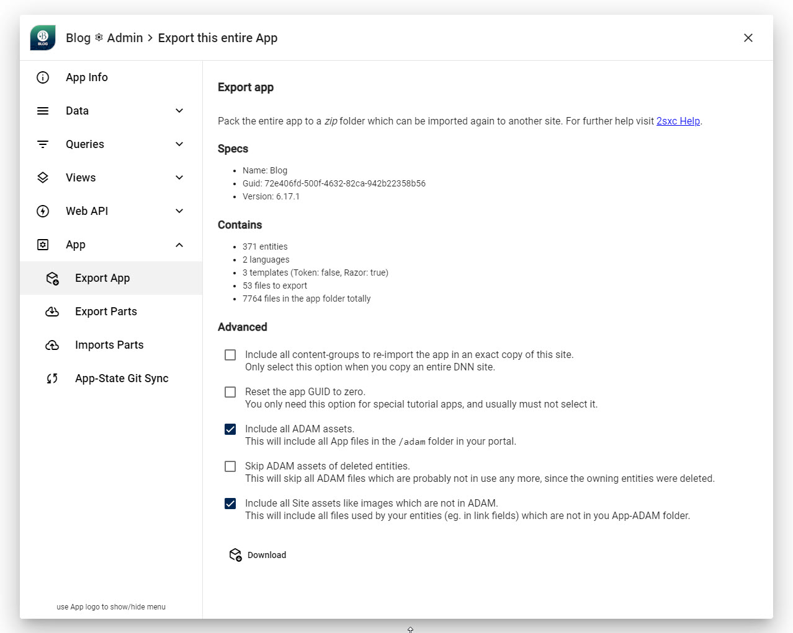

# App Export as ZIP

[!include]

Every App and parts of it can be _Exported_ as a ZIP which can then be distributed and re-imported.

## What's in the ZIP?

The ZIP contains everything about the App, including:

1. The data in an XML file
1. The App Settings (they are also just data)
1. The views and assets for the views such as CSS as normal files
1. The ADAM folder of the App containing assets which "belong" to this App
1. Any other files referenced by data in the app - like files in the `/Portals/0` folder

## How to Export

You can find the export dialog here.
What you see is quite self-explanatory:

1. The **Specs** Show some specs just so you see what version it will be ec. in case you need to change it first.
1. The **Contains** shows what will be exported.  
    _Note: some files such as the `node_modules` folder are not exported, as they are not needed in the target environment. This can be reconfigured._
1. **Advanced** lets you  make some advanced settings.

## Advanced Settings

### 🔳 Include all Content Groups

This is disabled by default.

Normally you want to export the App to install in another site, and then place things there anew as you need.
In that case, you don't need this checked.

But if you are migrating a site, then the **Content Groups** contain the references for what content to show on what page,
so you may want to include this.

### 🔳 Reset the GUID

Apps have a GUID to identify them.
Normally you will want the GUID to stay the same.

But in rare cases where you want to create a different App, you will want to reset the GUID.

### ✅ Include all ADAM Assets

By default, all assets belonging to the App are included.
These are in the `/Portals/x/Adam/[AppName]/` folder.

Sometimes you will want to skip these, for example if there are too many assets and the ZIP would become too large.
In such a scenario you would want to uncheck this,
and then manually copy the assets to the new site - ideally before importing the App, so the references are re-assigned correctly.

➡️ This feature is reserved to [patrons](xref:Patrons.Site).

### 🔳 Skip ADAM Assets of Deleted Entities

This is disabled by default.
If enabled, it would skip assets of deleted entities, as these are probably not in use any more.

➡️ This feature is reserved to [patrons](xref:Patrons.Site).

### ✅ Include all Site Assets like Images which are not in ADAM

By default, all assets _outside_ of the App, which are correctly referenced, are included.
These are in the `/Portals/x/` folder.

Sometimes you will want to skip these, for example if there are too many assets and the ZIP would become too large.
In such a scenario you would want to uncheck this,
and then manually copy the assets to the new site - ideally before importing the App, so the references are re-assigned correctly.

➡️ This feature is reserved to [patrons](xref:Patrons.Site).

---

## History

1. Introduced ca. 2sxc 2
1. New Asset features added in 2sxc 18.01

Shortlink: <https://go.2sxc.org/app-export>
