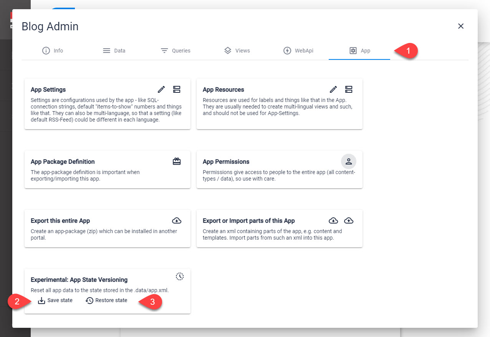
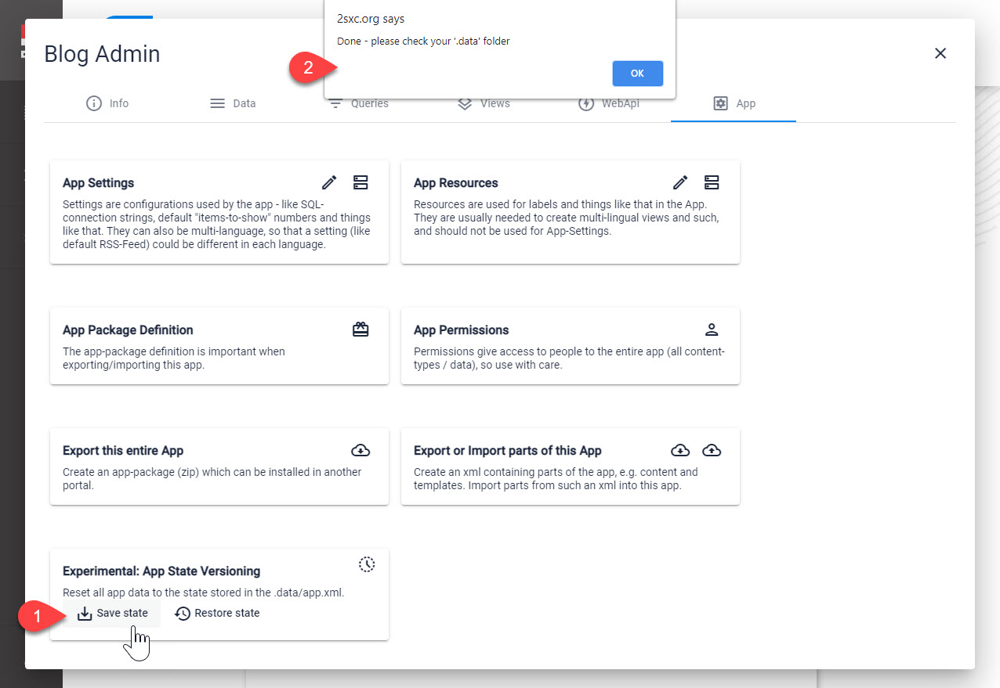
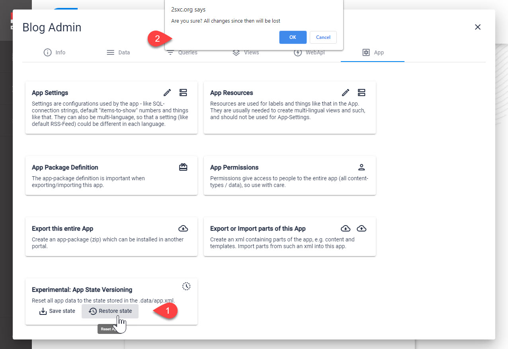

# App Git Integration

In 2sxc you can store the current App State to an XML file and restore it. 

## Why Store and Restore the App State

1. To save to git, and later see how the state got changed
1. To save to git, test some changes, and roll back to the previous state
1. To push to a remote repo (like Github) and pull again from another installation

## What's Included and What Not

If you save an [App Folder](xref:Basics.App.FoldersAndFiles.Index) to git...

* ...it contains everything in the App folder and [App Assets](xref:Basics.App.FoldersAndFiles.Assets) (unless you explicitly added it to the `.gitignore` file)
* ...it _may_ contain the App State (all the data items including configuration and settings) _if_ you previously exported them (see below)
* ...it _doesn't_ contain the [Content Assets](xref:Basics.Content.Assets) (images etc.) as that's in the ADAM folder of the App

## Saving / Restoring App State (Data)

This is where you can find the App State Save/Restore

On **2** you can save the state (it will be stored in `[app-root]/.data/app.xml`)

On **3** you can restore the data from this file:

## History

1. Export introduced ca. 2sxc v5
1. Re-Import introduced in 2sxc v11.11