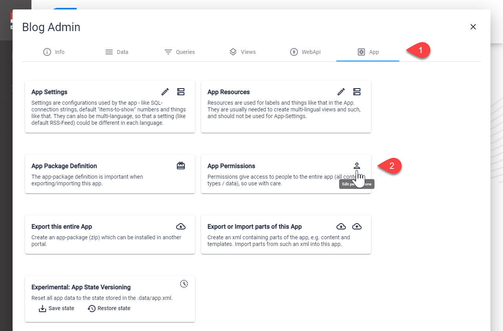

# App Permissions

[!include]

Every App has **Permissions** which apply to all data in the App. 

## Why would you use this?

Sometimes you have an App which needs to grant permissions to a specific user group, like edit permissions to all members of `News Editors`. In such cases you _should_ apply these permissions to the Content-Types, but you can also apply it at App level. 

> [!WARNING]
> Incorrect permission configuration can leave your App vulnerable to unexpected security risks. 
>
> This is especially important for **App Permissions** which apply to the entire App.
> 
> You should almost never use these permissions. 

## Examples

There are no examples for this, as it really only makes sense in very advanced use cases and usually should not be applied. 

## Edit App Permissions

This is where you can find the App Permissions

On **2** you can configure the permissions you need:

