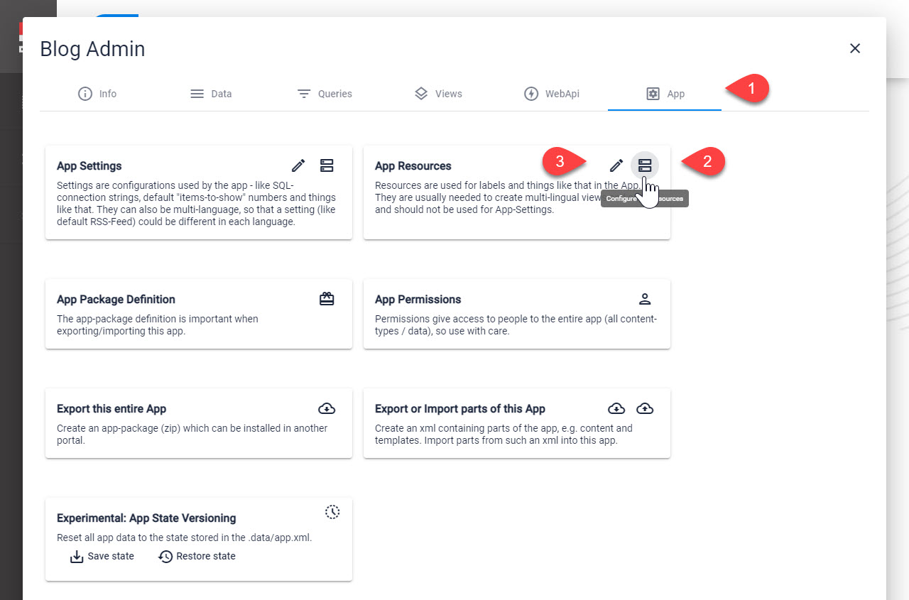
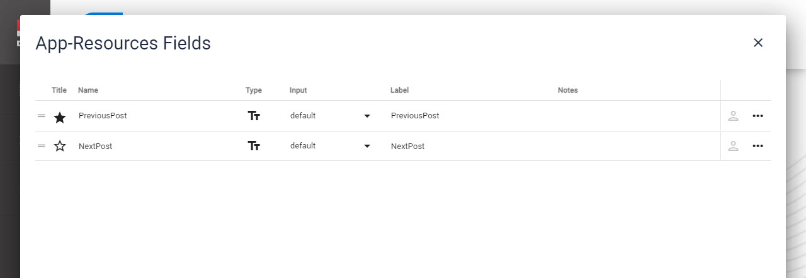
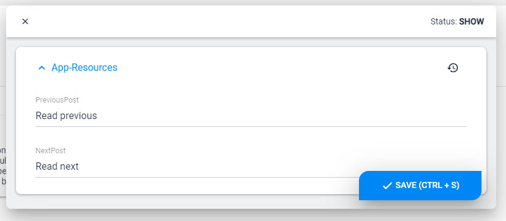

# App Resources

[!include]

Every App has a **Resources** Entity. The fields available can be anything your App needs, so there is no pre-defined set of fields. 

## Edit/Configure App Resources

This is where you can find the App Resources

On **2** you can configure the fields you need, just like any other Entity:

On **3** you can set the values you need

## Why would you use this?

Many templates may have special labels, intro-texts or buttons which would benefit from simple editing and from multi-language capabilities. This is what the **App Resources** are for. 

## Use in C# Code (Razor / WebAPI)

In 2sxc 12.04+ you should use the new `Resources` [Stack object](xref:Basics.Configuration.ResourcesStack) which merges resources from different sources incl. the App Resources. 
See [Resources C# Docs](xref:NetCode.DynamicCode.Objects.Resources).

In previous version you can access it on the `App.Resources` [Dynamic Entity](xref:NetCode.DynamicData.DynamicEntity), like `App.Resources.Introduction`. Check out the [App API docs](xref:NetCode.DynamicCode.Objects.App.Index)

## Use in Token Templates

Tokens templates are much more limited, but you can access these values using `[App:Resources:...]` - for example `[App:Resources:Introduction]`.

_The new v12 Resources-Stack is not available in tokens. If you think you need it, please post an issue on github._

## Don't use in VisualQuery

You _could_ also access these properties in [VisualQuery](xref:Basics.Query.VisualQuery.Index), using tokens like `[App:Resources:Introduction]` - but this is not recommended, as you should _not_ use **Resources** for this. Use  instead.

## Don't Use Resources for Settings

Resources should only be used for labels, logos, introduction-texts and similar. For **Settings** always use .

---

## History

1. Introduced in 2sxc 6.0
1. Extendend [_The_ Content App](xref:Basics.App.ContentApp.Index) to have multi-language App [Resources](xref:Basics.App.Settings) and [Settings](xref:Basics.App.Settings) 2sxc v11
1. Created the global [Resources](xref:Basics.Configuration.ResourcesStack) in v12.04
1. Placed the global Resources in the [Primary App](xref:Basics.App.PrimaryApp.Index) in v13.0