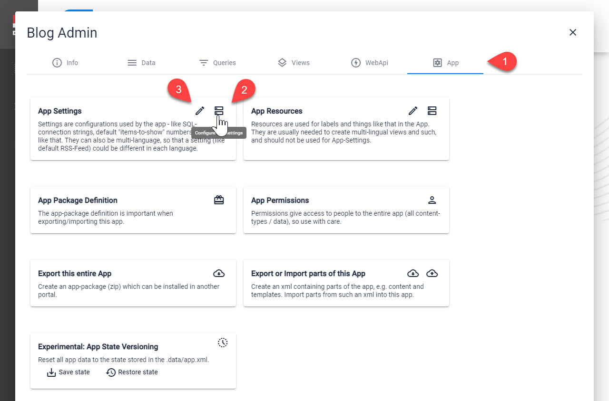
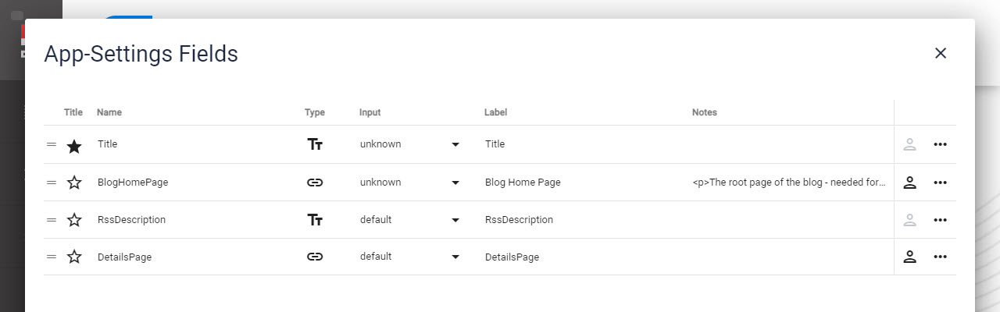
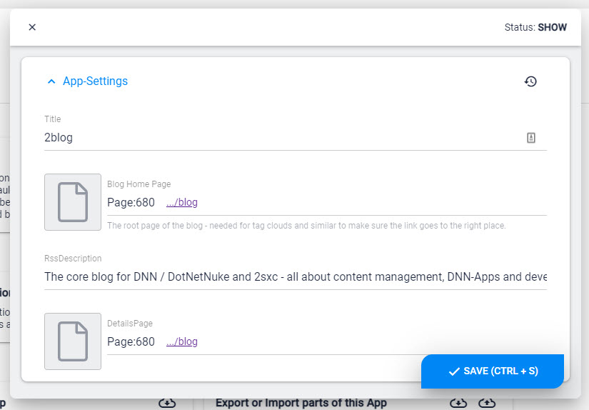

# App Settings

[!include]

Every App has a **Settings** Entity. The fields available can be anything your App needs, so there is no pre-defined set of fields. 

## Edit/Configure App Settings

This is where you can find the App Settings:

On **2** you can configure the fields you need, just like any other Entity:

On **3** you can set the values you need

## Why would you use this?

Imagine a Gallery App where each instance (Module) has settings like animation speed. You would place the default values in the **App Settings** so that by default all instances would behave the same, and you can still change this in one central location. 

## Example from the Content App

In newer versions, the Content-App has some App-Settings to store

* Google-Maps API keys
* Bootstrap versions (CSS Framework) to load if the Theme doesn't have Bootstrap activated

## Difference App Configuration / App Settings

The  is a system Entity and 2sxc needs it for the App to work properly. 

The  can contain any information you configure it to have, and the values are only used in the App itself. 

## Use in C# Code (Razor / WebAPI)

In 2sxc 12.04+ you should use the new `Settings` [Stack](xref:Basics.Configuration.SettingsStack) object which stacks settings from different sources incl. the App Settings. 
See [Settings C# Docs](xref:NetCode.DynamicCode.Objects.Settings).

In previous version you can access it on the `App.Settings` [Dynamic Entity](xref:NetCode.DynamicData.DynamicEntity), like `App.Settings.AnimationSpeed`. Check out the [App API docs](xref:NetCode.DynamicCode.Objects.App.Index)

## Use in Token Templates

Tokens templates are much more limited, but you can access these values using `[App:Settings:...]` - for example `[App:Settings:AnimationSpeed]`

_The new v12 Settings-Stack is not available in tokens. If you think you need it, please post an issue on github._

## Use in VisualQuery

You can also access these properties in [VisualQuery](xref:Basics.Query.VisualQuery.Index), also using tokens like `[App:Settings:DefaultCategory]`

_The new v12 Settings-Stack is not available in Visual Query. If you think you need it, please post an issue on github._

## Using Settings in Multi-Language Scenarios

Settings are normal Entities, and as such can be multi-language. We strongly recommend to limit the use of multi-language settings, as it can often lead to unexpected results. 

## Don't Use Settings for Labels

Remember to use  for button-labels, titles etc. and not Settings, as this would confuse the users. 

---

## History

1. Introduced in 2sxc 6.0
1. Extendend [_The_ Content App](xref:Basics.App.ContentApp.Index) to have multi-language App [Resources](xref:Basics.App.Settings) and [Settings](xref:Basics.App.Settings) 2sxc v11
1. Created the global [Settings](xref:Basics.Configuration.SettingsStack) in v12.04
1. Placed the global Settings in the [Primary App](xref:Basics.App.PrimaryApp.Index) in v13.0