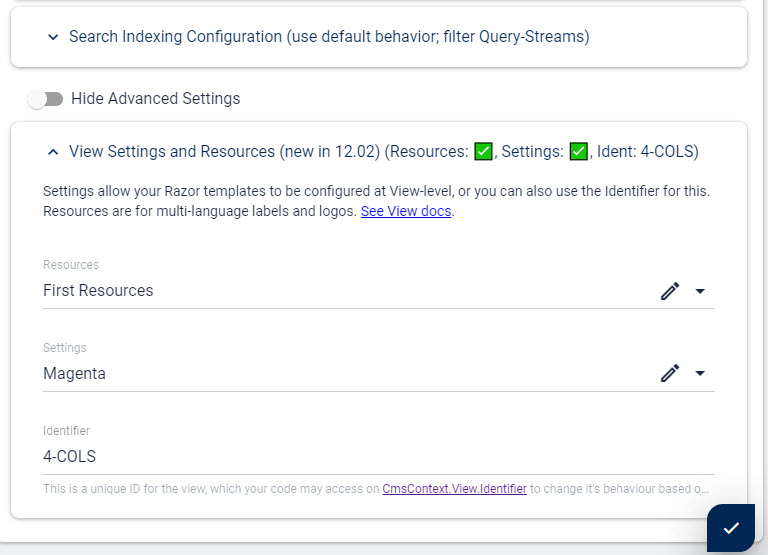

# View Resources (Advanced ⚠)

[!include]

Starting in 2sxc 12.02 you can also now create custom **Resources** for a [View](xref:Basics.App.Views.Index). 

## Why Use View Resources?

If Views need multi-language texts or images then the Resources would be the right place to handle them. 

Examples

1. button-labels
1. Views whichs how tables may have a lot of row or column labels

> [!TIP]
> View Resources complement [App Resources](xref:Basics.App.Resources). 
> The difference is that App-Resources are available on all Templates while View-Resources are only available on the Views they are configured on.

> [!TIP]
> If you can use View-Resources on multiple views. 
> This is great in cases where the same template is used for multiple views.  
> But you can also choose to use different Resources - just how you need it. 

> [!TIP]
> Remember that each Entity/Item can also be multi-language, so you only need View-Resources for static-localization.
> This means texts/labels/images which are the same every time the View is used. 

## How do View Resources Work?

View Resources are standard Entities in 2sxc. So you'll have to create a [Content-Type](xref:Basics.Data.ContentTypes.Index) for this containing the fields which you want to configure. 

To keep the normal `Data` section clean, the content-types are in the [Scope](xref:Basics.Data.Scopes) `System.Configuration`.

For multiple views you may end up using the same Resources Content-Type or create a new Content-Type for each view - as you need it. 

## How to Setup View Resources?

1. First create the Content-Type in the Scope `Configuration` and add the fields you want to configure
1. Then in the view-configuration select that Content-Type (it will only show types on `Configuration`) and either create a new entity or select an existing one.

## How Can I Access View Resources in Razor?

These can be found as a [Dynamic Stack Object](xref:ToSic.Sxc.Data.IDynamicStack) on `Resources` - see [Resources Docs](xref:NetCode.DynamicCode.Objects.Settings).

## How Can I Access View Settings in Tokens?

As of now this is not possible. 

---

## History

1. Made available to Razor in 2sxc 12.02