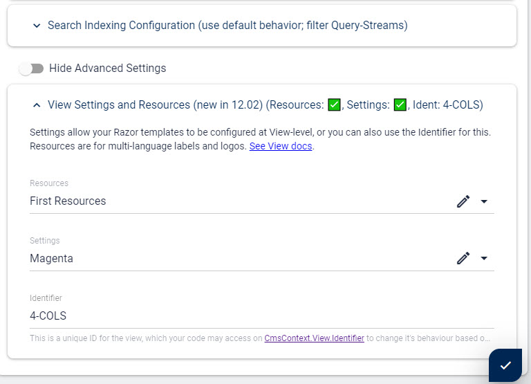

# View Settings (Advanced ⚠)

[!include]

Starting in 2sxc 12.02 you can also now create custom **Settings** for a a [View](xref:Basics.App.Views.Index).

## Why Use View Settings?

This is great if you have multiple Views showing the _same_ [Template](xref:Basics.App.Templates) which has a list of settings to be applied. 
Or if you want to keep the aspects building a View be configurable in the UI. 

## Simple Cases where the Identifier is Sufficient

> [!TIP]
> In many cases it's easier to just use the [Identifier](xref:Basics.App.Views.Index) and set some variables in your code.
> But in advanced cases where you may add more views in time and would like to have the variations configurable, the **View Settings** are the way to go.

## How do View Settings Work?

View Settings are standard Entities in 2sxc. So you'll have to create a [Content-Type](xref:Basics.Data.ContentTypes.Index) for this containing the fields which you want to configure. 

To keep the normal `Data` section clean, the content-types are in the [Scope](xref:Basics.Data.Scopes) `System.Configuration`.

For multiple views you may end up using the same Settings Content-Type or create a new Content-Type for each view - as you need it. 

## How to Setup View Settings?

1. First create the Content-Type in the Scope `Configuration` and add the fields you want to configure
1. Then in the view-configuration select that Content-Type (it will only show types on `Configuration`) and either create a new entity or select an existing one.

## How Can I Access View Settings in Razor?

These can be found on the [Dynamic Stack Object](xref:ToSic.Sxc.Data.IDynamicStack) on `Settings` - see [Settings Docs](xref:NetCode.DynamicCode.Objects.Settings).

## How Can I Access View Settings in Tokens?

As of now this is not possible. 

---

## History

1. Made available to Razor in 2sxc 12.02