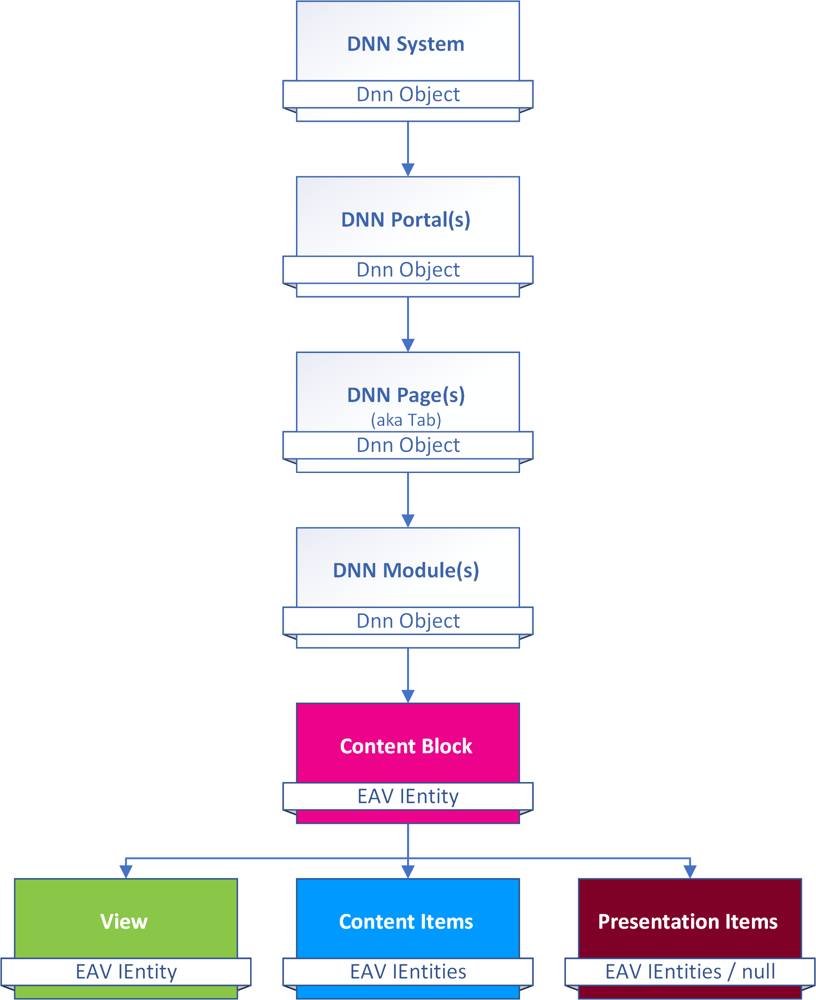

# 2sxc Content in Dnn

The vision of 2sxc is to be cross-platform, so we hope one day it will also run on NopCommerce and other systems. This is how it's integrated into Dnn. 

## What Dnn References to

### Portal to ZoneId Mapping

The EAV has a virtual container called a **Zone** which is similar to a Portal in Dnn. The IDs will not match though, so each Portal has a setting called `ToSIC_SexyContent_ZoneID` which contains the ZoneId for that portal. 

When 2sxc is used the first time on a portal, it will detect a missing ZoneId, which triggers zone creation and sets this value. 

### Module-Installation to App-Installation Mapping

A Dnn Module installation corresponds to an App installation. Internally there is no mapping, as it is not necessary. 

There is an important difference though: in Dnn, each installed Module is installed at the _System level_, so installed Modules are available on all Portals. On the other hand, Apps are installed at the _Zone (Portal) level_, so each app is only available on that portal. Customizations to the app also only affect that portal, and each Portal could have the same App installed in different versions. 

> [!NOTE]
> Technically there are a few ways to share Apps, their data, templates etc. across Portals, but these are fairly advanced scenarios. 

### Module-On-Page to ContentBlock Mapping

In Dnn each modules has _Module Settings_ to store configuration. 2sxc stores these two pieces of information in the Module Settings:

1. App ID - what app is being shown here
1. _Content Block_ ID - the GUID of the _Content Block_ Entity containing the rest of the configuration

Understanding how this ties in helps you make better decisions. Make sure you also read 

## Basic Setup: Content is assigned to the module

This is the most common setup - and used in the **Content** module as well as in many **App** modules, which rely on the author to manually create content for this specific module. It's not usually used in data-oriented modules like news, blogs, etc.

Here is how it's mapped:

## Also Read about Content Data Model

* Best also read about  in general. 
* [Blog about the internals of modules and content](https://2sxc.org/en/blog/post/understanding-content-binding-to-modules-and-pages-(300))

## History

1. Introduced in 2sxc 6, previously it was handled a bit differently
1. 2sxc 11.02 added a feature to see where views are in use