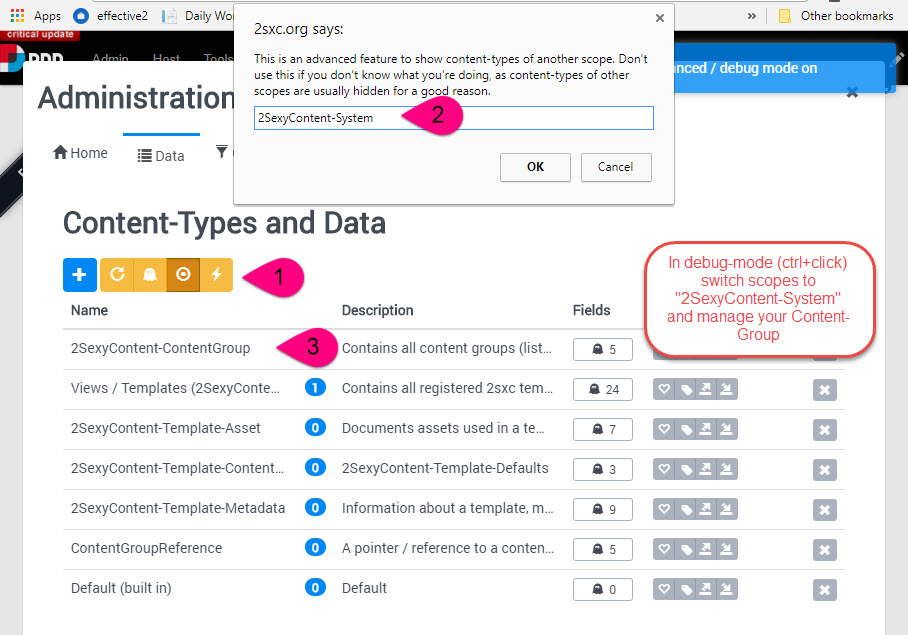

# Content Blocks

Content items wouldn't do much - they must be shown to the user in the intended layout. The configuration of such a _show these things using this template_ is handled in a **ContentBlock**. The data model for these _Content Blocks_ looks like this:

So each _Content Block_ has:

1. One reference to a View configuration
1. Zero, one or many references to content items
1. The same amount of Content-Presentation items 
1. Zero or one references to Header items
1. The same amount of Header-Presentation items

> [!TIP]
> Content Blocks contain a reference to the _View_ and optionally a bunch of _Content Items_ that will be used/shown in that _View_. But there are actually 4 possible scenarios deciding what is actually shown:
>
> 1. The _View_ can show the content-items provided by the _Content Block_
> 1. The _View_ can be configured to use a _Query_ and show data from that
> 1. The _Template_ code could also get data from the _App_ directly and show that
> 1. Combinations of the three options above are possible

> [!IMPORTANT]
> Since the _View_ can also be configured to get data from other sources, it may show items that are not in the list of the _Content Block_. 

## Content Blocks in a CMS like Dnn

When you see 2sxc data in Dnn, that's because a module was added to the page pointing to a _Content Block_. If you want to know more about that, read .

## Manually Managing this Data

Note: you shoudn't usually do this - but sometimes you have to. Check out this short explanation:

> [!NOTE]
> This scerenshot above is from 2sxc 8. In 2sxc 11 you can change scopes in the dropdown below the data table.

## FAQ

1. If a page or module is deleted, does it also delete the _Content Block_?  
No. Note that if a page or module is deleted, it goes into the Dnn trash, so it could always be restored again. 
1. If a page or module is deleted from the trash, does it also delete the _Content Block_?  
No. Dnn does not inform modules about delete actions, so we can't do clean-up.
1. Are _Content Blocks_ which don't appear on a page orphaned and can I delete them?  
Maybe. Since they could be used in other apps (see ) as _Inner Content_, there is no quick way to tell if it's being used elsewhere.
1. Can a _Content Block_ be used on multiple modules / pages?  
Yes. It's not common, but since a module can be shown on multiple pages or even on other portals, it would show the same _Content Block_ there as well. 
