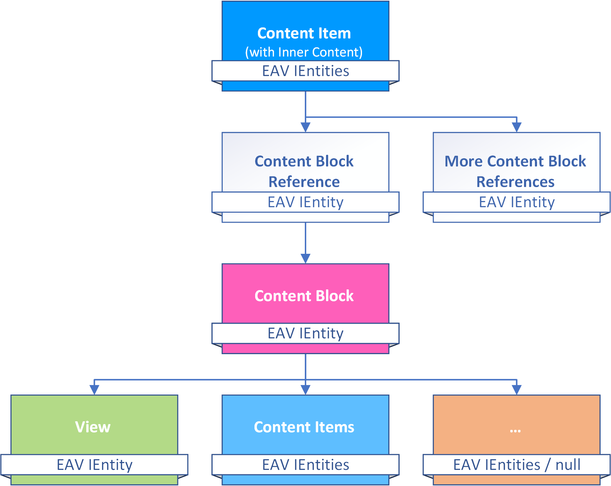
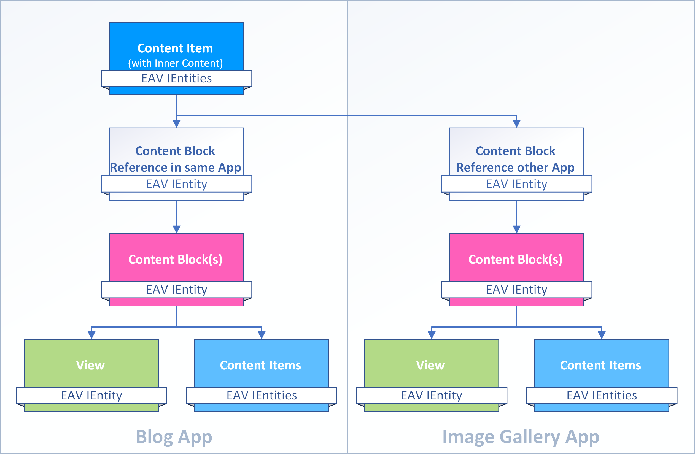

# Inner Content

_Content Blocks_ are usually added to pages as [Dnn Modules](xref:Basics.Cms.ContentBlocks.Dnn). But there is another way: as **Inner Content**. What this means is that a **Content Item** like a Blog-Post says "Show this other content-block right...here". To help 2sxc keep track of what is used where, this relationship is stored as a **Content Block Reference**. 

## Inner Content from Another App

Usually an _App_ is self-contained, so everything it shows comes from the same _App_. 
This also means that exporting/importing an app will result in the same stuff arriving at the destination. 

The following diagram shows how Content can come from multiple apps

> [!IMPORTANT]
> So if you're using _Inner Content_ and referencing content from another _App_, this 
> crosses the borders between apps, and you'll need to export/import both _Apps_ to get the same result. 
