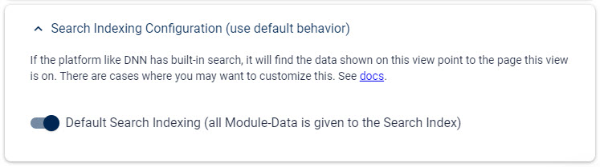
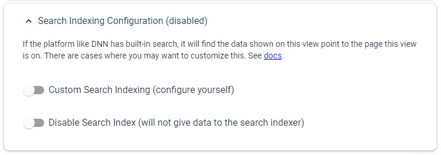
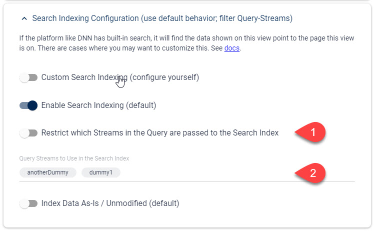
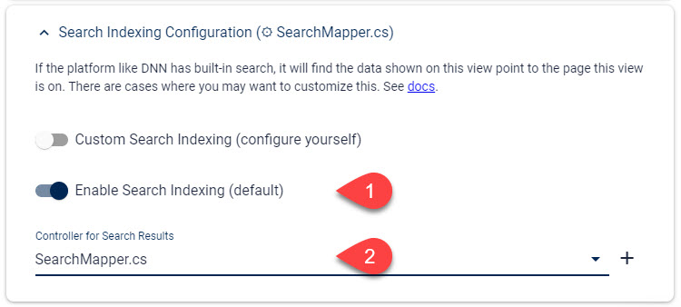

# Customize the Search-Index Results (Dnn ☢️ only)

[!include]

Dnn has a built-in search engine which crawls all the modules asking them for data.

Every 2sxc module will be queried and will give the search index all the entities which are given to this module.

## Default Scenarios

1. If a view shows data which was added by the editor these items will be in the `Default` stream and there may also be a single item in the `Header` stream. This data is given to the search index. This applies to both single-item templates as well as to lists. Note that `Presentation` items are not given to the search index as they should only contain settings how to show something, and not the real relevant data.
1. If a view shows data from a [Query](xref:Basics.Query.Index) then all the streams of that query will be given to the search index.

## Why Customize the Search Index?

You can customize this behavior to your hearts desire. Here are typical reasons to do so:

1. You may show the same items in many places - for example the _Home_ page may show the top 3 news, but search results shouldn't point to these.
1. A list/details setup would have each item in the list-view, but the search result should lead it to the details view
1. You may want to exclude some query-streams in the search results - like exclude the categories-stream since it may not be relevant

## Ways to Customize the Search Results

There are two ways to customize the search results:

1. [Using configuration](#customize-the-search-results-using-configuration) _new in v12_
1. [Using a separate code file which does this](#custom-search-index-using-code) _new in v12_
1. [Using code inside a Razor file](#custom-search-index-using-code) _not recommended, but works in older versions of 2sxc_

## Customize the Search Results Using Configuration

The following configuration options let you specify how data is handed to the Search Indexer.
These options are set in the [View](xref:Basics.App.Views.Index) configuration.

> [!TIP]
> If you expect to use the same template in many places but need different search-configurations,
> just configure multiple views using different Search configs.

### Ensure Default Search Behavior

By default the data given to the Module is also provided to the search. This is what it looks like in the [View-Configuration](xref:Basics.App.Views.Index).

### Don't Show Any Data in the Search Results

Reasons for doing this:

1. If you have views showing extracts of data (like the top 3 news) which are already added to the search index on the full news list, then you may create a `Top News` view which shouldn't return data
1. If you show a tag-cloud this may not make sense to include in a search index

This is where you can find the settings in the view configuration:

### Exclude Query-Streams from the Search Results

In some cases your View may use a [Query](xref:Basics.Query.Index) containing a lot of streams like `Default` and `Categories`, where only `Default` would make sense to include in the search.
For this you can simply configure what streams you want. _Note that these UIs automatically appear if you are using a Query_:

## Custom Search-Index Using Code

For very advanced cases you will want full control over what lands in the search index.
To implement this, you can create your own Search Mapper in C#.

This is how to configure this:

👉 Read about [Custom Search in C# here](xref:NetCode.Search.Index)

> [!NOTE]
> In older versions of 2sxc (between 6 and 12) the Search Customization code was placed in the Razor file.
> This is deprecated and should not be used any more.

---

## History

1. Introduced in 2sxc 6.2
2. Added support for newer Dnn versions at a later time - not sure when
3. Introduced Search Configuration in 2sxc 12.02
4. Introduced separate Code-File for this in 2sxc 12.02
