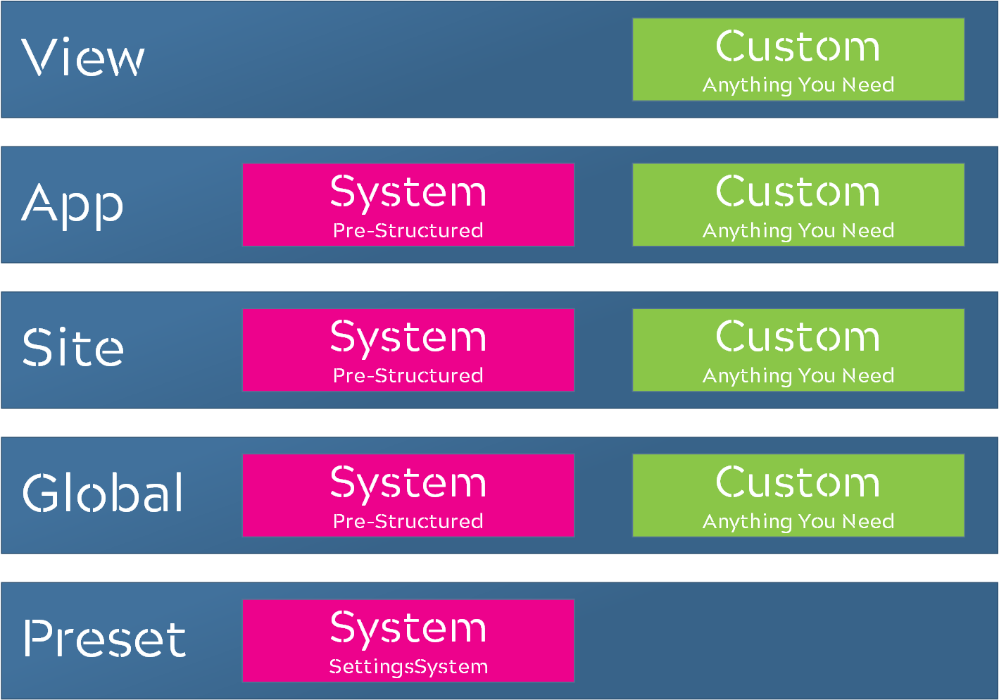
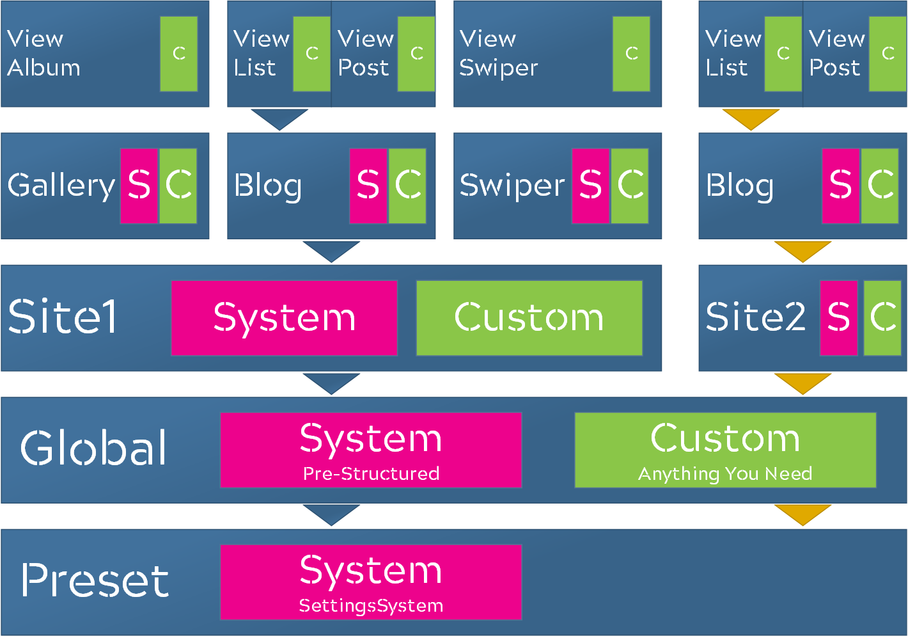
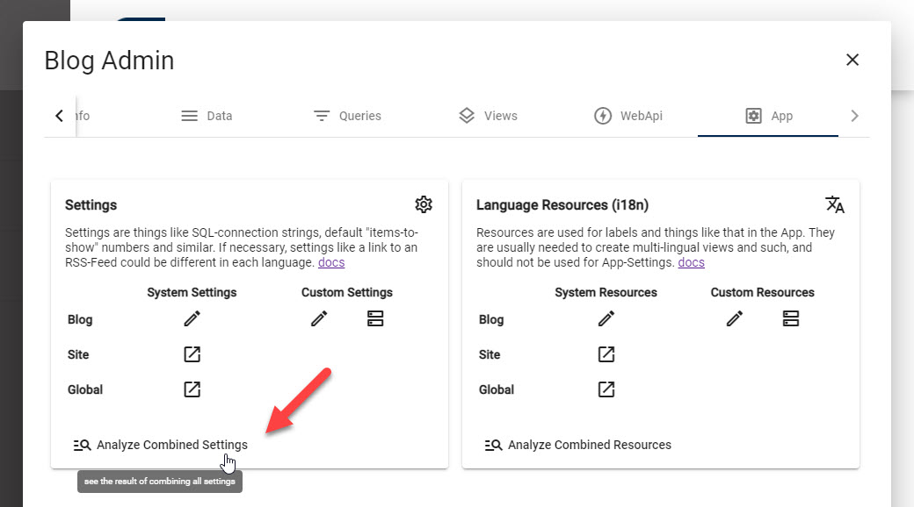
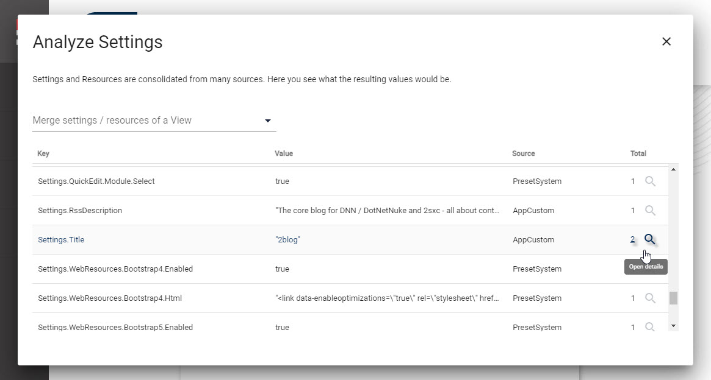

# Settings Stack in 2sxc ✨ new!

[!include]

Settings come in 2 distinct flavors:

* **Standardized Settings** use a content-type called `SettingsSystem` with a predefined structure.  
  These settings are meant to be used across tools and apps.
* **Dynamic Settings** use a custom `App-Settings` content-types which you define.  
  These settings can have any keys and values you want.  
  The effect/reach of this depends on the level where you add it (global, site, app).
  The code using these will usually come from you, as these settings are not standardized. 

Settings can be edited on many levels. The most general or fallback settings are presets in 2sxc. The most specific settings only apply to a specific view. 

In most cases your templates and code will simply want to get the most-relevant setting, no matter where it was configured. 
To make this possible, settings are treated as a stack. 
This is how it stacks up:

The most-relevant setting is top-most setting and is the one which will be used. 
So if a _View_ setting and a _Site_ setting have the same key, the _View_ setting will be preferred. Take a look at this illustration:

Assume the _Blog App_ has a _List View_ which needs `Settings.Images.Content`.
The first Blog will look for it in the sequence of the blue arrows. 
The second will look in the sequence of the yellow arrows. 
So each Blog could get a different Setting, depending on where it is configured or overwritten.

## Settings Sources and Priorities

The Settings are stacked in the following priority:

1. **ViewCustom** - dynamic settings configured in the [View](xref:Basics.App.Views.Index) 
1. **AppCustom** - the dynamic `App-Settings` (see [App-Settings](xref:Basics.App.Settings)) of an [App](xref:Basics.App.Index) 
1. **AppSystem** - The `SettingsSystem` in the current [App](xref:Basics.App.Index) 
1. **AncestorCustom** - Optional, only on inherited Apps - `App-Settings` on ancestor app (v13)
1. **AncestorSystem** - Optional, only on inherited Apps - `SettingsSystem` on ancestor app (v13)
1. **SiteCustom** - an optional, manually created dynamic `App-Settings` on the _Primary App_ of the current site
1. **SiteSystem** - an optional `SettingsSystem` in the _Primary App_ of the current site
1. **GlobalCustom** - an optional, manually created dynamic `App-Settings` on the _Global System App_
1. **GlobalSystem** - an optional `SettingsSystem` on the _Global System App_
1. **PresetSystem** - the `SettingsSystem` which are included in the installation of 2sxc

There is no setting called **ViewSystem** or **PresetCustom**.

## Review the Settings-Stack

In case you need to see what setting applies to what view, you can easily analyze this in the [App Administration](xref:Basics.App.Settings). 

There you can see each setting and what source it came from + you can analyze all the sources which configure this setting:

Next we'll explain where you can configure settings for different effects / scopes.

## Global Settings which Affect All Sites

Global Settings for all sites are configured in the **Global System App**. It's usually on Zone `1` and App `1`. 

1. go to the **Global System App** using [this checklist](https://azing.org/2sxc/r/QES7BFGU). 
1. for **Global System-Settings** just edit them here
1. for **Global Custom-Settings** just edit the App-Settings of the global app 

> [!TIP]
> This stuff is fairly new, and in rare cases new global settings don't automatically
> propagate to the sites. If you experience this, just restart the system. 
> 
> As of now, this only affects new fields, so once a field has been available changes will propagate as expected. 

## Site Settings which Affect an Entire Site

These are configured in the **Primary App** of the site you want to configure. 

1. go to the **Primary App** of the Site [using this checklist](https://azing.org/2sxc/r/653OKPVz)
1. for **Site System-Settings** just edit them here
1. for **Site Custom-Settings** just edit the App-Settings of this app

> [!TIP]
> This stuff is fairly new, and in rare cases new site settings don't automatically
> propagate to the apps. If you experience this, just restart the system. 
> 
> As of now, this only affects new fields, so once a field has been available changes will propagate as expected. 

## App Settings which Affect an Entire App

These settings override previous settings but only for a specific App. 

1. Go to the the **App Configuration** [using this checklist](https://azing.org/2sxc/r/_a0Pg3Ku)
1. for **App System-Settings** just edit them here
1. for **App Custom-Settings** aka App-Settings you can edit them here or configure fields etc. directly from this dialog. Thisis feature has existed long before the stack was invented. 
See .

## View Settings which Affect a specific View

As of v12.04 Views are only meant to have Custom Settings. 
It is still possible to override SystemSettings just by creating a field which has the same name, but we don't recommend it. 

To create Custom View Settings, create a custom content-type in the **Configuration** scope and use it in the view. 
See .

---

## History

* Full Settings Stack introduced in 2sxc 12.04
* Dropped `SettingsCustom` as a type in v13, as not needed any more because we changed how the site-level settings work
* Added `AncestorCustom` and `AncestorSettings` on v13 if the app inherits from an ancestor