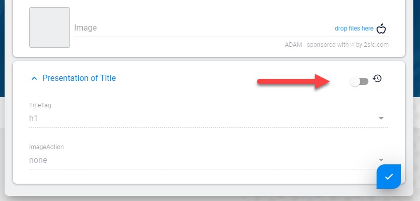

# Content Presentation Settings

[!include]

When [Data](xref:Basics.Data.Index) is used as [Content](xref:Basics.Content.Index) it can also have **Presentation** settings. This is important because the _same piece_ of content (like an Address) may need to be visualized different ways depending on how it's used.

## Quick Example

Let's say we have an Address of 2sic in Switzerland as Data, and we're using it in a few places:

1. In the footer of the website we're just showing it, the template says how it's shown
1. In the _We make Websites Page_ we have a CTA (Call to Action) with two addresses, and the 2sic address is configured to be highlighted using the **Presentation**
1. We have a _Contact Page_ where it's shown in a Google-Maps - there we configured the **Presentation** to use a pink pin

## Edit Behavior

Since the **Presentation** is directly connected to the Item it's showing, the Edit-UI will open both items for editing together:

## More Use-Case Examples

1. You have a template that shows simple content, and sometimes the title should be `<h1>`, sometimes `<h2>`, etc. Instead of creating 6 different templates, it would be easier to allow simple configuration of the heading-tag. This kind of presentation-configuration is handled by the Presentation-entity.
1. Your Title/Text/Image allows the user to place the image no the right or on the left side. Instead of creating multiple templates, let's just let the user configure the variation he wants. This too is handled by the Presentation-entity.
1. A complex template like a Google-map can configure 10-20 different parameters. These should not be set in the address which we will show - because these parameters have nothing to do with the address itself. So we need a way to provide 10-20 input-fields, drop-downs etc. - but not mix it with the address itself. These 10-20 input fields would be handled in a Presentation-entity.
1. The same piece of information - like the address of 2sic - could be shown on different pages. Each instance might have some presentation configuration that differs from the other ones. It would be impossible to configure this if the config-fields were in the address-entity. So we place them in a separate Presentation-entity.

## Demo / Defaults Behavior

One thing we discovered, is that configurable templates can be annoying because often there is a default configuration which applies to 90%. For example, if you create a configurable heading-tag `<h1>` through `<h6>`, usually 90% of the cases need `<h1>` because this is used on every page. Such defaults are handled easily by providing the template with a default-presentation entity containing these common settings. These will automatically be used if not overruled.

> [!IMPORTANT]
> Presentation Settings are not changed in 90% of all cases, so use Defaults whenever possible!

Very often the **Presentation** contains default settings which are often left untouched. In these cases the Presentation-item is not stored, but the Demo-data is provided automatically. This allows you to update the defaults an any time and it will be reflected on all items which have unmodified Presentation settings.

Here's what Presentation looks like when inheriting defaults:

This is what Presentation looks like when you set it on the current item:

## Available on each Content-Item and on Header

**Presentation** is available on _each_ Content item and also in the Header (if a View is configured to have a [List](xref:Basics.Content.Lists)). Each Content item will have it's own presentation settings.

The [View](xref:Basics.App.Views.Index) configuration determines if there is a **Presentation** setting on Content (or Header) and what Content-Type is to be used.

## Use in Code

In C# you will usually do things like `@Content.Presentation.Color` or similar. Check the [C# API Docs for this](xref:NetCode.DynamicCode.Content).

In Tokens you will usually do things like `[Content:Presentation:Color]`. Check the [Tokens docs](xref:Basics.Server.Render.Tokens.Index).

## Real Example

Example: Using the Presentation to control the heading-tag in a template

### The Content-Types

1. Simple Content - with the following fields
    * `Title` (text, 1 line)
    * `Content` (wysiwyg-text)
    * `Image` (link to an image file)
1. Presentation for Simple Content with the following field
    * `Heading` (text, drop-down containing h1, h2, h3, h4, h5, h6)

The template configuration specifies the simple-content as the content type, and the presentation-for-simple-content as the Presentation-type. The user now has an additional section in the Edit-UI to configure the presentation.

### The Template

This The template would then contain the following fragment:

#### Token

Instead of the classic

`<h1>[Content:Title]</h1>`

it would have

`<[Presentation:Heading]>[Content.Title]</[Presentation:Heading]>`

#### Razor
Instead of the classic

`<h1>@Content.Title</h1>`

...it would have

`<@Presentation.Heading>@Content.Title</@Presentation.Heading>`

### Power-Feature: Using Default-Values in this Presentation

Now remember that probably 90% of all use cases for this will want an `<h1>` tag. It would be annoying to have to specify this every time, so please create a demo-entity and assign it in the template-configuration.

## Features and Behavior of Presentation-Data

1. Presentation-Types are optional, templates don't require them
1. Default-Values are optional, but highly recommended
1. Data / Values in a presentation-content-type are not indexed by the search
1. Presentation-Items are unique for every use. So if you show a piece of content in many places, each occurrence can have different presentation-settings
1. Content-Items can have a presentation...
1. ...List Headers can have their own, different presentation. This is used to configure the list (for example, how many items to show before paging)
1. ...and List Headers can also have their own default presentations for fallback
1. The UI always allows the editor to revert back to the default-settings

## History

1. Introduced in 2sxc v3.0
