# Content-Type Composition and Inheritance (new v18.02)

[!include["Data"](~/pages/basics/data/_shared-content-types.md)]

This explains **Content-Type Composition and Inheritance**.
For an overview check out .

## What is Content-Type Composition?

Content-Type Composition is the ability to create a new Content-Type by combining fields from existing Content-Types.
This is a powerful feature which allows you to create new Content-Types by reusing existing fields.

Here's a simple example:

1. You have a `Person` Content-Type with fields like `Name`, `Email`, `Phone`, `Salutation`
1. You have a `Company` Content-Type with fields like `Name`, `Address`, `Phone`
1. You want to create a `Contact` Content-Type with fields like `Name`, `Email`, `Phone`, `Address`, `Salutation`, `Relationship`

With Content-Type Composition, you can create the `Contact` Content-Type by combining fields from `Person` and `Company`.
This is what you _could_ do:

| Field       | Person    | Company       | Contact     | Notes |
| ---         | ---       | ---           | ---         | --- |
| Name        | 🔊 Master | 🚫 Own Field  | 🔗 Inherit | Company name has different description etc. so it does not inherit |
| Email       | 🔊 Master |               | 🔗 Inherit | |
| Phone       | 🔊 Master | 🔗 Inherit    | 🔗 Inherit | |
| Address     |           | 🔊 Master     | 🔗 Inherit | |
| Salutation  | 🔊 Master |               | 🔗 Inherit | |
| Relationship|           |               | 🚫 Own Field | |

Or you could do this:

| Field       | PersonShared  | Person      | Company     | Contact     | Notes |
| ---         |               | ---         | ---         | ---         | --- |
| Name        | 🔊 Master     | 🔗 Inherit | 🚫 Own Field | 🔗 Inherit | Company name is different so it does not inherit |
| Email       | 🔊 Master     | 🔗 Inherit |              | 🔗 Inherit | |
| Phone       | 🔊 Master     | 🔗 Inherit | 🔗 Inherit   | 🔗 Inherit | |
| Address     | 🔊 Master     |            | 🔗 Inherit   | 🔗 Inherit | |
| Salutation  | 🔊 Master     | 🔗 Inherit |              | 🔗 Inherit | |
| Relationship|               |            |              | 🚫 Own Field | |

## How Does Composition Relate to Inheritance

> [!NOTE]
> Inheritance is a basic concept where a master definition is used to create a new object which is a variation of the master.
> Basically an inheriting definition can only add properties, but not remove or change them.

Composition on the other hand is much more flexible.

1. You can inherit only a sub-set of fields from any master.
1. You can inherit fields from multiple masters.
1. You can inherit fields from masters and then add more fields.
1. You can inherit some fields, but specifically implement certain fields yourself, for example when the `Name` on Company above should have a different description.

> [!NOTE]
> The "downside" of composition is that inheriting definitions
> must specify which fields they inherit.
> So adding fields to the master does not automatically add it to any children.
> This is a good thing, but you must be aware of it.

## Important Things to Know

> [!TIP]
> Content-Type Composition is a great way to standardize and improve your Content-Type definitions.
> Any changes to the master fields will automatically be applied to all inheriting fields.

> [!WARNING]
> Inheriting a field will only inherit it's definition, which includes label, description, dropdown values etc.
> The name of the field is _not_ inherited, so you can specify a different name in the inheriting Content-Type.
> This provides some flexibility, but if you rename the master, it will not automatically rename the inheriting fields.

> [!NOTE]
> Content-Type Composition is an advanced feature which is reserved to our patrons.
> If you don't have the feature enabled/licensed, it will still work, but show a license warning.
>
> But it can be a great solution to save time and streamline your work, so please look into sponsoring us.
> ➡️ See 

## How to Use Content-Type Composition

Not every field is suitable for composition.
Because of this, you must explicitly specify which fields are shared.
This makes it easier for you to understand which fields are shared and which are not.

### 1. Share Fields

To share a field, you must specify that it is shared. Follow these instructions:

  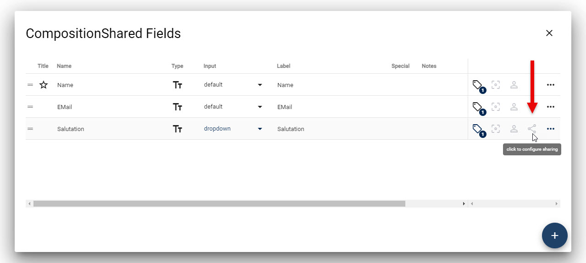
  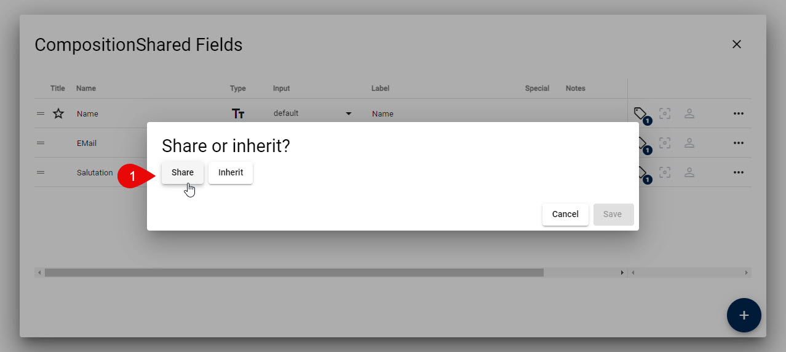
  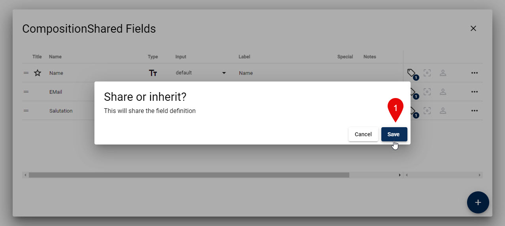
  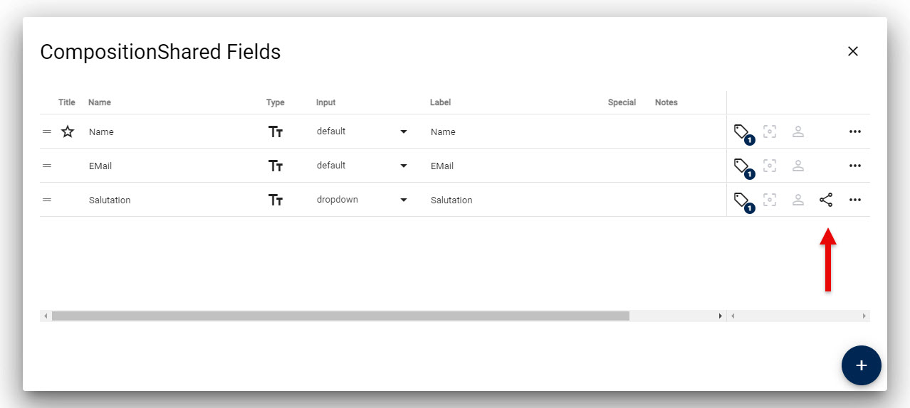

### 2a. Create _New_ Field Which Inherits

When adding new fields which should inherit the settings, it's best to do this directly upon creation.

  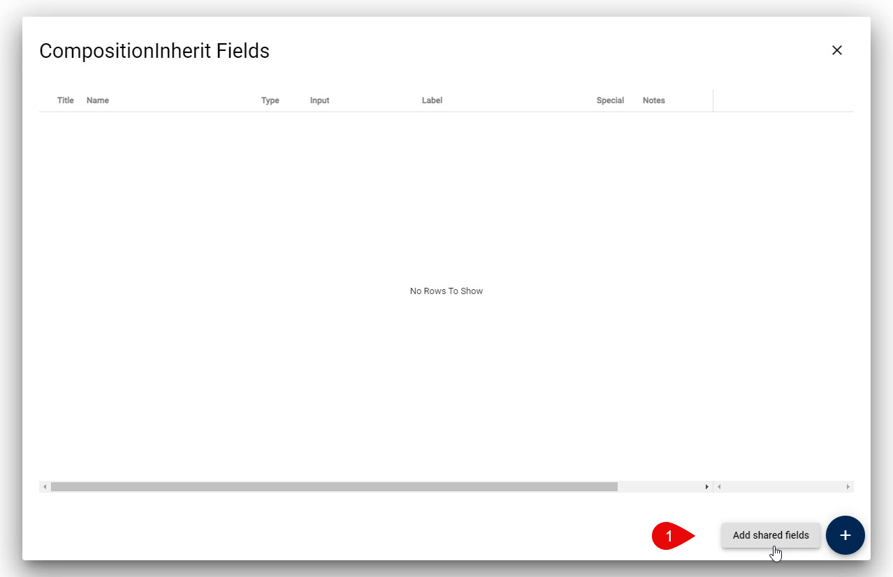
  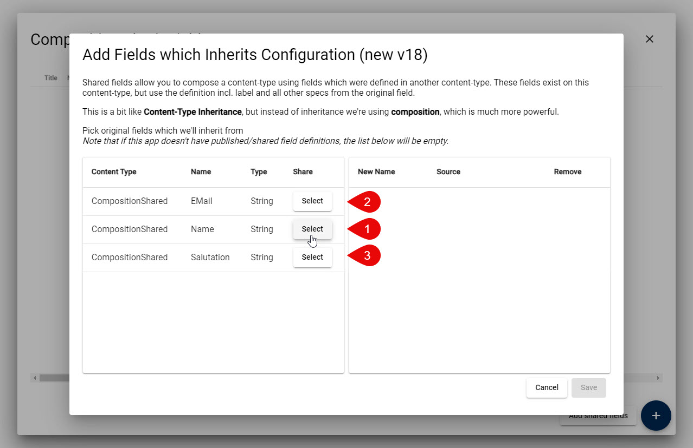
  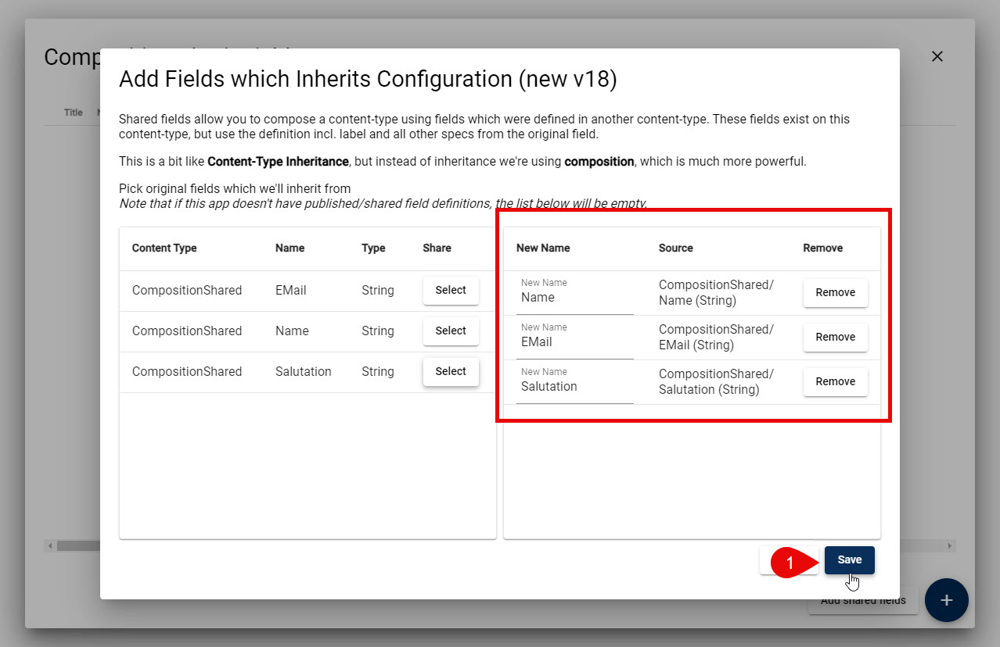
  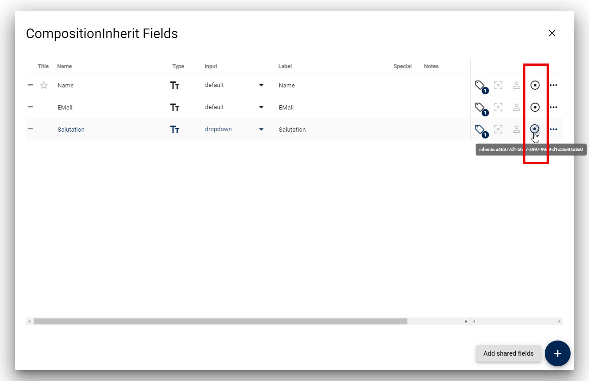

### 2b. Change _Existing_ Field to Inherit

Sometimes you already have a field, or you need a different name but it should inherit the settings.

  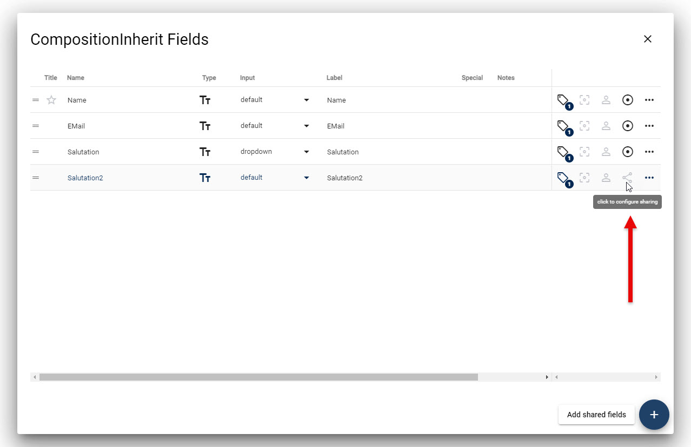
  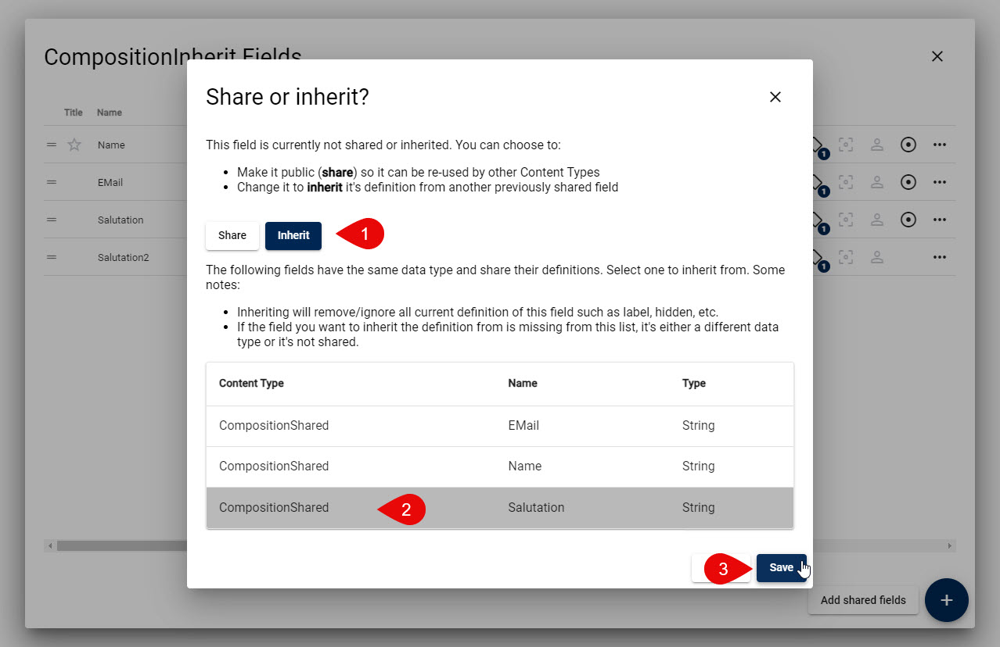
  

### 3. Review Inheritance

On the shared master, you can always review where it is used.
And on the inheriting field, you can always review where the definition is from.

  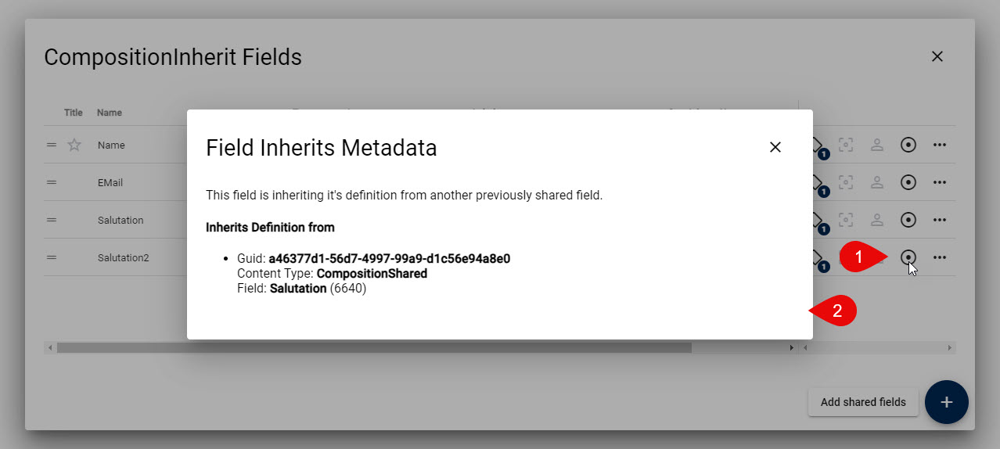
  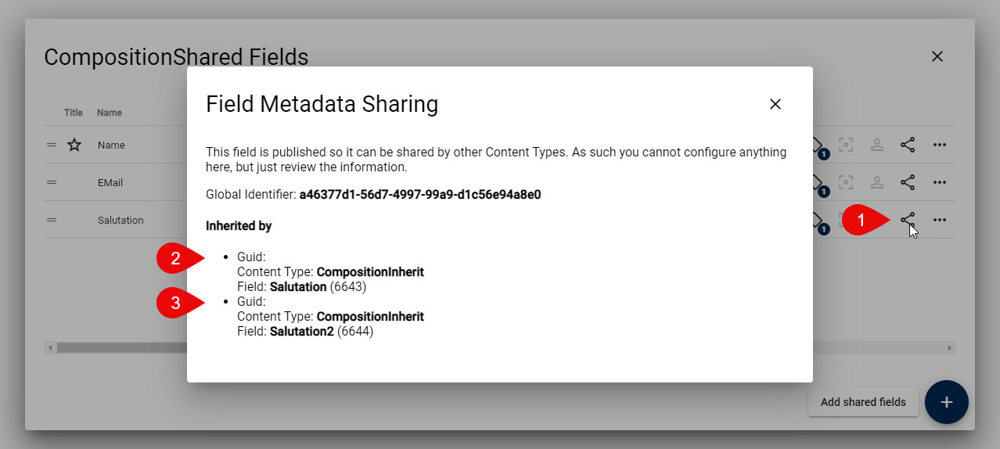

### 4. Change / Stop Inheritance

As of now, there is no UI for this.
For now, you'll need to manually change the `SysSettings` column in the SQL table of this field.

If it turns out to be a common use case, we'll look at it in more detail.

### 5. Partial Inheritance

There is a beta feature, where inheritance can be partial.
This would allow you to inherit only the dropdown-definition, but allow you to configure your own title etc.

At the moment this is not stable enough to use.

---

## History

1. Introduced in 2sxc 16.0 for internal use
1. Released in 2sxc 18.02 for public use (patrons only)
