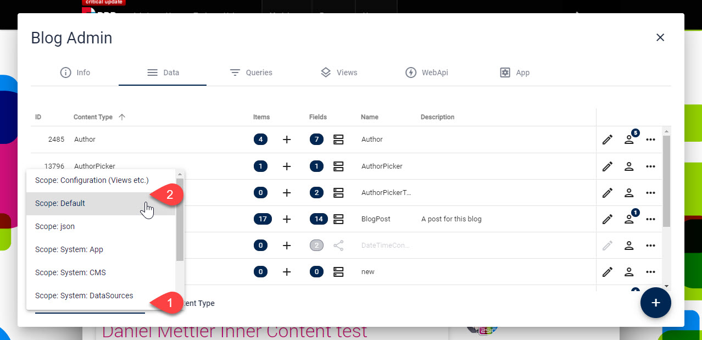

# Content-Type Scopes

[!include["Data"](~/pages/basics/data/_shared-content-types.md)]

This explains **Content-Type Scopes**. For an overview check out .

---

## What is a Content-Type Scope?

Content-Types have a _Scope_. This is like a category for the Content-Type. 

> Normally you only see the Content-Types and Entities of the default Scope. 

The other Scopes have internal and system Content-Types like `@String`. 

* [Here's the full list of current Scopes](https://azing.org/2sxc/r/LqblhYXD)

## Switch Scopes

Just use the built-in scope switcher like this:

For older versions see this checklist on how to [switch Scopes](https://azing.org/2sxc/r/MEa0dtBw) to manage data of other Scopes

## Nice to Know about Scopes

You can easily create your own scope at any time. This is usually used for  or if your App is getting really complex and has so many Content-Types that it confuses the Admin. 

## History

1. Introduced in 2sxc 2.0
